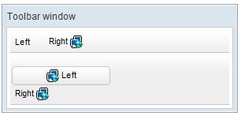
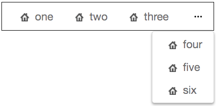
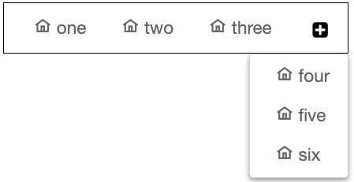

# Toolbar

- Demonstration: [Toolbar](http://www.zkoss.org/zkdemo/menu/toolbar)
- Java API: <javadoc>org.zkoss.zul.Toolbar</javadoc>
- JavaScript API: <javadoc directory="jsdoc">zul.wgt.Toolbar</javadoc>
- Style Guide: [
  Toolbar](ZK_Style_Guide/XUL_Component_Specification/Toolbar)

# Employment/Purpose

A `toolbar` is used to place a series of buttons, such as
`toolbarbutton`or `button.`The toolbar buttons could be used without
toolbars, so a toolbar could be used without tool buttons. However, the
tool buttons change their appearance if they are placed inside a
toolbar.

The toolbar has two orientation: `horizontal`and `vertical.`It controls
how the buttons are placed.

See also : [
Button](ZK_Component_Reference/Essential_Components/Button),
[
Toolbarbutton](ZK_Component_Reference/Essential_Components/Toolbarbutton)

# Example



``` xml
<window title="Toolbar window" border="normal" width="300px">
    <toolbar>
        <toolbarbutton label="Left" />
        <space />
        <toolbarbutton label="Right" image="/img/network.gif"
            dir="reverse" />
    </toolbar>
    <toolbar orient="vertical">
        <button label="Left" image="/img/network.gif" width="125px" />
        <toolbarbutton label="Right" image="/img/network.gif"
            dir="reverse" />
    </toolbar>
</window>
```

# overflowPopup



When `overflowPopup="true"`, a toolbar will have a `...` symbol that
shows a popup that contains those buttons not fitting in the toolbar.

Default: false.



``` xml
    <toolbar overflowPopup="true" width="350px" style="border: 1px black solid;">
        <toolbarbutton label="one" iconSclass="z-icon-home"/>
        <toolbarbutton label="two" iconSclass="z-icon-home"/>
        <toolbarbutton label="three" iconSclass="z-icon-home"/>
        <toolbarbutton label="four" iconSclass="z-icon-home"/>
        <toolbarbutton label="five" iconSclass="z-icon-home"/>
        <toolbarbutton label="six" iconSclass="z-icon-home"/>
    </toolbar>
```

# overflowPopupIconSclass



When overflowPopup="true", you can customize a toolbar `...` symbol just
specify the `overflowPopupIconSclass` attribute. For a complete list of
icons, please refer to [FontAwesome
Cheatsheet](http://fontawesome.io/cheatsheet/).

Default: `...` symbol



``` xml
    <toolbar overflowPopup="true" overflowPopupIconSclass="z-icon-plus-square" width="350px" style="border: 1px black solid;">
        <toolbarbutton label="one" iconSclass="z-icon-home"/>
        <toolbarbutton label="two" iconSclass="z-icon-home"/>
        <toolbarbutton label="three" iconSclass="z-icon-home"/>
        <toolbarbutton label="four" iconSclass="z-icon-home"/>
        <toolbarbutton label="five" iconSclass="z-icon-home"/>
        <toolbarbutton label="six" iconSclass="z-icon-home"/>
    </toolbar>
```

# Supported Events

<table>
<thead>
<tr class="header">
<th><center>
<p>Name</p>
</center></th>
<th><center>
<p>Event Type</p>
</center></th>
</tr>
</thead>
<tbody>
<tr class="odd">
<td><p>None</p></td>
<td><p>None</p></td>
</tr>
</tbody>
</table>

- Inherited Supported Events: [
  XulElement](ZK_Component_Reference/Base_Components/XulElement#Supported_Events)

# Supported Molds

Available molds of a component are defined in lang.xml embedded in
zul.jar. It is suggested to set mold to panel while toolbar is in the
footer of a panel.

<table>
<thead>
<tr class="header">
<th><center>
<p>Name</p>
</center></th>
<th><center>
<p>Snapshot</p>
</center></th>
</tr>
</thead>
<tbody>
<tr class="odd">
<td><center>
<p>default</p>
</center></td>
<td></td>
</tr>
<tr class="even">
<td><center>
<p>panel</p>
</center></td>
<td></td>
</tr>
</tbody>
</table>

# Supported Children

`*ALL`


