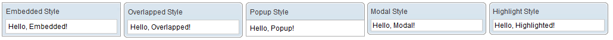
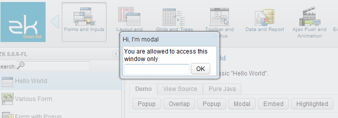
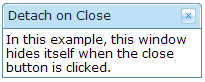
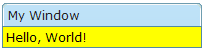
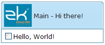

# Window

- Demonstration:
  [Window](http://www.zkoss.org/zkdemo/window/positioning)
- Java API: <javadoc>org.zkoss.zul.Window</javadoc>
- JavaScript API: <javadoc directory="jsdoc">zul.wnd.Window</javadoc>
- Style Guide: [
  Window](ZK_Style_Guide/XUL_Component_Specification/Window)

# Employement/Purpose

A window is, like HTML DIV tag, used to group components. Unlike other
components, a window has the following characteristics.

- A window is an owner of [an ID
  space](ZK_Developer's_Reference/UI_Composing/ID_Space). Any
  component contained in a window, including itself, could be found by
  use of
  <javadoc method="getFellow(java.lang.String)">org.zkoss.zk.ui.Component</javadoc>,
  if it is assigned with an identifier.
- A window could be overlapped, popup, and embedded.
- A window could be a modal dialog.

# Example



``` xml
    <window title="Embedded Style" border="normal" width="200px">Hello,
        Embedded!
    </window>
    <window title="Overlapped Style" mode="overlapped" border="normal"
            width="200px">Hello, Overlapped!
    </window>
```

# Window Modes

A window could be in one of five different modes:

- embedded (**default**)
- overlapped
- popup
- modal
- highlighted and

You could change the mode by the use of
<javadoc method="setMode(java.lang.String)">org.zkoss.zul.Window</javadoc>.

``` xml
<window title="Hi, I'm Overlapped" border="normal" mode="overlapped">
...
</window>
```

Alternatively, you could invoke one of
<javadoc method="doOverlapped()">org.zkoss.zul.Window</javadoc>,
<javadoc method="doPopup()">org.zkoss.zul.Window</javadoc>,
<javadoc method="doModal()">org.zkoss.zul.Window</javadoc>,
<javadoc method="doHighlighted()">org.zkoss.zul.Window</javadoc>, and
<javadoc method="doEmbedded()">org.zkoss.zul.Window</javadoc>, as shown
below.

``` xml
<zk>
    <window id="win" title="Hi!" border="normal" width="200px">    
        <caption>        
            <toolbarbutton label="Help"/>
        </caption>        
        <checkbox label="Hello, Wolrd!"/>        
    </window>    
        
    <button label="Overlap" onClick="win.doOverlapped();"/>    
    <button label="Popup" onClick="win.doPopup();"/>    
    <button label="Modal" onClick="win.doModal();"/>    
    <button label="Embed" onClick="win.doEmbedded();"/>    
    <button label="Highlighted" onClick="win.doHighlighted();"/>    
</zk>
```

## Embedded

An embedded window is placed inline with other components. In this mode,
you cannot change its position, since the position is decided by the
browser. It is the default mode since it is the most common appearance.

## Overlapped

An overlapped window is overlapped with other components, such that
users could drag it around and developer could set its position by
<javadoc method="setLeft(java.lang.String)">org.zkoss.zul.Window</javadoc>
and
<javadoc method="setTop(java.lang.String)">org.zkoss.zul.Window</javadoc>
based on the entire scrollable area.

``` xml
<window title="My Overlapped" width="300px" mode="overlapped">
</window>
```

An overlapped window is typically used to display the information that
should co-exist with the current operation and should appear for a long
time. You might have multiple overlapped windows and each for different
set of information. If you want to show the information that will appear
only temporarily (dismissed as soon as a user clicks somewhere else),
you could use the popup mode as described in the next section, or the
[Popup](ZK_Component_Reference/Essential_Components/Popup)
component.

## Popup

A popup window is similar to overlapped windows, except it is
automatically closed when user clicks on any component other than the
popup window itself or any of its descendants. Of course, you could
dismiss it manually by making it invisible or detaching it.

As its name suggested, it is designed to implement the popup windows. A
typical application is to display information that won't obscure the
current operation and are easy to close. A popup window is usually
position around the focal point (such as a button). It can be done by
use of
<javadoc method="setPosition(java.lang.String)">org.zkoss.zul.Window</javadoc>
with `parent`.

For example, we could display a popup window right after a button as
depicted below.

``` xml
<zk>
    <toolbarbutton label="More info" onClick="info.doPopup()"/><span>
    <window id="info" visible="false" width="120px" border="normal" position="parent">
    Here is more information
    </window>
    </span>
</zk>
```

where we specify `position="parent"`, and make it as a child of a
[span](ZK_Component_Reference/Containers/Span) component. The
span component acts as an anchor point and the window is posited based
on it.

In additions to popup windows, you could use
[Popup](ZK_Component_Reference/Essential_Components/Popup)
for displaying a popup. The popup component has more control how to
position it (by the use of
<javadoc method="open(org.zkoss.zk.ui.Component, java.lang.String)">org.zkoss.zul.Popup</javadoc>).

## Modal and Highlighted

By default, a modal window is the same as a highlighted window. You
should consider them exactly the same.

### Blocking Background Content

A modal window provides the so-called *modal* effect that limits a user
from accessing components other than the modal window. Users cannot
access anything outside of the modal window, including clicking or
tabbing.

For instance, you could access only the textbox and button in the
following example:



You can have multiple modal windows at the same time, and a user can
only access the last modal window. Once the last modal is dismissed
(invisible or detached), the previous modal window will become the
*active* modal window until it is dismissed.

### Dismiss

To dismiss a modal window, you can make it invisible
(<javadoc method="setVisible(boolean)">org.zkoss.zul.Window</javadoc>),
or detach it from a page.

### Position

By default, a modal window is positioned at the center of the viewport.
You can change the position by
<javadoc method="setPosition(java.lang.String)">org.zkoss.zul.Window</javadoc>
or
<javadoc method="setLeft(java.lang.String)">org.zkoss.zul.Window</javadoc>
and
<javadoc method="setTop(java.lang.String)">org.zkoss.zul.Window</javadoc>
based on the current viewport.

### Enforce Gaining the Focus

If there is a modal(highlighted) window on a page when a user clicks any
place on the page. The window will enforce the focus on its first
focusable child component.

## Modal Windows and Event Processing Threads



By default, events are processed in the same thread that serves the HTTP
request (so-called Servlet thread). However, you could configure ZK to
process events in an individual thread, such that the event listener
could suspend the execution at any time, and resume later. For how to
enable the event processing thread, please refer to [ZK Configuration Reference](ZK_Configuration_Reference/zk.xml/The_system-config_Element#The_disable-event-thread_Element).

> ------------------------------------------------------------------------
>
> Notice that, for better integration with other frameworks, such as
> Spring, it is suggested to *disable* the event processing thread
> (default). For more information, please refer to the [Event Threads](ZK_Developer's_Reference/UI_Patterns/Event_Threads)
> section.

Once the event thread is enabled, a modal window will behave differently
from other modes:
<javadoc method="doModal()">org.zkoss.zul.Window</javadoc> will suspend
the execution until dismissed (invisible, detached or mode changed). It
is convenient to implement something that has to wait for user's further
input.

As depicted in the following example, `f1()` is called only after `win1`
is dismissed, while `g1()` is called immediately right after `win2`
becomes highlighted:

``` xml
win1.doModal(); //the execution is suspended until win1 is closed
f1();
win2.doHighlighted(); //the execution won't be suspended
g1()
```

# Properties and Features

## Border

The `border` property
(<javadoc method="setBorder(java.lang.String)">org.zkoss.zul.Window</javadoc>)
specifies whether to display a border for window. The default style
sheets support only `normal` and `none`. The default value is `none`,
i.e., no border.

## Closable

By setting the `closable` property
(<javadoc method="setClosable(boolean)">org.zkoss.zul.Window</javadoc>)
to true, a close button is shown for the window, which enables a to
close the window by clicking the button. Once the user clicks on the
`close` button, an `onClose` event is sent to the window which is
processed by the `onClose` method of the `Window` component. Then,
`onClose`, by default, detaches the window itself.

### The onClose Event

You can override it to do whatever you want. Or, you can register your
own listener to change the default behavior. For example, you might
choose to hide the window rather than close it.



``` xml
<window closable="true" title="Detach on Close" border="normal" width="200px"
 onClose="self.visible = false; event.stopPropagation();">
     In this example, this window hides itself when the close button is clicked.
</window>
```

Notice that `event.stopPropagation()`
(<javadoc method="stopPropagation()">org.zkoss.zk.ui.event.Event</javadoc>)
must be called to prevent the default onClose handler
(<javadoc method="onClose()">org.zkoss.zul.Window</javadoc>) being
called.

**Tip**: If the window is a popup, the `onOpen` event will be sent to
the window with open=false, when the popup is closed due to the user
clicking outside of the window, or pressing `ESC`.

The `onClose` is sent to ask the server to detach or to hide the window.
By default, the window is detached. Of course, the application can
override this behavior and do whatever it wants as described above.

On the other hand, `onOpen` is a notification. It is sent to notify the
application that the client has hidden the window. The application
cannot prevent it from hiding or changing the behavior to be detached.

## ContentStyle and ContentSclass

You can customize the look and feel of window's content block by
specifying the `contentStyle` property
(<javadoc method="setContentStyle(java.lang.String)">org.zkoss.zul.Window</javadoc>).



``` xml
<zk>
    <window title="My Window" border="normal" width="200px" contentStyle="background:yellow">
        Hello, World!
    </window>
</zk>
```

### Scrollable Window

A typical use of the `contentStyle` attribute is to make a window
scrollable as follows.


``` xml
<window id="win" title="Hi" width="150px" height="100px" contentStyle="overflow:auto" border="normal">
     This is a long line wrapped over several lines, and more content to display. 
     Finally, the scrollbar becomes visible.
     This is another line.
</window>
```

Note: For IE 7's overflow bug, also use **position:relative** with
overflow:auto

## Position

By default, its value is null. That is, an overlapped/popup window is
positioned by the `left` and `top` attributes based on the entire
scrollable area, while a highlighted/modal window is positioned at the
center of the viewport.

If you specify a value in this attribute, it takes higher priority than
`left` and `top` attributes. Hence, a window is rendered upon this
position and ignore `left` and `top`.

For example, the following code snippet positions the window to the
right-bottom corner.

``` xml
<window width="300px" mode="overlapped" position="right,bottom">
 ...
```

The `position`'s value can be a combination of the following constants
by separating them with commas (`,`).

<table>
<thead>
<tr class="header">
<th><center>
<p>Constant</p>
</center></th>
<th><center>
<p>Description</p>
</center></th>
</tr>
</thead>
<tbody>
<tr class="odd">
<td><center>
<p>center</p>
</center></td>
<td><p>Position the window at the center. If <code>left</code> or
<code>right</code> is also specified, it means the vertical center. If
<code>top</code> or <code>bottom</code> is also specified, it means the
horizontal center. If none of <code>left</code>, <code>right</code>,
<code>top</code> and <code>bottom</code> is specified, it means the
center in both directions.</p>
<p>Both the <code>left</code> and <code>top</code> properties are
ignored.</p></td>
</tr>
<tr class="even">
<td><center>
<p>left</p>
</center></td>
<td><p>Position the window at the left edge.</p>
<p>The <code>left</code> property is ignored.</p></td>
</tr>
<tr class="odd">
<td><center>
<p>right</p>
</center></td>
<td><p>Position the window at the right edge.</p>
<p>The <code>left</code> property is ignored.</p></td>
</tr>
<tr class="even">
<td><center>
<p>top</p>
</center></td>
<td><p>Position the window at the top.</p>
<p>The <code>top</code> property is ignored.</p></td>
</tr>
<tr class="odd">
<td><center>
<p>bottom</p>
</center></td>
<td><p>Position the window at the bottom.</p>
<p>The <code>top</code> property is ignored.</p></td>
</tr>
</tbody>
</table>

### Based on Viewport

ZK calculates the `position` based on the current
[viewport](https://developer.mozilla.org/en-US/docs/Glossary/Viewport),
not the whole scrollable area's boundary. So if you scroll down a page
for 1000px, the `top` means the top of the viewport instead of the top
of the page.

### Based on the Parent

<table>
<thead>
<tr class="header">
<th><center>
<p>Constant</p>
</center></th>
<th><center>
<p>Description</p>
</center></th>
</tr>
</thead>
<tbody>
<tr class="odd">
<td><center>
<p>parent</p>
</center></td>
<td><p>Position the window relative to the top-left corner of the parent
component. See specific details in the <a href="#popup")

``` xml
<zk>
    <window title="Demo" border="normal" width="350px">
        <caption>
            <toolbarbutton label="More" />
            <toolbarbutton label="Help" />
        </caption>
        <toolbar>
            <toolbarbutton label="Save" />
            <toolbarbutton label="Cancel" />
        </toolbar>
        What is your favorite framework?
        <radiogroup>
            <radio label="ZK" />
            <radio label="JSF" />
        </radiogroup>
    </window>
</zk>
```

You are also able to specify a label and an image within a caption, and
then the appearance is as follows.



``` xml
 
<zk>
    <window id="win" title="Main" border="normal" width="200px">
        <caption image="/images/ZK-Logo.PNG" label="Hi there!"/>
        <checkbox label="Hello, World!"/>
    </window>
</zk>
```

# Troubleshooting with browser issues

- There's an issue for Listbox/Grid in a window, please reference [Grid
  in window get a wrong display in
  IE7/IE6](https://sourceforge.net/tracker/?func=detail&atid=785191&aid=3291179&group_id=152762%7C3291179)

# Common Dialogs

The XUL component set supports the following common dialogs to simplify
some common tasks.

- [Messagebox](ZK_Component_Reference/Supporting_Classes/Messagebox)
- [Fileupload](ZK_Component_Reference/Essential_Components/Fileupload)
- [Filedownload](ZK_Component_Reference/Essential_Components/Filedownload)

# Supported Events

<table>
<thead>
<tr class="header">
<th><center>
<p>Name</p>
</center></th>
<th><center>
<p>Event Type</p>
</center></th>
</tr>
</thead>
<tbody>
<tr class="odd">
<td><center>
<p><code>onMove</code></p>
</center></td>
<td><p><strong>Event:</strong>
<javadoc>org.zkoss.zk.ui.event.Event</javadoc></p>
<p>Denotes the position of the window is moved by a user.</p></td>
</tr>
<tr class="even">
<td><center>
<p><code>onOpen</code></p>
</center></td>
<td><p><strong>Event:</strong><javadoc>org.zkoss.zk.ui.event.OpenEvent</javadoc></p>
<p>Denotes user has opened or closed a component.</p>
<p><strong><code>Note:</code></strong></p>
<p>Unlike <code>onClose</code>, this event is only a notification.
The</p>
<p>client sends this event after opening or closing the</p>
<p>component.</p>
<p>It is useful to implement load-on-demand by listening to</p>
<p>the <code>onOpen</code> event, and creating components when the</p>
<p>first time the component is opened.</p></td>
</tr>
<tr class="odd">
<td><center>
<p><code>onClose</code></p>
</center></td>
<td><p><strong>Event:</strong>
<javadoc>org.zkoss.zk.ui.event.Event</javadoc></p>
<p>Denotes the close button is pressed by a user, and the</p>
<p>component shall detach itself.</p></td>
</tr>
<tr class="even">
<td><center>
<p><code>onMaximize</code></p>
</center></td>
<td><p><strong>Event:</strong>
<javadoc>org.zkoss.zk.ui.event.MaximizeEvent</javadoc></p>
<p>Denotes user has maximize a component.</p></td>
</tr>
<tr class="odd">
<td><center>
<p><code>onMinimize</code></p>
</center></td>
<td><p><strong>Event:</strong>
<javadoc>org.zkoss.zk.ui.event.MinimizeEvent</javadoc></p>
<p>Denotes user has minimize a component.</p></td>
</tr>
<tr class="even">
<td><center>
<p><code>onSize</code></p>
</center></td>
<td><p><strong>Event:</strong>
<javadoc>org.zkoss.zk.ui.event.SizeEvent</javadoc></p>
<p>Denotes the panel's size is updated by a user.</p></td>
</tr>
<tr class="odd">
<td><center>
<p><code>onZIndex</code></p>
</center></td>
<td><p><strong>Event:</strong>
<javadoc>org.zkoss.zk.ui.event.ZIndexEvent</javadoc></p>
<p>Denotes the panel's zindex is updated by a user.</p></td>
</tr>
</tbody>
</table>

- Inherited Supported Events: [
  XulElement](ZK_Component_Reference/Base_Components/XulElement#Supported_Events)

# Supported Children

`*ALL`

# Use Cases

| Version | Description                                                       | Example Location                              |
|---------|-------------------------------------------------------------------|-----------------------------------------------|
| 5.0+    | How to create a modal Window and communicate with it              | <http://www.zkoss.org/forum/listComment/9785> |
| 3.6+    | Best practises on creating a pop-up window to display PDF reports | <http://www.zkoss.org/forum/listComment/9305> |
|         |                                                                   |                                               |


