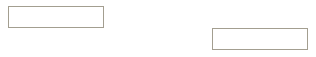

- **Java API:** [org.zkoss.zul.Div](https://www.zkoss.org/javadoc/latest/zk/org/zkoss/zul/Div.html)
- **JavaScript API:** [zul.wgt.Div](https://www.zkoss.org/javadoc/latest/jsdoc/classes/zul.wgt.Div.html)

## Employment/Purpose
The `Div` component is a lightweight container used to group child components for various purposes such as assigning CSS styles or creating more complex layouts. It functions similarly to an HTML `<div>` tag, displaying as a block element with line breaks before and after it. This component is commonly used for organizing content and defining structure within a ZK application.

## Common Use Cases

- **Grouping related widgets** — Wrap a set of input components (e.g. `<textbox>`, `<button>`) inside a `<div>` to apply a shared `style` or `sclass` without introducing any semantic container overhead.
- **CSS-driven layouts** — Use inline `style="display:flex"` (or a grid equivalent) on a `<div>` to arrange child components in rows and columns when a heavyweight layout container such as `<hlayout>` or `<borderlayout>` is not needed.
- **Conditional visibility** — Toggle an entire panel of components at once by setting `visible="false"` on the enclosing `<div>` rather than on each child individually.
- **Absolute positioning** — Place a block of child components at a precise location with inline CSS: `style="position:absolute; left:20px; top:40px"` on the `<div>` (inside a parent that establishes a positioning context, e.g. `style="position:relative"`). ZK's `<div>` has no `position` attribute; use `style` for CSS positioning.

```xml
<!-- Flex layout -->
<div style="display:flex; gap:8px;">
    <textbox placeholder="First name"/>
    <textbox placeholder="Last name"/>
    <button label="Search"/>
</div>

<!-- Toggled panel -->
<div id="detailPanel" visible="false">
    <label value="Detail content here"/>
</div>
```

## Example
The example demonstrates the usage of the `Div` component by creating two separate div containers, each containing a `doublebox` component. The first `div` aligns its content to the left within a width of 300px, while the second `div` aligns its content to the right within the same width.



```xml
<zk>
    <div style="text-align:left" width="300px">
        <doublebox />
    </div>
    <div style="text-align:right" width="300px">
        <doublebox />
    </div>
</zk>
```

Try it
*  [Div with text alignment](https://zkfiddle.org/sample/1d30bqc/1-ZK-Component-Reference-Div-Example?v=latest&t=Iceblue_Compact)

## Supported Children

`*ALL`: Indicates that the Div component can have any kind of ZK component as its child element. This allows you to include any ZK component within the Div, providing flexibility and customization options for your designs.
