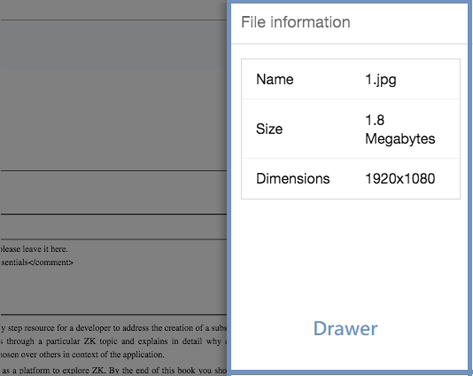
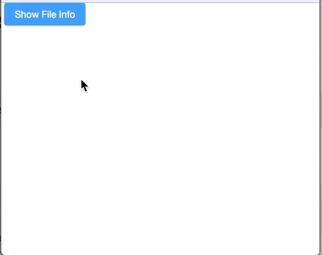

# Drawer

- **Demonstration:** [Introduce a new ZK Addon: Drawer](https://blog.zkoss.org/2019/04/17/introduce-a-new-zk-addon-drawer/)
- **Java API:** [org.zkoss.zkmax.zul.Drawer](https://www.zkoss.org/javadoc/latest/zk/org/zkoss/zkmax/zul/Drawer.html)
- **JavaScript API:** [zkmax.wgt.Drawer](https://www.zkoss.org/javadoc/latest/jsdoc/classes/zkmax.wgt.Drawer.html)

Available for ZK: [`Enterprise Edition`](https://www.zkoss.org/whyzk/zkee)

## Employment/Purpose

The Drawer component functions as a panel that remains attached to the boundary of a web page. By utilizing the Drawer, developers can maintain a cleaner page layout and enhance the user experience by organizing detailed information within the Drawer itself.

## Example

The example below demonstrates the placement of a Drawer on the right side of the page and exhibits detailed file information contained within the Drawer:





In this example, a button labeled "Show File Info" is used to trigger the opening of the Drawer component with the title "File Information". Within the Drawer, a grid layout is applied to display specific file details such as Name, Size, and Dimensions.

```xml
<zk>
  <button label="Show File Info" onClick="fi.open()"/>
  <drawer id="fi" title="File information">
    <grid>
      <rows>
        <row>
          <label value="Name"/>
          1.jpg
        </row>
        <row>
          <label value="Size"/>
          1.8 Megabytes
        </row>
        <row>
          <label value="Dimensions"/>
          1920x1080
        </row>
      </rows>
    </grid>
  </drawer>
</zk>
```

Try it
*  [Drawer with Grid](https://zkfiddle.org/sample/1g9so9c/1-ZK-Component-Reference-Drawer-Example?v=latest&t=Iceblue_Compact)


## Open / Close the Drawer

You can utilize both the `visible` attribute and the `open/close` methods to interact with the Drawer component for opening and closing it as needed.

## Change Animation Speed

The Drawer component supports the `data-animationspeed` attribute for adjusting the animation speed. Refer to [Data-AnimationSpeed](https://www.zkoss.org/javadoc/latest/zkref/ZUMLReference/ZUMLNamespaces/ClientAttribute/Data-AnimationSpeed.html) for more information.

## Properties

### Autodrop


When enabled, the drawer will automatically open when the mouse cursor approaches the page edge. Note that this feature is not currently supported on mobile devices.

### Closable

Determines whether the Drawer can be closed by the user through the display of a close button. Even if the `closable` attribute is set to false, users can still close the Drawer by clicking outside of it.

### Mask

Controls whether a translucent dark gray full-screen mask is displayed when the Drawer is opened. Users can still close the Drawer by clicking outside of it, even when the `mask` attribute is set to false.

### Position

**Default Value:** `right`

Specifies the placement position of the Drawer on the web page. Supported values include `left`, `right`, `top`, and `bottom`.

### Title

Sets the title of the Drawer component. A `null` value indicates no title for the Drawer.

## Supported Events

| Name   | Event Type                            | Description |
|------------|-------------------------------------------|-------------|
| `onOpen`   | **Event:** [OpenEvent](https://www.zkoss.org/javadoc/latest/zk/org/zkoss/zk/ui/event/OpenEvent.html) | The `onOpen` event signifies that the user has opened or closed a component. Unlike the `onClose` event, `onOpen` serves as a notification event sent after the opening or closing of the component. |

## Supported Children

`*ALL`: Indicates that the Drawer component can have any kind of ZK component as its child element. This allows you to include any ZK component within the Drawer, providing flexibility and customization options for your designs.
