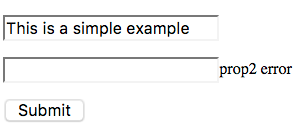

- **Java API:** [org.zkoss.zkmax.zul.Fragment](https://www.zkoss.org/javadoc/latest/zk/org/zkoss/zkmax/zul/Fragment.html)
- **JavaScript API:** [zkmax.wgt.Fragment](https://www.zkoss.org/javadoc/latest/jsdoc/classes/zkmax.wgt.Fragment.html)

Available for ZK: [`Enterprise Edition`](https://www.zkoss.org/whyzk/zkee)

## Employment/Purpose
The `Fragment` component in ZK allows developers to combine native HTML elements with ZK data binding syntax, enabling them to make static pages dynamic. By utilizing annotations such as `@save`, `@load`, `@bind`, `@command`, and `@global-command`, developers can create interactive and data-driven web applications.

## Example
The following example demonstrates how to use the `Fragment` component with MVVM data binding:



```xml
<zk>
    <fragment viewModel="@id('vm') @init('org.zkoss.fragment.demo.VM2')" validationMessages="@id('vmsgs')"
              form="@id('fx') @load(vm) @save(vm, before='submit') @validator(vm.formValidator)"
              prop1="@bind(fx.prop1)" prop1err="@bind(vmsgs['fkey1'])"
              prop2="@bind(fx.prop2)" prop2err="@bind(vmsgs['fkey2'])"><![CDATA[
        <p><input type="text" value="@bind(prop1)"/><span textContent="@load(prop1err)"/></p>
        <p><input type="text" value="@bind(prop2)"/><span textContent="@load(prop2err)"/></p>
        <button onclick="@command('submit')">Submit</button>
    ]]></fragment>
</zk>
```

In this example:
- `viewModel` defines the ViewModel class and initializes it.
- `validationMessages` holds validation messages for properties.
- `prop1` is bound to the ViewModel property `prop1`.
- `prop1err` is bound to the validation message for `prop1`.

## Data Binding
The `Fragment` component supports various annotations for data binding, such as `@save`, `@load`, `@bind`, `@command`, and `@global-command`. Developers can bind properties of the ViewModel to native HTML elements for dynamic interaction.

## Enclose with CDATA
Remember to mark the fragment content with the CDATA section to avoid being parsed by server-side binder and causing problems:

```xml
<fragment><![CDATA[
    ...
]]></fragment>
```

## Supported Bindings
The supported annotations for binding within a `Fragment` include:
- `@save`
    > syntax: @save([limited EL-expression])
- `@load`
    > syntax: @load(limited EL-expression)
- `@bind`
    > syntax: @bind(limited EL-expression)
- `@command`
    > syntax: @command(mybean.myproperty, [arbitraryKey]=[limited EL-expression])
- `@global-command`
    > syntax: @global-command(mybean.myproperty, [arbitraryKey]=[limited EL-expression])

## Limited EL-expression
Inside a fragment, it only supports partially, limited data binding expressions including bean dot notation, arithmetic operator, `!`, and `==`

## Put HTML as Text Content
Developers can use the `textContent` attribute to insert data into HTML elements within the `Fragment` component, facilitating dynamic content manipulation.

```xml
<zk>
    <fragment viewModel="@id('vm') @init('org.zkoss.zktest.test2.F85_ZK_3681_Command_VM')"
              status="@bind(vm.status)"><![CDATA[
        <div>
            <input type="checkbox" onchange="@command('onCheck', checked=event.checked)" />
            Check this checkbox: <span textContent="@load(status)"/>
        </div>

        <div>
            <button onclick="@global-command('callGlobal', text='Hello', num=1)">Call global (1)</button>
            <button onclick="@global-command('callGlobal', text='World', num=2)">Call global (2)</button>
        </div>
    ]]></fragment>
</zk>
```

## Shadow Elements
`Fragment` component supports conditional and collection rendering through shadow elements like `if` and `forEach` tags. These elements provide additional flexibility in defining the display logic within the component.

```xml
<zk>
    <fragment viewModel="@id('vm') @init('org.zkoss.zktest.test2.F85_ZK_3681_Shadow_VM')"
        issues="@bind(vm.issues)"><![CDATA[
        <section>
            <h1>My Issue List</h1>
            <ul>
                <forEach items="@load(issues)">
                    <!-- There's a pre-defined variable "each" for convenience. -->
                    <li>
                        <!-- @bind(each) is wrong because each is just a temp variable in loops. -->
                        <input type="checkbox" checked="@load(each.isDone)" />
                        <if test="@load(each.isDone)">
                            <strike>[<span textContent="@load(each.id)"/>]
                            <span textContent="@load(each.description)"/></strike>
                        </if>
                        <!-- No else for now. -->
                        <if test="@load(!each.isDone)">
                            [<span textContent="@load(each.id)"/>]
                            <span textContent="@load(each.description)"/>
                        </if>
                    </li>
                </forEach>
            </ul>
        <section>
    ]]></fragment>
</zk>
```

# Data Validation

## Server-side Property/Form Validation
To validate data on the server-side using ZK's validators, you can utilize the following syntax:

```xml
<zk>
    <fragment viewModel="@id('vm') @init('org.zkoss.fragment.demo.VM1')" validationMessages="@id('vmsgs')"
              prop1="@bind(vm.prop1) @validator(vm.validator1)"
              prop1err="@bind(vmsgs['prop1'])"><![CDATA[
        <input type="text" value="@bind(prop1)"/>
        <span textContent="@load(prop1err)"/>
    ]]></fragment>
</zk>
```

In this code snippet, you can see how to bind properties and validators to validate form fields. By assigning a custom key as an alias, you can access invalid messages easily.

To validate multiple fields using form binding and form validators, you can use the following approach:

```xml
<zk>
    <fragment viewModel="@id('vm') @init('foo.BarVM')" validationMessages="@id('vmsgs')"
     form="@id('fx') @load(vm.currentUser) @save(vm.currentUser, before='submit') @validator('formBeanValidator', prefix='p_')"
     name="@bind(fx.name)" nameerror="@bind(vmsgs['p_name'])"><![CDATA[
     <input type="text" value="@bind(name)"/><span textContent="@load(nameerror)"/>
     <button onclick="@command('submit')">Submit</button>
    ]]></fragment>
</zk>
```

This code snippet demonstrates how to validate form elements and display error messages for each field.

## Client-side Property Validation
ZK also provides client-side validation using the `@jsvalidator` attribute, allowing you to run custom JavaScript functions for validation without sending requests to the server for each validation. Here is an example:

`@jsvalidator`
> syntax: @jsvalidator(validation_function_name)

The following is the definition of custom JavaScript function.
> ValidationFunction(val, vmsgs)
> * val: The input data.
> * vmsgs: 
>    The validation message holder object. You can add an invalidate message by adding a new property. 
>    If you want to clear the specific message, assign an empty string to the property.
> * Returns: Boolean. True if the data is valid.

```xml
<zk>
    <fragment viewModel="@id('vm') @init('foo.BarVM')" someprop="@bind(vm.prop1)"><![CDATA[
        <input type="text" value="@bind(someprop) @jsvalidator('validateExample')"/>
        <span textContent="@load(vmsgs['foo'])"/>
    ]]></fragment>
    <script type="text/javascript">
        function validateExample(val, vmsgs) {
            var isValid = someValidationProcess(val);
            vmsgs['foo'] = isValid ? '' : 'Invalid value';
            return isValid;
        }
    </script>
</zk>
```

In this example, a custom JavaScript function `validateExample` is used to validate a property client-side and show error messages accordingly.

## The Differences Between @validator and @jsvalidator
Here are the key differences between `@validator` and `@jsvalidator` in ZK:

| Catalogue              | @validator                  | @jsvalidator            |
|------------------------|-----------------------------|-------------------------|
| Validate at            | Server side                 | Client side             |
| ZK form validation     | Supported                   | Not supported           |
| Validation message holder | Initialized in validationMessages | An implicit `vmsgs` object|

It's recommended to use server-side `@validator` for most cases due to security concerns, but you can use client-side `@jsvalidator` for instant feedback requirements like password strength or number range validation.


# Event Handling

ZK provides the ability to handle events in ViewModel by using `@command` or `@global-command` attributes on HTML elements. The ViewModels can execute commands based on DOM events such as `onclick`, `onkeydown`, `onchange`, etc. Here are some of the supported events and corresponding ZK Event objects:
<table class="wikitable" width="100%">
  <tbody>
    <tr>
      <th>ZK Event object</th>
      <th>DOM event</th>
    </tr>
    <tr>
      <td rowspan="10"><a href="https://www.zkoss.org/javadoc/latest/zk/org/zkoss/zk/ui/event/MouseEvent.html" title="org.zkoss.zk.ui.event.MouseEvent">MouseEvent</a></td>
      <td>onclick</td>
    </tr>
    <tr>
      <td>oncontextmenu</td>
    </tr>
    <tr>
      <td>ondblclick</td>
    </tr>
    <tr>
      <td>onmousedown</td>
    </tr>
    <tr>
      <td>onmouseenter</td>
    </tr>
    <tr>
      <td>onmouseleave</td>
    </tr>
    <tr>
      <td>onmouseover</td>
    </tr>
    <tr>
      <td>onmouseout</td>
    </tr>
    <tr>
      <td>onmouseup</td>
    </tr>
    <tr>
      <td>ondrag</td>
    </tr>
    <tr>
      <td rowspan="3"><a href="https://www.zkoss.org/javadoc/latest/zk/org/zkoss/zk/ui/event/KeyEvent.html" title="org.zkoss.zk.ui.event.KeyEvent">KeyEvent</a></td>
      <td>onkeydown</td>
    </tr>
    <tr>
      <td>onkeypress</td>
    </tr>
    <tr>
      <td>onkeyup</td>
    </tr>
    <tr>
      <td rowspan="2"><a href="https://www.zkoss.org/javadoc/latest/zk/org/zkoss/zk/ui/event/InputEvent.html" title="org.zkoss.zk.ui.event.InputEvent">InputEvent</a></td>
      <td>onchange</td>
    </tr>
    <tr>
      <td>oninput</td>
    </tr>
    <tr>
      <td rowspan="2"><a href="https://www.zkoss.org/javadoc/latest/zk/org/zkoss/zk/ui/event/CheckEvent.html" title="org.zkoss.zk.ui.event.CheckEvent">CheckEvent</a></td>
      <td>onchange (checkbox)</td>
    </tr>
    <tr>
      <td>oninput (checkbox)</td>
    </tr>
    <tr>
      <td><a href="https://www.zkoss.org/javadoc/latest/zk/org/zkoss/zk/ui/event/SelectionEvent.html" title="org.zkoss.zk.ui.event.SelectionEvent">SelectionEvent</a></td>
      <td>onselect</td>
    </tr>
    <tr>
      <td><a href="https://www.zkoss.org/javadoc/latest/zk/org/zkoss/zk/ui/event/DropEvent.html" title="org.zkoss.zk.ui.event.DropEvent">DropEvent</a></td>
      <td>ondrop</td>
    </tr>
    <tr>
      <td rowspan="4"><a href="https://www.zkoss.org/javadoc/latest/zk/org/zkoss/zk/ui/event/Event.html" title="org.zkoss.zk.ui.event.Event">Event</a></td>
      <td>onblur</td>
    </tr>
    <tr>
      <td>onfocus</td>
    </tr>
    <tr>
      <td>onfocusin</td>
    </tr>
    <tr>
      <td>onfocusout</td>
    </tr>
  </tbody>
</table>

For more details on retrieving the event object, you can refer to the [Retrieve Event Object](https://books.zkoss.org/zk-mvvm-book/8.0/advanced/parameters.html#retrieve-event-object) documentation.


## Properties
The `Fragment` component supports the following properties:
- `content`: Specify the content of the component.
- `src`: Specify the URI of an external content file.
- `recoverId`: Specify the recovery ID.

## Supported Events

| Name            | Event Type                                                          | Description |
|-----------------|---------------------------------------------------------------------|------------|
| `onRecover`     | **Event:** [Event](https://www.zkoss.org/javadoc/latest/zk/org/zkoss/zk/ui/event/Event.html) | Represents an event sent back to the server caused by an offline recovery. |

## Supported Children
- `*NONE`: This component does not support any child components.
