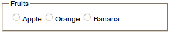
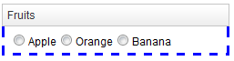
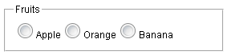
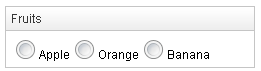

- **Demonstration:** [Groupbox Demo](https://www.zkoss.org/zkdemo/layout/group_box)
- **Java API:** [org.zkoss.zul.Groupbox](https://www.zkoss.org/javadoc/latest/zk/org/zkoss/zul/Groupbox.html)
- **JavaScript API:** [zul.wgt.Groupbox](https://www.zkoss.org/javadoc/latest/jsdoc/classes/zul.wgt.Groupbox.html)

## Employment/Purpose
The Groupbox component in ZK is used to group related components together visually. It provides a border around the components to indicate their relationship. The label displayed at the top of the group box can be created using the [Caption](caption) component, similar to the HTML legend element. Unlike the [Window](window) component, a group box does not own the ID space and cannot be overlapped or popped up.

## Common Use Cases

### Collapsible Content Panel

Use `closable="true"` (the default) together with the `3d` mold to give users a toggle to collapse sections of a form or dashboard:

```xml
<groupbox mold="3d" closable="true" width="400px">
    <caption label="Advanced Settings"/>
    <vlayout>
        <checkbox label="Enable debug logging"/>
        <checkbox label="Show developer toolbar"/>
    </vlayout>
</groupbox>
```

### Grouping Form Fields

Wrap related input fields in a groupbox to make long forms easier to scan. Use the `title` attribute for a quick label or a `<caption>` child for a richer header:

```xml
<groupbox title="Shipping Address" width="350px">
    <grid>
        <rows>
            <row>Street: <textbox/></row>
            <row>City: <textbox/></row>
            <row>Zip: <textbox/></row>
        </rows>
    </grid>
</groupbox>
```

### Applying Custom Border Style to the Content Area

Use `contentStyle` or `contentSclass` to style the inner content block independently from the groupbox border:

```xml
<groupbox mold="3d" width="350px"
    contentStyle="background:#f9f9f9; padding:8px">
    <caption label="Summary"/>
    <label value="Your order has been placed."/>
</groupbox>
```

### Setting the Default Mold Application-wide

To use the `3d` mold for all groupboxes without specifying it on every component, add the following to `/WEB-INF/zk.xml`:

```xml
<library-property>
    <name>org.zkoss.zul.Groupbox.mold</name>
    <value>3d</value>
</library-property>
```

## Example
In the provided example, a Groupbox is used to group a set of Radio components under the label "Fruits."



```xml
 <groupbox width="350px">
     <caption label="Fruits"/>
     <radiogroup>
         <radio label="Apple"/>
         <radio label="Orange"/>
         <radio label="Banana"/>
     </radiogroup>
 </groupbox>
```

Try it
*  [Groupbox with Caption](https://zkfiddle.org/sample/1j5b78e/1-ZK-Component-Reference-Groupbox-Example?v=latest&t=Iceblue_Compact)

## Properties

## ContentStyle

Specifies the CSS style for the content block of the groupbox.



```xml
<groupbox width="350px" mold="3d"
    contentStyle="border: 3px blue dashed;border-top:0px">
    <caption label="Fruits"/>
    <radiogroup>
        <radio label="Apple"/>
        <radio label="Orange"/>
        <radio label="Banana"/>
    </radiogroup>
</groupbox>
```

Try it

*  [Groupbox ContentStyle](https://zkfiddle.org/sample/1k2vv2g/1-ZK-Component-Reference-Groupbox-ContentStyle-Example?v=latest&t=Iceblue_Compact)

## ContentSclass

Specifies the CSS class for the content block of the groupbox.


```xml
<zk>
    <style>
    .mygroupbox-cnt {
        border: 3px blue dashed;
        border-top:0px
    }
    </style>
    <groupbox width="350px" mold="3d"
        contentSclass="mygroupbox-cnt">
        <caption label="Fruits"/>
        <radiogroup>
            <radio label="Apple"/>
            <radio label="Orange"/>
            <radio label="Banana"/>
        </radiogroup>
    </groupbox>
</zk>
```

Try it

* [Groupbox ContentSclass](https://zkfiddle.org/sample/304je74/1-ZK-Component-Reference-Groupbox-ContentSclass-Example?v=latest&t=Iceblue_Compact)

## Closable

**Default Value:** `true`

Specifies whether the groupbox can be collapsed or not.

```xml
<groupbox width="350px" mold="3d" closable="true">
```

**Note**: the function can only be applied when the [Caption](caption) or the title attribute exists.

## Open

**Default Value:** `true`

Specifies the display of the groupbox, whether it is open or closed.

```xml
<groupbox width="250px" mold="3d" open="false">
```

**Note**: false means the groupbox is closed, i.e., no content can appear.

## Title

**Default Value:** `""` (empty string)

Sets a plain-text label displayed at the top of the groupbox, before any [`Caption`](caption) child component. This attribute provides a lightweight alternative to adding a `<caption>` child when a simple text title is sufficient. When both `title` and a `<caption>` child are present, the `title` text is rendered first.



```xml
<groupbox title="Personal Information" width="350px">
    <vlayout>
        <textbox placeholder="First name"/>
        <textbox placeholder="Last name"/>
    </vlayout>
</groupbox>
```

## Supported Events

| Name | Event Type | Description |
|------|------------|-------------|
| `onOpen` | [OpenEvent](https://www.zkoss.org/javadoc/latest/zk/org/zkoss/zk/ui/event/OpenEvent.html) | The `onOpen` event signifies that the user has opened or closed a component. Unlike the `onClose` event, `onOpen` serves as a notification event sent after the opening or closing of the component. |

## Supported Molds
The available molds for the Groupbox component are:

| Name    | Snapshot                            |
|---------|-------------------------------------------|
| `default`   | |
| `3d`   | |

## Supported Children

`*ALL`: Indicates that the Groupbox component can have any kind of ZK component as its child element. This allows you to include any ZK component within the Groupbox, providing flexibility and customization options for your designs.

Note: Only one [`Caption`](caption) component is allowed in the `Groupbox` and it must be the first component.