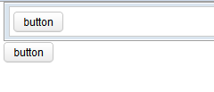

- Java API: [org.zkoss.zul.Idspace](https://www.zkoss.org/javadoc/latest/zk/org/zkoss/zul/Idspace.html)
- JavaScript API: [zul.wgt.Idspace](https://www.zkoss.org/javadoc/latest/jsdoc/classes/zul.wgt.Idspace.html)

## Employment/Purpose
The `Idspace` component, similar to a `Div`, implements the ID space in ZK. All descendant components of `Idspace`, including the `Idspace` itself, form an independent ID space. This allows developers to group components under a common ID space, simplifying the management of unique identifiers within each subset separately.

**Since**: 8.0.3

To group components without rendering a `Div`, `Idspace` provides a "nodom" mold. This mold renders a no-DOM widget on the client-side, only displaying comment nodes for positioning purposes. It is important to note that using `hflex` or `vflex` in the children of a nodom element is not recommended.

## Example

In this example, an `Idspace` component is used as the topmost component to group a `window` and a `div`, each containing a button with a unique ID and label. (Note: `window` is also an ID space in ZK.)



```xml
<idspace>
    <window border="normal">
        <button id="btn" label="button" />
    </window>
    <div>
        <button id="btn" label="button" />
    </div>
</idspace>
```

Try it

* [Idspace Example](https://zkfiddle.org/sample/164o6hq/1-ZK-Component-Reference-Idspace-Example?v=latest&t=Iceblue_Compact)

## Supported Children

`*ALL`: Indicates that the `Idspace` component can have any kind of ZK component as its child element. This allows you to include any ZK component within the `Idspace`, providing flexibility in structuring your UI. By grouping components under a common `Idspace`, you can simplify the management of unique identifiers within each subset separately.
