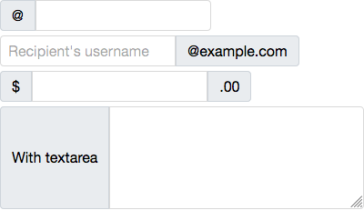
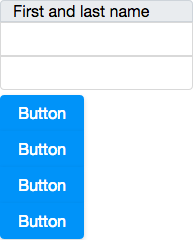

- **Demonstration:** [Inputgroup – organize your input components](https://www.zkoss.org/zkdemo/input/inputgroup)
- **Java API:** [`org.zkoss.zul.Inputgroup`](https://www.zkoss.org/javadoc/latest/zk/org/zkoss/zul/Inputgroup.html)
- **JavaScript API:** [`zul.wgt.Inputgroup`](https://www.zkoss.org/javadoc/latest/jsdoc/classes/zul.wgt.Inputgroup.html)



## Employment/Purpose
The Inputgroup component in ZK provides a way to prepend or append components to an input component, allowing for the creation of custom form-input components by merging different elements together. It allows for enhanced organization and layout flexibility in input forms.

## Common Use Cases

- **Prepend/append labels or symbols to text inputs** — place a currency sign (`$`), unit label (`kg`), or email domain (`@example.com`) directly beside an `<textbox>` so the two appear as a single merged control.
- **Button groups adjacent to inputs** — attach a `<button>` (e.g. "Search" or "Go") flush against a `<textbox>` or `<combobox>` without custom CSS.
- **Vertical input stacks** — use `orient="vertical"` to stack multiple inputs (e.g. first name / last name) under a shared label, keeping related fields visually grouped.
- **Mixed content rows** — combine `<label>`, `<textbox>`, `<combobox>`, and `<button>` children in a single `<inputgroup>` to build compound form controls such as price-range selectors or search bars with filters.

## Example
The Inputgroup component can be used in various ways to enhance the user interface and functionality of input forms. The following examples demonstrate different use cases:

1. **Basic Inputgroup:**
   
   The basic inputgroup example demonstrates how to prepend text to a textbox using the `@` symbol.

   

   ```xml
   <zk>
       <inputgroup>
           @<textbox />
       </inputgroup>
       
       <inputgroup>
           <textbox placeholder="Recipient's username"/>@example.com
       </inputgroup>
       
       <inputgroup>
           $<textbox/>.00
       </inputgroup>
       
       <inputgroup>
           With textarea
           <textbox multiline="true" rows="5" cols="30"/>
       </inputgroup>
   </zk>
   ```

   Try it

   * [Inputgroup with Basic](https://zkfiddle.org/sample/3j1g0he/1-ZK-Component-Reference-Inputgroup-Basic-Example?v=latest&t=Iceblue_Compact)

2. **Vertical Orientation:**
   
   The vertical orientation example shows how to set the inputgroup to display components vertically using the `orient` attribute.

   

   ```xml
   <zk>
        <inputgroup orient="vertical">
            First and last name<textbox/><textbox/>
        </inputgroup>
        
        <inputgroup orient="vertical">
            <button label="Button"/>
            <button label="Button"/>
            <button label="Button"/>
            <button label="Button"/>
        </inputgroup>
    </zk>
   ```

   Try it

   * [Inputgroup with Vertical](https://zkfiddle.org/sample/35fiuq3/1-ZK-Component-Reference-Inputgroup-Vertical-Example?v=latest&t=Iceblue_Compact)

## Properties

## Orient

**Default Value:** `horizontal`

Sets the orientation of the inputgroup. Accepted values:

| Value | Meaning |
|-------|---------|
| `horizontal` | Children are laid out in a row (default). |
| `vertical` | Children are stacked in a column. |

```xml
<inputgroup orient="vertical">
    First and last name
    <textbox placeholder="First"/>
    <textbox placeholder="Last"/>
</inputgroup>
```

## Supported Children
- [`Label`](label)
- [`InputElement`](inputelement)
- [`LabelImageElement`](labelimageelement)