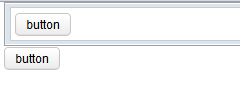

- **Demonstration:** [Nodom](https://www.zkoss.org/zkdemo/input/nodom)
- **Java API:** [org.zkoss.zul.NoDOM](https://www.zkoss.org/javadoc/latest/zk/org/zkoss/zul/NoDOM.html)
- **JavaScript API:** [zul.wgt.Nodom](https://www.zkoss.org/javadoc/latest/jsdoc/classes/zul.wgt.Nodom.html)

## Employment/Purpose

The `Nodom` component in ZK is a server-side Java object that does not render any DOM elements or JavaScript widgets at the client-side. Instead, it renders comment nodes for positioning. This makes it ideal for controlling a group of components without introducing unnecessary DOM elements. You can use the `Nodom` component as the outermost container to group components under a controller (such as a composer or ViewModel) instead of using a `Window` or a `Div`.

## Common Use Cases

### Grouping Components Without a DOM Wrapper

Use `nodom` when you need to attach a ViewModel or composer to a logical group of components but do not want to introduce a wrapping `<div>` or `<window>` in the rendered HTML. Because `nodom` emits only HTML comment nodes at the client side, the surrounding DOM structure stays clean.

```xml
<nodom viewModel="@id('vm')@init('foo.DashboardVM')">
    <grid model="@bind(vm.rows)">
        <columns><column label="Name"/></columns>
        <template name="model"><row><label value="@bind(each.name)"/></row></template>
    </grid>
    <paging pageSize="10" totalSize="@bind(vm.totalSize)"/>
</nodom>
```

### Replacing `<window>` as the Outermost Apply Target

Use `nodom` instead of `<window apply="..." />` when you want a composer or ViewModel to control multiple peer components without the visual frame or z-index stacking that `<window>` adds.

```xml
<nodom apply="foo.MyComposer">
    <div id="header"><label value="Header"/></div>
    <div id="content"><button id="saveBtn" label="Save"/></div>
</nodom>
```

**Note:** The `Nodom` component does not support using `hflex` or `vflex` properties within itself and its children components.

## Example



In the following example, the `Nodom` component is used as the outermost container to group components under a ViewModel. The example includes a `button` component inside a `window` and another `button` component inside a `div`.

```xml
<nodom viewModel="@id('vm')@init('foo.MyViewModel')">
	<window border="normal">
		<button id="btn" label="@init(vm.label)" />
	</window>
	<div>
		<button id="btn" label="@init(vm.label)" />
	</div>
</nodom>
```

```java
public class MyViewModel {

  public String getLabel() {
		return "button";
  }
}
```

Try it

* [Nodom Example](https://zkfiddle.org/sample/1l6ppia/2-ZK-Component-Reference-Nodom-Example?v=latest&t=Iceblue_Compact)

## Supported Children

`*ALL`: Indicates that the `Nodom` component can have any kind of ZK component as its child element. This allows you to include any ZK component within the `Nodom`, providing flexibility and customization options for your designs.
