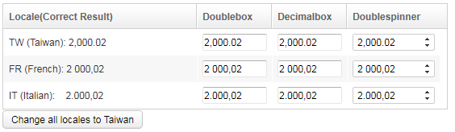

- Demonstration:[Number Input Element](http://www.zkoss.org/zkdemo/userguide/#f2)
- Java API: [org.zkoss.zul.impl.NumberInputElement](https://www.zkoss.org/javadoc/latest/zk/org/zkoss/zul/impl/NumberInputElement.html)
- JavaScript API: N/A

## Employment/Purpose
The ZK Number Input Element provides a skeletal implementation for a number-type input box. It allows users to input numerical values in various formats and locales.

## Per-component Locale
**Since**: 5.0.8
You can set a specific locale for each component using the NumberInputElement.

For example:



```xml
<grid width="550px">
    <columns>
        <column hflex="min" label="Locale (Correct Result)" />
        <column hflex="min" label="Doublebox" />
        <column hflex="min" label="Decimalbox" />
        <column hflex="min" label="Doublespinner" />
    </columns>
    <rows id="rows">
        <row>
            TW (Taiwan): 2,000.02
            <doublebox format="#,###.00" locale="zh_TW" value="2000.02" />
            <decimalbox format="#,###.00" locale="zh_TW" value="2000.02"/>
            <doublespinner format="#,###.00" locale="zh_TW" value="2000.02" step="0.5"/>
        </row>
        <row>
            FR (French): 2 000,02
            <doublebox format="#,###.00" locale="fr" value="2000.02" />
            <decimalbox format="#,###.00" locale="fr" value="2000.02"/>
            <doublespinner format="#,###.00" locale="fr" value="2000.02" step="0.5"/>
        </row>
        <row>
            <label pre="true">IT (Italian): 2.000,02</label>
            <doublebox format="#,###.00" locale="it" value="2000.02" />
            <decimalbox format="#,###.00" locale="it" value="2000.02"/>
            <doublespinner format="#,###.00" locale="it" value="2000.02" step="0.5"/>
        </row>
    </rows>
</grid>
<button label="Change all locales to Taiwan">
    <attribute name="onClick"><![CDATA[
        for(Iterator it = rows.getChildren().iterator(); it.hasNext();) {
            for(Iterator itt = it.next().getChildren().iterator(); itt.hasNext();) {
                Component c = itt.next();
                if (c instanceof org.zkoss.zul.impl.NumberInputElement)
                    c.setLocale("zh_TW");
            }
        }
    ]]></attribute>
</button>
```

Try it
*  [Number Input Elements](https://zkfiddle.org/sample/2kqnun7/1-ZK-Component-Reference-NumberInputElement-Example?v=latest&t=Iceblue_Compact)

## Supported Events
Inherited Supported Events: [FormatInputElement](formatinputelement#supported-events)

## Supported Children
`*NONE`: The number input element does not support any children.
