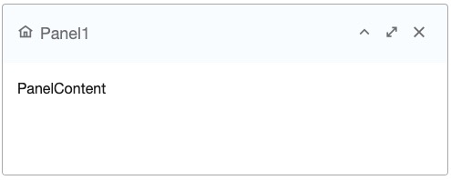
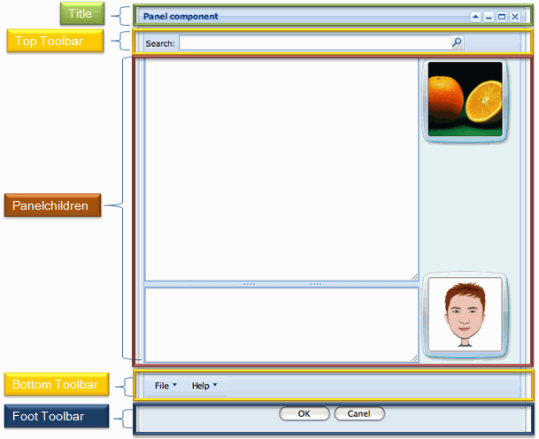

- **Demonstration**: [Panel](https://www.zkoss.org/zkdemo/window/panel)
- **Java API**: [org.zkoss.zul.Panel](https://www.zkoss.org/javadoc/latest/zk/org/zkoss/zul/Panel.html)
- **JavaScript API**: [zul.wnd.Panel](https://www.zkoss.org/javadoc/latest/jsdoc/classes/zul.wnd.Panel.html)

## Employment/Purpose

The Panel component in ZK is a versatile container that serves as a foundational building block for application-oriented user interfaces. It offers a variety of structural components such as top, bottom, and foot toolbars, along with distinct header, footer, and body sections. Some key functionalities of the Panel component include collapsible, closable, maximizable, and minimizable behavior. It also provides pre-built tool buttons that can be customized for specific actions. Panels can be easily embedded into ZUL components that allow children or layout components. Additionally, Panels offer features such as float and move. Unlike the Window component, a Panel can only be floated and moved within its parent node. The Panel is not an independent ID space, allowing the ID of each child to be used throughout the Panel.

## Example

### Simple Panel Example



```xml
<panel height="20%" style="margin-bottom:10px"
       title="Panel1" border="normal" maximizable="true" closable="true"
       collapsible="true">
    <caption iconSclass="z-icon-home"/>
    <panelchildren>PanelContent</panelchildren>
</panel>
```

In the above example, a Panel is created with specified attributes such as height, title, border, and buttons for maximizable, collapsible, and closable functionalities.

Try it

* [Panel Example](https://zkfiddle.org/sample/1t41t2r/1-ZK-Component-Reference-Panel-Example?v=latest&t=Iceblue_Compact)

### Java Example

```java
Panel panel = new Panel();
panel.setTitle("Here is Title");
panel.setBorder("normal");

Panelchildren pc = new Panelchildren();
pc.setParent(panel);
pc.appendChild(new Label("Here is Content"));
```

The Java example demonstrates the creation of a Panel programmatically and adding content to the Panel using a Panelchildren component.

## Properties

### Sizable

The Panel can be resized by setting the `sizable` attribute to `true`. The example below shows a resizable panel:

```xml
<panel sizable="true" id="panel" width="500px" height="400px"
    title="Panel"
    maximizable="true" minimizable="true" border="normal"
    collapsible="true" closable="true">
    <panelchildren>
        <textbox hflex="true" vflex="true" />
    </panelchildren>
</panel>
```

Try it

* [Panel Sizable](https://zkfiddle.org/sample/1bajqva/1-ZK-Component-Reference-Panel-Sizable-Example?v=latest&t=Iceblue_Compact)

### Draggable

When used with a PortalLayout, the `draggable` property can control whether the panel is draggable within the portal layout:

```xml
<portallayout>
   <portalchildren style="padding: 5px" width="30%">
      <panel height="150px" title="Google Tools" border="normal"
           collapsible="true" closable="true" maximizable="true"
           style="margin-bottom:10px">
         <panelchildren>
 
         </panelchildren>
      </panel>
      <panel height="300px" title="LabPixies Clock" border="normal"
           collapsible="true" closable="true" maximizable="true"
           style="margin-bottom:10px"
           draggable="false">
          <panelchildren>
             This is not draggable. 
          </panelchildren>
      </panel>
   </portalchildren>
</portallayout>
```

Try it

* [Panel Dragable](https://zkfiddle.org/sample/2rds9kh/1-ZK-Component-Reference-Panel-Draggable-Example?v=latest&t=Iceblue_Compact)


### Border

The `border` property specifies the style of the panel border, with options like `none` and `normal`.

### Title

The `title` attribute sets the title of the panel. You can also use the [Caption](caption) component to create more complex titles.

### Closable

The `closable` attribute determines whether a close button is displayed on the panel. An `onClose` event is triggered when the close button is clicked.

## Miscellaneous

### Scrollable Panel

To enable a scrollbar when the content exceeds the panel height, set `style="overflow: auto"` on the Panelchildren component.

```xml
<panel height="200px">
    <panelchildren style="overflow: auto">
        <div style="background: #999966" height="195px" />
        <div style="background: #669999">Div Content</div>
    </panelchildren>
</panel>
```

Try it

* [Panel Scrollable](https://zkfiddle.org/sample/lhk9fh/1-ZK-Component-Reference-Panel-Scrollable-Example?v=latest&t=Iceblue_Compact)


### Toolbar Positions

Panel supports three toolbar positions: `Top`, `Bottom`, and `Foot`. These toolbars can be added to the panel for specific functionalities.



```xml
<panel id="panel" width="500px" height="550px"
    title="Panel component" floatable="true" movable="true"
    maximizable="true" minimizable="true" border="normal"
    collapsible="true" closable="true">
    <toolbar>
      ... // Top Toolbar of the panel
    </toolbar>
    <panelchildren>
      ... // Content in the body of the panel
    </panelchildren>
    <toolbar>
      ... // Bottom Toolbar of the panel
    </toolbar>
    <toolbar>
      ... // Foot Toolbar of the panel
    </toolbar>
</panel>
```

Try it

* [Panel Scrollable](https://zkfiddle.org/sample/37ktdo8/1-ZK-Component-Reference-Panel-Toolbar-Example?v=latest&t=Iceblue_Compact)


- Top Toolbar (Line 5): It is used to display a toolbar at the top, close to the body content of the panel.
- Bottom Toolbar (Line 11): It is used to display a toolbar at the bottom, close to the body content of the panel.
- Foot Toolbar (Line 14): It is used to show operating buttons below the body content with some padding.

For more details, refer to [Using Panel to Lay out Your Website](https://www.zkoss.org/wiki/Small_Talks/2008/July/Using_Panel_to_Lay_out_Your_Website).

## Supported Events

| Name           | Event Type                                   |Description |
|----------------|----------------------------------------------|------------|
| `onMove`       | Event: [MoveEvent](https://www.zkoss.org/javadoc/latest/zk/org/zkoss/zk/ui/event/MoveEvent.html) | Denotes the position of the pnael is moved by a user. |
| `onOpen`       | Event: [OpenEvent](https://www.zkoss.org/javadoc/latest/zk/org/zkoss/zk/ui/event/OpenEvent.html) | Denotes user has opened or closed a component. This event is only a notification sent after opening or closing the component. It can be used for implementing load-on-demand by creating components the first time the panel is opened.|
| `onMaximize`   | Event: [MaximizeEvent](https://www.zkoss.org/javadoc/latest/zk/org/zkoss/zk/ui/event/MaximizeEvent.html) | Denotes user has maximized a component. |
| `onMinimize`   | Event: [MinimizeEvent](https://www.zkoss.org/javadoc/latest/zk/org/zkoss/zk/ui/event/MinimizeEvent.html) | Denotes user has minimized a component.|
| `onClose`      | Event: [OpenEvent](https://www.zkoss.org/javadoc/latest/zk/org/zkoss/zk/ui/event/OpenEvent.html) | Denotes the close button is pressed by a user, and the component shall detach itself. |
| `onSize`       | Event: [SizeEvent](https://www.zkoss.org/javadoc/latest/zk/org/zkoss/zk/ui/event/SizeEvent.html) | Denotes the panel's size is updated by a user.
 |
| `onZIndex`     | Event: [ZIndexEvent](https://www.zkoss.org/javadoc/latest/zk/org/zkoss/zk/ui/event/ZIndexEvent.html) | Denotes the panel's z-index is updated by a user.|

## Supported Children
- [`Caption`](caption): Indicates that the `Panel` can only have one child component of type `Caption`.
- [`Panelchildren`](panelchildren): Indicates that the `Panel` can only have one child component of type `Panelchildren`.
- [`Toolbar`](toolbar): Indicates that the `Panel` can have up to three `Toolbar` components, which can be positioned at the top, bottom, and foot sections of the `Panel`.
