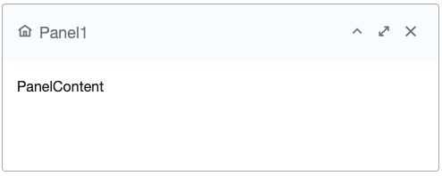
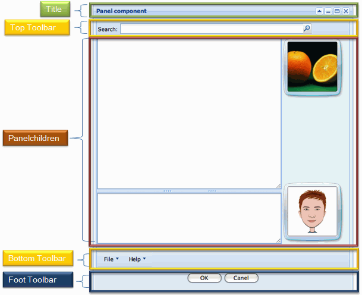

- **Demonstration**: [Panel](https://www.zkoss.org/zkdemo/window/panel)
- **Java API**: [org.zkoss.zul.Panel](https://www.zkoss.org/javadoc/latest/zk/org/zkoss/zul/Panel.html)
- **JavaScript API**: [zul.wnd.Panel](https://www.zkoss.org/javadoc/latest/jsdoc/classes/zul.wnd.Panel.html)

## Employment/Purpose

The Panel component in ZK is a versatile container that serves as a foundational building block for application-oriented user interfaces. It offers a variety of structural components such as top, bottom, and foot toolbars, along with distinct header, footer, and body sections. Some key functionalities of the Panel component include collapsible, closable, maximizable, and minimizable behavior. It also provides pre-built tool buttons that can be customized for specific actions. Panels can be easily embedded into ZUL components that allow children or layout components. Additionally, Panels offer features such as float and move. Unlike the Window component, a Panel can only be floated and moved within its parent node. The Panel is not an independent ID space, allowing the ID of each child to be used throughout the Panel.

## Common Use Cases

- **Collapsible dashboard panels**: Set `collapsible="true"` so users can collapse panels to free up screen space, combined with `title` or a `<caption>` child so the toggle button is visible.
- **Floating dialog substitute**: Set `floatable="true"` together with `movable="true"`, `top`, and `left` to position a panel like a lightweight floating dialog that stays within its parent layout.
- **Resizable workspace pane**: Enable `sizable="true"` and tune `minwidth`/`minheight` to constrain how small a user can drag the panel edges.
- **Maximize / minimize in portal layouts**: Pair `maximizable="true"` and `minimizable="true"` to give users full-screen or hidden states; handle `onMaximize` / `onMinimize` events in a composer for custom transitions.

## Example

### Simple Panel Example



```xml
<panel height="20%" style="margin-bottom:10px"
       title="Panel1" border="normal" maximizable="true" closable="true"
       collapsible="true">
    <caption iconSclass="z-icon-home"/>
    <panelchildren>PanelContent</panelchildren>
</panel>
```

In the above example, a Panel is created with specified attributes such as height, title, border, and buttons for maximizable, collapsible, and closable functionalities.

Try it

* [Panel Example](https://zkfiddle.org/sample/1t41t2r/1-ZK-Component-Reference-Panel-Example?v=latest&t=Iceblue_Compact)

### Java Example

```java
Panel panel = new Panel();
panel.setTitle("Here is Title");
panel.setBorder("normal");

Panelchildren pc = new Panelchildren();
pc.setParent(panel);
pc.appendChild(new Label("Here is Content"));
```

The Java example demonstrates the creation of a Panel programmatically and adding content to the Panel using a Panelchildren component.

## Properties

## Collapsible

**Default Value:** `false`

Sets whether to show a toggle button on the title bar that lets the user collapse or expand the panel body. The toggle button is only rendered when the panel has a `title` attribute or a `<caption>` child — it will not appear on a panel without a header.

When the user clicks the toggle button, an `onOpen` event is fired.

```xml
<panel title="My Panel" collapsible="true" border="normal">
    <panelchildren>Panel content here.</panelchildren>
</panel>
```

## Floatable

**Default Value:** `false`

Sets whether to float the panel so it is absolutely positioned and can overlay sibling content. When `floatable` is `true`, the panel is taken out of normal document flow. Use `top` and `left` (inherited from `HtmlBasedComponent`) to set the initial position explicitly; without a fixed position the panel renders at default offsets relative to its nearest absolutely-positioned ancestor.

Always assign an explicit `width` to a floatable panel; without one it expands to fill to the right edge of the viewport.

```xml
<panel title="Floating Panel" floatable="true"
       top="50px" left="100px" width="300px" border="normal">
    <panelchildren>Floating content.</panelchildren>
</panel>
```

## Maximizable

**Default Value:** `false`

Sets whether to display a maximize button on the title bar. When clicked, the button expands the panel to fill its offset parent (or the viewport when `floatable` is `true`), and automatically changes to a restore button that returns the panel to its previous size.

The maximize button is only rendered when the panel has a `title` attribute or a `<caption>` child.

```xml
<panel title="Maximizable Panel" maximizable="true" border="normal">
    <panelchildren>Content here.</panelchildren>
</panel>
```

## Maximized

**Default Value:** `false`

Sets the initial maximized state of the panel. When `true`, the panel renders already expanded to fill its offset parent. Setting this to `true` requires `maximizable="true"`; otherwise a `UiException` is thrown at runtime.

Setting `maximized` to `true` also implicitly clears any `minimized` state.

```xml
<panel title="Pre-maximized" maximizable="true" maximized="true" border="normal">
    <panelchildren>Content here.</panelchildren>
</panel>
```

## Minheight

**Default Value:** `100` (pixels)



Sets the minimum height in pixels allowed when the user resizes the panel. Only takes effect when `sizable="true"`. If a negative value is supplied, `100` is used instead.

```xml
<panel title="Sizable Panel" sizable="true" minheight="150"
       width="400px" height="300px" border="normal">
    <panelchildren>Resize me.</panelchildren>
</panel>
```

## Minimizable

**Default Value:** `false`

Sets whether to display a minimize button on the title bar. Clicking the button fires a `MinimizeEvent`; the actual minimize behavior (hiding the panel body, collapsing to title bar, etc.) must be implemented by the application by handling `onMinimize`.

The minimize button is only rendered when the panel has a `title` attribute or a `<caption>` child.

```xml
<panel title="Minimizable Panel" minimizable="true" border="normal"
       onMinimize="self.setMinimized(true)">
    <panelchildren>Content here.</panelchildren>
</panel>
```

## Minimized

**Default Value:** `false`

Sets the initial minimized state of the panel. When `true`, the panel renders as hidden (invisible). Setting this to `true` requires `minimizable="true"`; otherwise a `UiException` is thrown at runtime.

Setting `minimized` to `true` also implicitly clears any `maximized` state.

```xml
<panel title="Pre-minimized" minimizable="true" minimized="true" border="normal">
    <panelchildren>Content here.</panelchildren>
</panel>
```

## Minwidth

**Default Value:** `200` (pixels)



Sets the minimum width in pixels allowed when the user resizes the panel. Only takes effect when `sizable="true"`. If a negative value is supplied, `200` is used instead.

```xml
<panel title="Sizable Panel" sizable="true" minwidth="250"
       width="400px" height="300px" border="normal">
    <panelchildren>Resize me.</panelchildren>
</panel>
```

## Movable

**Default Value:** `false`

Sets whether the user can drag the panel to a new position. This property only has effect when `floatable="true"` — a non-floatable panel cannot be moved.

```xml
<panel title="Movable Panel" floatable="true" movable="true"
       top="80px" left="120px" width="320px" border="normal">
    <panelchildren>Drag the title bar to move.</panelchildren>
</panel>
```

## Open

**Default Value:** `true`

Sets whether the panel body is visible (open). Setting `open="false"` hides the panel body and renders the panel in a collapsed state without requiring `collapsible="true"`. Unlike `minimized`, this does not affect the panel's visibility in the page flow.

```xml
<panel title="Closed Panel" open="false" border="normal">
    <panelchildren>This content is hidden until opened.</panelchildren>
</panel>
```

## Sizable

The Panel can be resized by setting the `sizable` attribute to `true`. The example below shows a resizable panel:

```xml
<panel sizable="true" id="panel" width="500px" height="400px"
    title="Panel"
    maximizable="true" minimizable="true" border="normal"
    collapsible="true" closable="true">
    <panelchildren>
        <textbox hflex="true" vflex="true" />
    </panelchildren>
</panel>
```

Try it

* [Panel Sizable](https://zkfiddle.org/sample/1bajqva/1-ZK-Component-Reference-Panel-Sizable-Example?v=latest&t=Iceblue_Compact)

### Scrollable Panel

To enable a scrollbar when the content exceeds the panel height, set `style="overflow: auto"` on the Panelchildren component.

```xml
<panel height="200px">
    <panelchildren style="overflow: auto">
        <div style="background: #999966" height="195px" />
        <div style="background: #669999">Div Content</div>
    </panelchildren>
</panel>
```

Try it

* [Panel Scrollable](https://zkfiddle.org/sample/lhk9fh/1-ZK-Component-Reference-Panel-Scrollable-Example?v=latest&t=Iceblue_Compact)

### Toolbar Positions

Panel supports three toolbar positions: `Top`, `Bottom`, and `Foot`. These toolbars can be added to the panel for specific functionalities.



```xml
<panel id="panel" width="500px" height="550px"
    title="Panel component" floatable="true" movable="true"
    maximizable="true" minimizable="true" border="normal"
    collapsible="true" closable="true">
    <toolbar>
      ... // Top Toolbar of the panel
    </toolbar>
    <panelchildren>
      ... // Content in the body of the panel
    </panelchildren>
    <toolbar>
      ... // Bottom Toolbar of the panel
    </toolbar>
    <toolbar>
      ... // Foot Toolbar of the panel
    </toolbar>
</panel>
```

Try it

* [Panel Scrollable](https://zkfiddle.org/sample/37ktdo8/1-ZK-Component-Reference-Panel-Toolbar-Example?v=latest&t=Iceblue_Compact)

- Top Toolbar (Line 5): It is used to display a toolbar at the top, close to the body content of the panel.
- Bottom Toolbar (Line 11): It is used to display a toolbar at the bottom, close to the body content of the panel.
- Foot Toolbar (Line 14): It is used to show operating buttons below the body content with some padding.

For more details, refer to [Using Panel to Lay out Your Website](https://www.zkoss.org/wiki/Small_Talks/2008/July/Using_Panel_to_Lay_out_Your_Website)

## Supported Events

| Name           | Event Type | Description |
|----------------|----------------------------------------------|------------|
| `onMove`       | [MoveEvent](https://www.zkoss.org/javadoc/latest/zk/org/zkoss/zk/ui/event/MoveEvent.html) | Denotes the position of the panel is moved by a user. |
| `onOpen`       | [OpenEvent](https://www.zkoss.org/javadoc/latest/zk/org/zkoss/zk/ui/event/OpenEvent.html) | Denotes user has opened or closed a component. This event is only a notification sent after opening or closing the component. It can be used for implementing load-on-demand by creating components the first time the panel is opened.|
| `onMaximize`   | [MaximizeEvent](https://www.zkoss.org/javadoc/latest/zk/org/zkoss/zk/ui/event/MaximizeEvent.html) | Denotes user has maximized a component. |
| `onMinimize`   | [MinimizeEvent](https://www.zkoss.org/javadoc/latest/zk/org/zkoss/zk/ui/event/MinimizeEvent.html) | Denotes user has minimized a component.|
| `onClose`      | [Event](https://www.zkoss.org/javadoc/latest/zk/org/zkoss/zk/ui/event/Event.html) | Denotes the close button is pressed by a user, and the component shall detach itself. |
| `onSize`       | [SizeEvent](https://www.zkoss.org/javadoc/latest/zk/org/zkoss/zk/ui/event/SizeEvent.html) | Denotes the panel's size is updated by a user. |
| `onZIndex`     | [ZIndexEvent](https://www.zkoss.org/javadoc/latest/zk/org/zkoss/zk/ui/event/ZIndexEvent.html) | Denotes the panel's z-index is updated by a user.|

## Supported Children
- [`Caption`](caption): Indicates that the `Panel` can only have one child component of type `Caption`.
- [`Panelchildren`](panelchildren): Indicates that the `Panel` can only have one child component of type `Panelchildren`.
- [`Toolbar`](toolbar): Indicates that the `Panel` can have up to three `Toolbar` components, which can be positioned at the top, bottom, and foot sections of the `Panel`.
