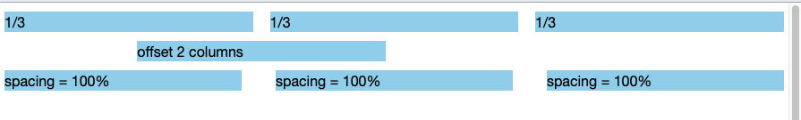

- **Demonstration:** [Rowlayout](https://www.zkoss.org/zkdemo/layout/rowlayout)
- **Java API:** [org.zkoss.zkmax.zul.Rowlayout](https://www.zkoss.org/javadoc/latest/zk/org/zkoss/zkmax/zul/Rowlayout.html)
- **JavaScript API:** [zkmax.layout.Rowlayout](https://www.zkoss.org/javadoc/latest/jsdoc/classes/zkmax.layout.Rowlayout.html)



# Employment/Purpose

A `rowlayout` lays out a container which can have multiple columns, it
offers a 12-column grid out of the box. You can simply chooses the
number of columns to occupy for each major content area, and may also
skip columns for extra space without inserting space-inducing elements.

The following diagram illustrates the rowlayout/rowchildren components
and their various configurable parameters.


# Example

Using rowlayout component is simple. First, use rowlayout to divide the
horizontal space of its parent container into a number of columns. You
can also optionally specify the column/spacing ratio. The default number
of columns is 12, and the default column/spacing ratio is 1/3, which
means column is 3 times wider than the spacing between columns. Spacing
could be given as a ratio, a percentage or a floating-point number.

Next, use rowchildren component to place components into an integral
number of these columns. You can also optionally specify how many
columns to skip ahead.

### Equally Divided

```xml
    <rowlayout ncols="12">
        <forEach begin="1" end="3">
            <rowchildren colspan="4" style="background-color: skyblue">
                1/3
            </rowchildren>
        </forEach>
    </rowlayout>
```

### Position Offset

```xml
    <rowlayout ncols="12">
        <rowchildren colspan="4" style="background-color: skyblue" offset="2">
            offset 2 columns
        </rowchildren>
    </rowlayout>
```

### Column Spacing

```xml
    <rowlayout ncols="12" spacing="100%">
        <forEach begin="1" end="3">
            <rowchildren colspan="4" style="background-color: skyblue">
                spacing = 100%
            </rowchildren>
        </forEach>
    </rowlayout>
```

The above examples look like: 

## Common Use Cases

### Responsive Equal-Width Columns

Use `ncols` together with `rowchildren colspan` to create equal-width column layouts. A 12-column grid is the default; set `colspan` to the same fraction (e.g. `4` for three equal columns, `6` for two).

```xml
<rowlayout ncols="12">
    <rowchildren colspan="4" style="background-color: #cfe2ff">Column 1</rowchildren>
    <rowchildren colspan="4" style="background-color: #d1e7dd">Column 2</rowchildren>
    <rowchildren colspan="4" style="background-color: #fff3cd">Column 3</rowchildren>
</rowlayout>
```

### Offsetting Columns

Use the `offset` attribute on `rowchildren` to skip columns and create whitespace before a child. The `offset` value is counted in the same column units as `colspan`.

```xml
<rowlayout ncols="12">
    <rowchildren colspan="4" offset="2" style="background-color: #cfe2ff">
        starts at column 3
    </rowchildren>
</rowlayout>
```

### Adjusting Column Spacing

Control the visual gap between columns with the `spacing` attribute. A larger ratio produces wider gutters; `"0"` eliminates spacing entirely.

```xml
<!-- Wider gutters: spacing equals half the column width -->
<rowlayout ncols="12" spacing="1/2">
    <rowchildren colspan="6" style="background-color: #cfe2ff">Left</rowchildren>
    <rowchildren colspan="6" style="background-color: #d1e7dd">Right</rowchildren>
</rowlayout>

<!-- No gutters -->
<rowlayout ncols="12" spacing="0">
    <rowchildren colspan="6" style="background-color: #cfe2ff">Left</rowchildren>
    <rowchildren colspan="6" style="background-color: #d1e7dd">Right</rowchildren>
</rowlayout>
```

### Stacking Rows to Form a Grid

Stack multiple `rowlayout` elements with the same `ncols` and `spacing` inside a common container to build a multi-row grid. All rows share the same column widths because they inherit the container width.

```xml
<div>
    <rowlayout ncols="12">
        <rowchildren colspan="6" style="background-color: #cfe2ff">Row 1, Col A</rowchildren>
        <rowchildren colspan="6" style="background-color: #d1e7dd">Row 1, Col B</rowchildren>
    </rowlayout>
    <rowlayout ncols="12">
        <rowchildren colspan="6" style="background-color: #fff3cd">Row 2, Col A</rowchildren>
        <rowchildren colspan="6" style="background-color: #f8d7da">Row 2, Col B</rowchildren>
    </rowlayout>
</div>
```

# Properties

## Ncols

**Default Value:** `12`

Sets the number of columns to divide the row into. The minimum accepted value is `1`; any value less than 1 is silently clamped to 1.

```xml
<rowlayout ncols="6">
    <rowchildren colspan="3" style="background-color: skyblue">left half</rowchildren>
    <rowchildren colspan="3" style="background-color: lightcoral">right half</rowchildren>
</rowlayout>
```

## Spacing

**Default Value:** `"0.333333333333333"` (i.e. 1/3 — spacing is one-third the column width)

Sets the spacing between columns as a ratio relative to a single column width. The value can be expressed in three equivalent notations:

| Notation | Example | Meaning |
|---|---|---|
| Ratio (fraction) | `"1/3"` | spacing = 1 &divide; 3 of column width |
| Percentage | `"33.3%"` | spacing = 33.3% of column width |
| Decimal | `"0.3333"` | spacing = 0.3333 of column width |

Any negative value is clamped to `0` (no spacing). An invalid string that cannot be parsed as one of these forms throws an `IllegalArgumentException`.

```xml
<rowlayout ncols="12" spacing="50%">
    <rowchildren colspan="4" style="background-color: skyblue">A</rowchildren>
    <rowchildren colspan="4" style="background-color: lightcoral">B</rowchildren>
    <rowchildren colspan="4" style="background-color: lightgreen">C</rowchildren>
</rowlayout>
```

# Supported Events

- Inherited Supported Events: [ XulElement]({{site.baseurl}}/zk_component_ref/xulelement#Supported_Events)

# Supported Children

`*`[` Rowchildren`]({{site.baseurl}}/zk_component_ref/rowchildren)
