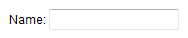

- **Java API:** [org.zkoss.zul.Span](https://www.zkoss.org/javadoc/latest/zk/org/zkoss/zul/Span.html)
- **JavaScript API:** [zul.wgt.Span](https://www.zkoss.org/javadoc/latest/jsdoc/classes/zul.wgt.Span.html)

## Employment/Purpose

The `Span` component in ZK is a lightweight container used for grouping child components. It is typically utilized for purposes such as assigning CSS styles or creating more complex layouts within ZK applications. Conceptually, the `Span` component functions similarly to HTML's SPAN tag. Notably, content placed within a `Span` is displayed inline with other sibling elements, without introducing line breaks between them.

## Common Use Cases

- **Inline styling of a group of components** — Wrap related components in a `<span>` and set a `style` or `sclass` attribute to apply visual formatting (e.g. color, font weight) to the entire group without introducing a block-level line break.

  ```xml
  <span style="color:red; font-weight:bold;">
      <label value="Error:" />
      <label value="Invalid input" />
  </span>
  ```

- **Inline label-plus-input pairing** — Place a descriptive label and its associated input field inside a `<span>` so they flow side-by-side within a form row without extra `<div>` or `<hbox>` overhead.

  ```xml
  <span>
      Name: <textbox />
  </span>
  ```

- **Conditional visibility toggling** — Apply `visible="false"` to a `<span>` to hide or show a group of inline components together in response to user actions or ViewModel state.

  ```xml
  <span visible="${vm.showDetails}">
      <label value="${vm.detail}" />
      <button label="Edit" onClick="@command('edit')" />
  </span>
  ```

# Example

The example illustrates the usage of the `Span` component in a ZK application. Within the `Span` container, a label "Name:" is followed by a textbox input field.



```xml
<span>
    Name:
    <textbox />
</span>
```

Try it

* [Span Example](https://zkfiddle.org/sample/1lopfso/1-ZK-Component-Reference-Span-Example?v=latest&t=Iceblue_Compact)

## Supported Children

`*ALL`: The `Span` component is a container component that can hold various kinds of components. It allows you to add any kind of component as its child.
