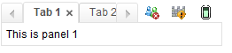
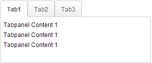
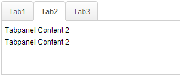
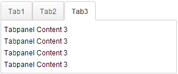

# Tabbox

- **Demonstration:** [Tabbox Demo](https://www.zkoss.org/zkdemo/tabbox)
- **Java API:** [`org.zkoss.zul.Tabbox`](https://www.zkoss.org/javadoc/latest/zk/org/zkoss/zul/Tabbox.html)
- **JavaScript API:** [`zul.tab.Tabbox`](https://www.zkoss.org/javadoc/latest/jsdoc/classes/zul.tab.Tabbox.html)

## Employment/Purpose

A Tabbox is a container used to display multiple tabbed groups of components. It provides a row of tabs at the top (or left or other location) of the tabbox, allowing users to switch between different groups. This component is helpful for organizing a large number of components into distinct groups contained within tab panels. Only one group is visible at a time, simplifying the user interface. When a tab of an invisible group is clicked, it becomes visible while the previously visible group becomes invisible. The currently visible group is referred to as ''selected''.

Developers can retrieve the selected group using [`org.zkoss.zul.Tabbox#getSelectedPanel()`](https://www.zkoss.org/javadoc/latest/zk/org/zkoss/zul/Tabbox.html#getSelectedPanel()) or [`org.zkoss.zul.Tabbox#getSelectedIndex()`](https://www.zkoss.org/javadoc/latest/zk/org/zkoss/zul/Tabbox.html#getSelectedIndex()).

## Example

The example below demonstrates the usage of a Tabbox component with two sets of tabs and tab panels. The first Tabbox is displayed with two tabs while the second Tabbox is using the 'accordion' mold to display two tabs in an accordion style.


```xml
<zk>
	<tabbox width="400px">
		<tabs>
			<tab label="Tab 1" />
			<tab label="Tab 2" />
		</tabs>
		<tabpanels>
			<tabpanel>This is panel 1</tabpanel>
			<tabpanel>This is panel 2</tabpanel>
		</tabpanels>
	</tabbox>
	<space />
	<tabbox width="400px" mold="accordion">
		<tabs>
			<tab label="Tab 3" />
			<tab label="Tab 4" />
		</tabs>
		<tabpanels>
			<tabpanel>This is panel 3</tabpanel>
			<tabpanel>This is panel 4</tabpanel>
		</tabpanels>
	</tabbox>
</zk>
```

Try it

* [Tabbox](https://zkfiddle.org/sample/cd1tff/1-ZK-Component-Reference-Tabbox-Example?v=latest&t=Iceblue_Compact)


## Properties and Features

### Toolbar in Tabbox

The Tabbox component supports the inclusion of other controls within its tab bar, allowing for additional layout options such as creating layouts with a toolbar acting as a menu system. The example below shows a Tabbox with extra controls in the tab bar acting like a menu system.

Note: Toolbar in Tabbox only works in a horizontal(top/bottom) orient Tabbox.


```xml
<tabbox width="250px">
	<tabs>
		<tab label="Tab 1" closable="true" />
		<tab label="Tab 2" closable="true" />
		<tab label="Tab 3" closable="true" />
		<tab label="Tab 4" closable="true" />
		<tab label="Tab 5" closable="true" />
	</tabs>
	<toolbar>
		<toolbarbutton image="/img/live.gif" onClick='alert("Live")' />
		<toolbarbutton image="/img/defender.gif" onClick='alert("Defender")' />
		<toolbarbutton image="/img/battery.gif" onClick='alert("Battery")' />
	</toolbar>
	<tabpanels>
		<tabpanel>This is panel 1</tabpanel>
		<tabpanel>This is panel 2 The second panel</tabpanel>
		<tabpanel>This is panel 3</tabpanel>
		<tabpanel>This is panel 4</tabpanel>
		<tabpanel>This is panel 5</tabpanel>
	</tabpanels>
</tabbox>
```

Try it

* [Tabbox Toolbar](https://zkfiddle.org/sample/27mram5/1-ZK-Component-Reference-Tabbox-Toolbar-Example?v=latest&t=Iceblue_Compact)


### MaximalHeight

Starting from version 7.0.0, the Tabbox component introduced the `MaximalHeight` feature to ensure all tab panels have the same maximum height. This feature sets the maximum height among all tab panels, ensuring consistent height across all tabs. The screenshot below demonstrates a Tabbox with 3 tab panels using the `MaximalHeight` feature.

Note: The Client ROD feature will be disabled if it is set to true.

  

```xml
<tabbox maximalHeight="true" width="300px">
	<tabs id="tabs0">
		<tab label="Tab1" />
		<tab label="Tab2" />
		<tab label="Tab3" />
	</tabs>
	<tabpanels id="pnls0">
		<tabpanel>
			<div>Tabpanel Content 1</div>
			<div>Tabpanel Content 1</div>
			<div>Tabpanel Content 1</div>
		</tabpanel>
		<tabpanel>
			<div>Tabpanel Content 2</div>
			<div>Tabpanel Content 2</div>
		</tabpanel>
		<tabpanel>
			<div>Tabpanel Content 3</div>
			<div>Tabpanel Content 3</div>
			<div>Tabpanel Content 3</div>
			<div>Tabpanel Content 3</div>
		</tabpanel>
	</tabpanels>
</tabbox>
```

Try it

* [Tabbox MaximalHeight](https://zkfiddle.org/sample/3b2hmvq/1-ZK-Component-Reference-Tabbox-MaximalHeight-Example?v=latest&t=Iceblue_Compact)

## Supported Events

| **Name**   | **Event Type**                            |Description |
|------------|-------------------------------------------|------------|
| `onSelect` | **Event:** [SelectEvent](https://www.zkoss.org/javadoc/latest/zk/org/zkoss/zk/ui/event/SelectEvent.html) | Denotes user has selected a tab. onSelect is sent to both tab and tabbox.|

## Supported Molds

| **Name**   | **Snapshot**                            |
|------------|-------------------------------------------|
|**Default:** ||
| **Accordion:** | |

## Supported Orients

| **Name**   | **Snapshot**                            |
|------------|-------------------------------------------|
|**Top:**| |
|**Left:**| |
|**Right:**| |
|**Bottom:**| |

## Supported Children
- [`Tabs`](tabs): Indicates that the `Tabbox` can only have one child component of type `Tabs`.
- [`Tabpanels`](tabpanels): Indicates that the `Tabbox` can only have one child component of type `Tabpanels`.
- [`Toolbar`](toolbar): Indicates that the `Tabbox` can only have one child component of type `Toolbar`.