- **Demonstration:** [Tabbox Demo](https://www.zkoss.org/zkdemo/tabbox)
- **Java API:** [`org.zkoss.zul.Tabbox`](https://www.zkoss.org/javadoc/latest/zk/org/zkoss/zul/Tabbox.html)
- **JavaScript API:** [`zul.tab.Tabbox`](https://www.zkoss.org/javadoc/latest/jsdoc/classes/zul.tab.Tabbox.html)

# Employment/Purpose

A Tabbox is a container used to display multiple tabbed groups of components. It provides a row of tabs at the top (or left or other location) of the tabbox, allowing users to switch between different groups. This component is helpful for organizing a large number of components into distinct groups contained within tab panels. Only one group is visible at a time, simplifying the user interface. When a tab of an invisible group is clicked, it becomes visible while the previously visible group becomes invisible. The currently visible group is referred to as ''selected''.

Developers can retrieve the selected group using [`org.zkoss.zul.Tabbox#getSelectedPanel()`](https://www.zkoss.org/javadoc/latest/zk/org/zkoss/zul/Tabbox.html#getSelectedPanel()) or [`org.zkoss.zul.Tabbox#getSelectedIndex()`](https://www.zkoss.org/javadoc/latest/zk/org/zkoss/zul/Tabbox.html#getSelectedIndex()).

## Common Use Cases

- **Wizard / multi-step forms** — place each step in a separate `<tabpanel>` so users can jump to any step by clicking its tab.
- **Settings / preference dialogs** — group related options (General, Security, Notifications) in distinct tab panels to keep the UI uncluttered.
- **Accordion navigation panels** — use `mold="accordion"` or `mold="accordion-lite"` to build collapsible side menus where only one section is expanded at a time.
- **Vertical tab navigation** — set `orient="left"` or `orient="right"` to render the tab strip as a vertical sidebar, suitable for dashboards with many categories.

# Example

The example below demonstrates the usage of a Tabbox component with two sets of tabs and tab panels. The first Tabbox is displayed with two tabs while the second Tabbox is using the 'accordion' mold to display two tabs in an accordion style.

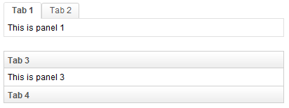

```xml
<zk>
	<tabbox width="400px">
		<tabs>
			<tab label="Tab 1" />
			<tab label="Tab 2" />
		</tabs>
		<tabpanels>
			<tabpanel>This is panel 1</tabpanel>
			<tabpanel>This is panel 2</tabpanel>
		</tabpanels>
	</tabbox>
	<space />
	<tabbox width="400px" mold="accordion">
		<tabs>
			<tab label="Tab 3" />
			<tab label="Tab 4" />
		</tabs>
		<tabpanels>
			<tabpanel>This is panel 3</tabpanel>
			<tabpanel>This is panel 4</tabpanel>
		</tabpanels>
	</tabbox>
</zk>
```

Try it

* [Tabbox](https://zkfiddle.org/sample/cd1tff/1-ZK-Component-Reference-Tabbox-Example?v=latest&t=Iceblue_Compact)

# Accessibility

 <!--REQUIRED ZK EDITION: PE -->


## Keyboard Support

| Key | Description |
|---|---|
| <b>Horizontal:</b> ArrowLeft / ArrowRight<br/> <b>Vertical:</b> ArrowUp / ArrowDown | Navigate tabs. |
| Enter / Spacebar | Select the tab. |
| Delete | Close the tab. (only if <b>closable</b> is enabled) |



# Properties

## Engine



Sets the `TabboxEngine` implementation used to render tabs from a `ListModel`. This is a ZK EE feature — assigning a custom engine is only relevant when `model` is also set. The default engine is resolved from the library property `org.zkoss.zul.tabbox.engine.class`.

```xml
<tabbox engine="com.example.MyTabboxEngine" />
```

## MaximalHeight

**Default Value:** `false`

Starting from version 7.0.0, the Tabbox component introduced the `MaximalHeight` feature to ensure all tab panels have the same maximum height. This feature sets the maximum height among all tab panels, ensuring consistent height across all tabs. The screenshot below demonstrates a Tabbox with 3 tab panels using the `MaximalHeight` feature.

Note: The Client ROD feature will be disabled if it is set to true.

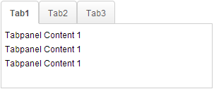 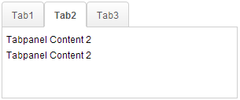 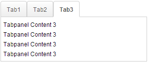

```xml
<tabbox maximalHeight="true" width="300px">
	<tabs id="tabs0">
		<tab label="Tab1" />
		<tab label="Tab2" />
		<tab label="Tab3" />
	</tabs>
	<tabpanels id="pnls0">
		<tabpanel>
			<div>Tabpanel Content 1</div>
			<div>Tabpanel Content 1</div>
			<div>Tabpanel Content 1</div>
		</tabpanel>
		<tabpanel>
			<div>Tabpanel Content 2</div>
			<div>Tabpanel Content 2</div>
		</tabpanel>
		<tabpanel>
			<div>Tabpanel Content 3</div>
			<div>Tabpanel Content 3</div>
			<div>Tabpanel Content 3</div>
			<div>Tabpanel Content 3</div>
		</tabpanel>
	</tabpanels>
</tabbox>
```

Try it

* [Tabbox MaximalHeight](https://zkfiddle.org/sample/3b2hmvq/1-ZK-Component-Reference-Tabbox-MaximalHeight-Example?v=latest&t=Iceblue_Compact)

## Model



Associates a `ListModel` with the tabbox so that tabs and tabpanels are rendered dynamically by the engine. [ZK EE]

The model must also implement `Selectable`. Assigning a non-null model (even the same instance) always triggers a full re-render. Set to `null` to detach the model and revert to static children.

```xml
<zscript>
    ListModel tabModel = new ListModelList(new String[]{"Tab A", "Tab B"});
</zscript>
<tabbox model="${tabModel}" tabboxRenderer="com.example.MyTabboxRenderer" />
```

## Orient



**Default Value:** `"top"`

Positions the tab strip relative to the content area. Not supported in accordion molds — setting `orient` on an accordion tabbox throws `WrongValueException`. A toolbar inside the tabbox also prevents vertical orients.

| Value | Meaning |
|---|---|
| `top` | Tab strip above the content panels (default). Replaces legacy `"horizontal"`. |
| `bottom` | Tab strip below the content panels. |
| `left` | Tab strip to the left of the content panels. Replaces legacy `"vertical"`. |
| `right` | Tab strip to the right of the content panels. |
| `horizontal` | Alias for `top` (accepted for backward compatibility). |
| `vertical` | Alias for `left` (accepted for backward compatibility). |

```xml
<tabbox orient="left" width="400px">
	<tabs>
		<tab label="Section A" />
		<tab label="Section B" />
	</tabs>
	<tabpanels>
		<tabpanel>Content A</tabpanel>
		<tabpanel>Content B</tabpanel>
	</tabpanels>
</tabbox>
```

## PanelSpacing

**Default Value:** `null` (no spacing)

Sets the spacing between `<tabpanel>` elements. This property is primarily used by accordion molds to control the visual gap between collapsed panels. Accepts any valid CSS length string (e.g. `"5px"`, `"0.5em"`). An empty string is treated as `null`.

```xml
<tabbox mold="accordion" panelSpacing="5px">
	<tabs><tab label="A" /><tab label="B" /></tabs>
	<tabpanels>
		<tabpanel>Content A</tabpanel>
		<tabpanel>Content B</tabpanel>
	</tabpanels>
</tabbox>
```

## SelectedIndex

**Default Value:** `-1` (no selection if no tabs exist)

Selects the tab at the given zero-based index. Passing a negative value selects the first tab. Throws `IllegalStateException` if the tabbox has no `<tabs>` child.

```xml
<tabbox selectedIndex="1">
	<tabs><tab label="Tab 1" /><tab label="Tab 2" /></tabs>
	<tabpanels>
		<tabpanel>Panel 1</tabpanel>
		<tabpanel>Panel 2</tabpanel>
	</tabpanels>
</tabbox>
```

## SelectedPanel

Selects the tab whose linked `<tabpanel>` matches the given panel. The panel must be a direct child of this tabbox's `<tabpanels>`; otherwise `UiException` is thrown. This is a convenient alternative to `selectedTab` or `selectedIndex` when you already hold a reference to the panel. Because it takes a `Tabpanel` object, set it from a composer or ViewModel; in static ZUL, pre-select declaratively with `selected="true"` on the desired `<tab>`.

```xml
<tabbox>
	<tabs>
		<tab label="One" />
		<tab label="Two" selected="true" />
	</tabs>
	<tabpanels>
		<tabpanel>Panel 1</tabpanel>
		<tabpanel>Panel 2</tabpanel>
	</tabpanels>
</tabbox>
```

## SelectedTab

Selects the given `<tab>` directly. The tab must belong to this tabbox; otherwise `UiException` is thrown. In ZUL you typically prefer `selectedIndex` for static markup; `selectedTab` is most useful in Java/MVVM code when you hold a `Tab` reference.

```xml
<tabbox id="box">
	<tabs>
		<tab id="t1" label="Alpha" />
		<tab id="t2" label="Beta" selected="true" />
	</tabs>
	<tabpanels>
		<tabpanel>Alpha content</tabpanel>
		<tabpanel>Beta content</tabpanel>
	</tabpanels>
</tabbox>
```

## TabboxRenderer



Sets a custom renderer used to create `<tab>` and `<tabpanel>` elements when a `model` is assigned. [ZK EE]

Changing the renderer alone does not trigger a re-render; either reassign the model or fire a `ListDataEvent`. Accepts either a `TabboxRenderer` instance or a fully-qualified class name string.

```xml
<zscript>
    ListModel tabModel = new ListModelList(new String[]{"Tab A", "Tab B"});
</zscript>
<tabbox model="${tabModel}" tabboxRenderer="com.example.MyTabboxRenderer" />
```

## Tabscroll



**Default Value:** `true`

Controls whether scroll arrows appear on the tab bar when the total width of tabs exceeds the available bar width. When `true` (the default), left and right arrow buttons are rendered automatically. Set to `false` to suppress scrolling and let the tab bar overflow or wrap instead.

```xml
<tabbox tabscroll="false" width="200px">
	<tabs>
		<tab label="Tab 1" /><tab label="Tab 2" /><tab label="Tab 3" />
	</tabs>
	<tabpanels>
		<tabpanel>1</tabpanel><tabpanel>2</tabpanel><tabpanel>3</tabpanel>
	</tabpanels>
</tabbox>
```

## Toolbar in Tabbox

The Tabbox component supports the inclusion of other controls within its tab bar, allowing for additional layout options such as creating layouts with a toolbar acting as a menu system. The example below shows a Tabbox with extra controls in the tab bar acting like a menu system.

Note: Toolbar in Tabbox only works in a horizontal(top/bottom) orient Tabbox.

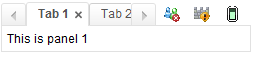

```xml
<tabbox width="250px">
	<tabs>
		<tab label="Tab 1" closable="true" />
		<tab label="Tab 2" closable="true" />
		<tab label="Tab 3" closable="true" />
		<tab label="Tab 4" closable="true" />
		<tab label="Tab 5" closable="true" />
	</tabs>
	<toolbar>
		<toolbarbutton image="/img/live.gif" onClick='alert("Live")' />
		<toolbarbutton image="/img/defender.gif" onClick='alert("Defender")' />
		<toolbarbutton image="/img/battery.gif" onClick='alert("Battery")' />
	</toolbar>
	<tabpanels>
		<tabpanel>This is panel 1</tabpanel>
		<tabpanel>This is panel 2 The second panel</tabpanel>
		<tabpanel>This is panel 3</tabpanel>
		<tabpanel>This is panel 4</tabpanel>
		<tabpanel>This is panel 5</tabpanel>
	</tabpanels>
</tabbox>
```

Try it

* [Tabbox Toolbar](https://zkfiddle.org/sample/27mram5/1-ZK-Component-Reference-Tabbox-Toolbar-Example?v=latest&t=Iceblue_Compact)

# Supported Events

_No events are declared directly on Tabbox. The `onSelect` event fires on individual `<tab>` components, not the tabbox itself._

# Supported Molds

| **Name**   | **Snapshot**                            |
|------------|-------------------------------------------|
|**Default:** |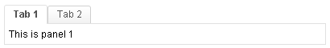|
| **Accordion:** | 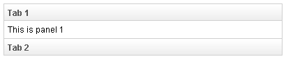|
| **Accordion-Lite:** | 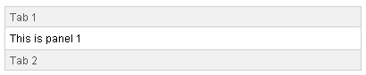 |

The `accordion-lite` mold is a lighter-weight variant of `accordion` that omits the panel header border decorations, producing a more minimal look suitable for sidebars and compact layouts.

# Supported Orients

| **Name**   | **Snapshot**                            |
|------------|-------------------------------------------|
|**Top:**| 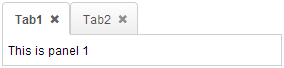|
|**Left:**| 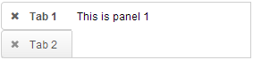|
|**Right:**| 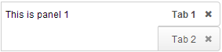|
|**Bottom:**| 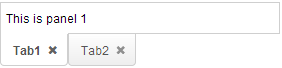|

# Supported Children
- [`Tabs`](tabs): Indicates that the `Tabbox` can only have one child component of type `Tabs`.
- [`Tabpanels`](tabpanels): Indicates that the `Tabbox` can only have one child component of type `Tabpanels`.
- [`Toolbar`](toolbar): Indicates that the `Tabbox` can only have one child component of type `Toolbar`.