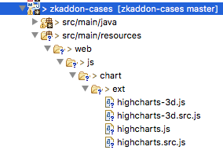

# IMPORTANT

Before enabling this feature upgrade to the latest available versions
(older versions contain a critical security vulnerability).

The latest versions containing a fix are:

- for CE users 8.0.2.2 or later
  [downloads](https://www.zkoss.org/download/zk)
- for PE/EE users 6.5.8.2, 7.0.8.1, 8.0.2.2, 8.0.3.1 or later [premium
  downloads](https://www.zkoss.org/download/premium)

**Property:**

` org.zkoss.web.util.resource.dir`



`Default: `<i>`none`</i>



It specifies a directory, where ZK will load the so-called Class-Web
Resources (CWR), in addition to the class path. CWR includes JavaScript
files, CSS files, and other resources that are specified in the form of
`~./xxx`.

By default, ZK only searches the class path for the required CWR. By
specifying a directory here, ZK will search the directory first and then
the class path. This implies that a developer can override the default
behavior by providing a file with the same name.

Notice: never put security sensitive files in the directory specified
here, since they can be accessed externally.

For example, assuming that we have a JavaScript package called
`foo.great` and we want to put it to `WEB-INF/cwr`, we have to specify
the following in `WEB-INF/zk.xml`:

``` xml
    <library-property>
        <name>org.zkoss.web.util.resource.dir</name>
        <value>/WEB-INF/cwr</value>
    </library-property>
```

You can place `zk.wpd` and the required JavaScript files under the
`WEB-INF/cwr/js/foo/great` directory.

# Overriding JavaScript Files in a JAR

Though rarely needed, sometimes you might need to override a JavaScript
file of a JAR file with this option. One example is that you don't have
to re-package `zul.jar` when replacing `zul/inp/Textbox.js` that is part
of `zul.jar`.

Rather, you could specify this library property as described above, and
place the modified version of `Textbox.js` under the
`/WEB-INF/cwr/js/zul/inp` directory. Then, ZK will load
`/WEB-INF/cwr/js/zul/inp/Textbox.js` you placed rather than the default
one in `zul.jar`.

## debug-js enabled

Notice that if
[debug-js]({{site.baseUrl}}/zk_config_ref/The_client-config_Element/The_debug-js_Element)
is turned on, ZK will actually look for `Textbox.src.js` rather than
`Textbox.js` in the above example. Thus, it is suggested to put both
files:

- `Textbox.src.js`
- `Textbox.js`

into the `/WEB-INF/cwr/js/zul/inp` directories. In addition,
`Textbox.src.js` is suggested to be the readable one (for debugging
purpose), while `Textbox.js` is the compressed one (for production
purpose).

## Overriding JavaScript in a ZK JAR

ZK loads the JavaScript file under the [ class path web resource
path](ZK_Developer%27s_Reference/UI_Composing/ZUML/Include_a_Page#Classpath_Web_Resource_Path),
**`WEB-INF/classes/web/js`**, in a **higher** priority than JavaScript
files in ZK jar (e.g. zul.jar). So that you can put javascript files
there to override the JavaScript files in ZK jar under the corresponding
path.

### Steps

1.  Check the js path in a jar.
      
    Assuming you want to override
    `zkcharts.jar/web/js/chart/ext/highchart.js`.
2.  create 2 files for overriding:
    1.  `highchart.js` - compressed, minified. ZK loads this file when
        no <debug-js> specified in zk.xml
    2.  `highchart.src.js` - uncompressed, with comments. ZK loads this
        file when <debug-js>`true`</debug-js> specified in zk.xml
3.  Put your custom js file under `WEB-INF/classes/web/`.
      
    Assume you have a Maven project, you need to put JavaScript files
    under the path: `src/main/resources/web/[JAVASCRIPT_PATH_IN_JAR]`.
    So the js files will be packaged into `WEB-INF/classes/web/`.

    The picture below demonstrates how to override javascript files
    under `zkcharts.jar/web/js/chart/ext`:



After doing this, ZK will load the js files under `WEB-INF/classes/web/`
instead of that js in the zkcharts.jar.

 This approach works in a different
way. We need to combine the js with other js in the same package. If you
have such requirements, please contact with zk support.
