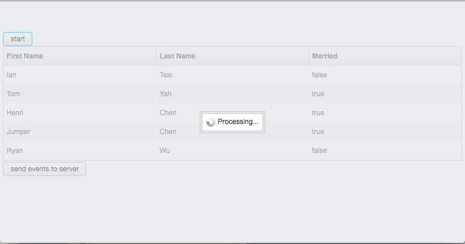

**Property:**

`org.zkoss.zk.ui.processMask.enabled`

Default:  `false`

Specifies whether always to show a processing mask when doing a lengthy
operation on the server side. The mask will cover the whole page to
prevent users from interacting with UI like:

