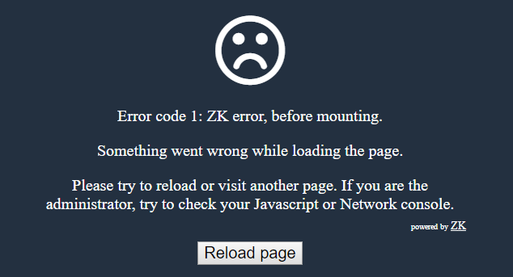

**Syntax:**

<init-crash-script>`javascript function assigned to ``window.zkShowCrashMessage`</init-crash-script>

`[Default: see crashmsg.js]`

If the client engine stops working before even the error handling is
initialized (e.g. when ZK's core scripts fail to download - `zk.wpd`),
you will see the message below:



This element allows you to show a custom crash message when initiation
by writing a javascript function which is assigned to
`window.zkShowCrashMessage`.

For example,

```xml
<client-config>
    <init-crash-script><![CDATA[
        window.zkShowCrashMessage = function (code) {
            var h2 = '<h2 style="background: rgb(1,133,174); text-align: center; ' 
                    + 'color: white; width: 700px; margin: 0 auto;">';
            var msg = 'Ooooops!! ErrorCode: ' + code;
            h2 = h2 + msg + '</h2>';
            document.body.style.background = 'rgb(1,133,174)';
            document.body.innerHTML = h2;
        }
      ]]></init-crash-script>
</client-config>
```

- Line 3, 6: The error code will be passed as a parameter, and you can
  take it for further use.

# Error Code

The error code has 5 values:

1.  zk before mounting error
      
    ZK client fails to proceed before mounting ZK javascript widgets.
2.  zk mounting error
      
    ZK client fails during mounting ZK javascript widgets
3.  zk after mounting error
      
    ZK client fails after mounting ZK javascript widgets.
4.  user script error
      
    ZK client fails while running your custom javascript code
5.  server no response error

# Version History

| Version | Date           | Content                                                                                                             |
|---------|----------------|---------------------------------------------------------------------------------------------------------------------|
| 7.0.4   | November, 2014 | [ZK-2495: When ZK init page, the loading animation runs in a endless loop](http://tracker.zkoss.org/browse/ZK-2495) |
