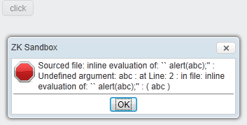

# Support Channel

If you are a ZK customer and your package comes with remote consulting
hours, you can contact
[mailto:support@potix.com](mailto:support@potix.com) to request
technical support. Please include your Invoice Number or License
Certificate number when you submit your question so that we can
associate you with the right company.

If you do not have remote consulting hours or if you are not sure,
please read [Customer
FAQ](https://www.zkoss.org/wiki/Customers/FAQ#What_is_my_current_ZK_Package.3F)
or contact us at info@zkoss.org.

# [Find Known Issues](https://tracker.zkoss.org/issues/)

If you think you encounter a bug, you can search for the bug in [our
tracker](https://tracker.zkoss.org/issues). If it's a known bug, there
is sometimes a workaround mentioned in the tracker. You can apply the
workaround before you get the official release.

# Getting prompt and efficient support from ZK

When you run into an issue in ZK, following this document can help you
to provide the support team with sufficient data, thus speeding up the
investigation and get prompt and efficient feedback. Here is a sample
screenshot of an error. However, with only a screenshot, it is difficult
for us to find enough clues and provide timely support. Instead of
providing a screenshot, please follow the tips and instructions below
when submitting your issue.



## Provide Sufficient information

Providing sufficient information helps us support you more efficiently.

### The Sufficient Information Includes:

1.  the complete server-side error or the client-side error if any (read
    [\#Check JavaScript Error](#Check_JavaScript_Error))
2.  complete exception stack trace (if any)
3.  A reproducible sample (please read [\#Tips for creating a
    reproducible
    sample](#Tips_for_creating_a_reproducible_sample)
4.  Precise and clear steps to reproduce the issue
5.  ZK version and edition
      
    e.g. ZK 9.0.1 PE
6.  Browser and its version
      
    e.g. Firefox 60
7.  If it is hard to create a sample, you can provide an URL so that the
    support team can access it. When providing this URL, remember to
    [turn on the js
    debug](https://www.zkoss.org/wiki/ZK%20Configuration%20Reference/zk.xml/The%20client-config%20Element/The%20debug-js%20Element)
    in your zk.xml.
8.  Application servers (e.g. JBoss 6, if it's necessary).
9.  If your case happens only in your specific environment, it is
    recommended to request an online meeting or provide a virtual
    machine as a copy of your actual environment
10. anything else that can help us understand your issue better

### Tips for creating a reproducible sample

#### You can provide:

1.  Use [zkfiddle](http://zkfiddle.org)
2.  Zip your maven project with pom.xml and include necessary source
    code
3.  Provide zul and its related Java source
4.  Provide a public URL that we can visit

#### Steps:

1.  Clone the original zul with the issue and remove irrelevant
    components.
2.  Replace your database data with static sample data in order to run
    without a database.

### Check JavaScript Error

You can check if there is any JavaScript error by opening the developer
tool. For example, press F12 to open the chrome developer tool/ Console
tab:


You can extract the error message by:

- select and copy the whole text or
- right-click, select "Save as..."

## If you cannot provide a reproducible sample

Then you can choose the following alternatives:

### Provide a Public URL of Your Web Application

Provide an URL so that the support team can access it. When providing
this URL, remember to turn on the js debug in your zk.xml.

### Provide ZK AU Request/Response Details

1.  Open the browser developer tool before starting to reproduce your
    issue
2.  Do the steps to reproduce your problem
3.  Send request details as HAR to us
      
    \* [Save all network requests to a HAR file in
    Chrome](https://developers.google.com/web/tools/chrome-devtools/network/reference#save-as-har)

    \* Save request details as HAR in Firefox 

    \* [Save request details as HAR in
    Edge](https://docs.microsoft.com/en-us/microsoft-edge/devtools-guide/network)

If your browser doesn't support saving requests as HAR, or just 1
request is related, you can also send us the screenshot of AU request
like:


### Provide Related Source

By checking your zul and Java source, we can try to simulate your case.
This is better than inferring what you describe in natural language.

# How to Include a JavaScript file

When you need to apply a js patch or include a 3rd-party js library, you
have to include the js file in your application. This section describes
how you can include the js file for different scopes.

## Page-Scope

- Use the script directive
  \[\[ZUML%20Reference/ZUML/Processing%20Instructions/script \|
  <?script?>

  \]\]
- Use the script component
  \[\[ZK%20Component%20Reference/Essential%20Components/Script \|
  <script>

  \]\]

## Application-Scope

If you need to include a javascript file on every zul, there are 2 ways:

### By language addon

Create a `lang-addon.xml` according to [ ZK Client-side
Reference/Language
Definition#Language_Addon](ZK_Client-side_Reference/Language_Definition#Language_Addon)
and include the javascript file with <javascript>. For example:

``` xml
<language-addon>
    <addon-name>patch-addon</addon-name><!-- give a meaningful name -->
    <language-name>xul/html</language-name>
    <depends>zul</depends>
    <javascript src="~./mypatch.js" />
    <javascript src="/zkpatch/mypatch2.js"/>
</language-addon>
```

- Line 4: see the next section
- Line 5: a path starting with `~./` is a [ classpath web resource
  path](ZK_Developer%27s_Reference/UI_Composing/ZUML/Include_a_Page#Classpath_Web_Resource_Path)
  which is a special path supported by ZK
- Line 6: You can also link a file under your web application context
  root

#### Dependent Addon

If you override a component's widget or extend an existing component,
it's crucial to specify <depends> correctly, so that your land addon
will take effect. According to which component you override, you need to
specify the corresponding addon name. For example:

- If you override a component in zul language e.g. <button>, you specify

<depends>`zul`</depends>

- If you override a component provided by zkmax e.g. <code>
  <nav>

  </code>, you specify

<depends>`zkmax`</depends>

- If you override something about accessibility, e.g. override aria
  attribute, you specify

<depends>`za11y`</depends>

=== Use
\[\[ZK_Configuration_Reference/zk.xml/The_device-config_Element/The_embed_Element
\|

<embed>

\]\] ===

# How to Run a Sample Maven Project

In order to narrow down the problem and eliminate differences caused by
different environments, we often send you a sample maven project that
tries to simulate and reproduce your issue. To run the project, you need
to [download maven](http://maven.apache.org/download.cgi) and
[setup](http://maven.apache.org/guides/getting-started/maven-in-five-minutes.html)
first.

1.  Run your command line interface
2.  switch to the sample project's root folder that has a `pom.xml`
3.  Start jetty server with the command below
      
    `mvn jetty:run`
4.  Visit the project's pages with your browser

If you don't know the zul's path or if the path is incorrect, just visit
<http://localhost:8080>. A browser will show a link with the correct
context path: 

Click the link and it will list folders then you can navigate to find
the zul. 

# How to get Browser Performance Profile

If you are running into a performance issue, you can first check out
[Step by Step Trouble
Shooting](https://www.zkoss.org/wiki/ZK_Developer's_Reference/Performance_Monitoring/Step_by_Step_Trouble_Shooting)
and do a first step analysis using browser's developer tools.

## [By Chrome developer tool](https://developers.google.com/web/tools/chrome-devtools/evaluate-performance)

## [By Firefox developer tool](https://developer.mozilla.org/en-US/docs/Tools/Performance)

## [By Edge developer tool](https://docs.microsoft.com/en-us/microsoft-edge/devtools-guide/performance)
