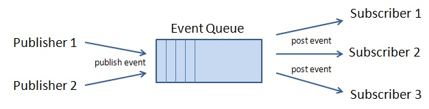

# Overview

An event queue is an event-based publish-subscriber solution for
application information delivery and messaging. It provides asynchronous
communications for different modules/roles in a loosely-coupled and
autonomous fashion.

By publishing, a module (publisher) sends out messages without
explicitly specifying or having knowledge of intended recipients. By
subscribing, a receiving module (subscriber) receives messages that the
subscriber has registered an interest in it, without explicitly
specifying or knowing the publisher. 


The purpose of event queues are two folds:

1.  Simplify the many-to-many communication.
2.  Make the application independent of the underlying communication
    mechanism. The application remains the same, while the event queue
    can be implemented with the use of Ajax, server push and even
    message queue.

# Identification of an Event Queue

An event queue is identified by a name and a scope. The scope represents
the visibility of an event queue. For example, while a desktop-scoped
event queue is visible in the same desktop, the application-scoped event
queue is only visible in the whole application.

## Locate an Event Queue

You could locate an event queue by invoking one of the `lookup` methods
of <javadoc>org.zkoss.zk.ui.event.EventQueues</javadoc>. For example,

``` java
EventQueues.lookup("myQueue"); //assumes the desktop scope
EventQueues.lookup("anotherQueue", EventQueues.SESSION, true);
EventQueues.lookup("anotherQueue", session, true);
```

Notice that if you want to locate an event queue in a working thread
(rather than an event listener), you have to use
<javadoc method="lookup(java.lang.String, org.zkoss.zk.ui.Session)">org.zkoss.zk.ui.event.EventQueues</javadoc>
or
<javadoc method="lookup(java.lang.String, org.zkoss.zk.ui.Application)">org.zkoss.zk.ui.event.EventQueues</javadoc>,
depending on your requirement.

## The Scope of an Event Queue

There are currently four different scopes: desktop, group, session, and
application. In addition, you add your own scope, such as that you can
include a message queue to communicate among several servers.

<table>
<thead>
<tr class="header">
<th><p>Scope</p></th>
<th><p>API</p></th>
<th><p>Description</p></th>
</tr>
</thead>
<tbody>
<tr class="odd">
<td><p>desktop</p></td>
<td><p><javadoc method="lookup(java.lang.String, java.lang.String)">org.zkoss.zk.ui.event.EventQueues</javadoc><br />
<javadoc method="lookup(java.lang.String, java.lang.String, boolean)">org.zkoss.zk.ui.event.EventQueues</javadoc></p></td>
<td><p>The event queue is visible only in the same desktop. (<a
href="https://www.zkoss.org/javadoc/latest/zk/org/zkoss/zk/ui/event/impl/DesktopEventQueue.html">DesktopEventQueue</a>)</p></td>
</tr>
<tr class="even">
<td><p>group</p></td>
<td><p><javadoc method="lookup(java.lang.String, java.lang.String)">org.zkoss.zk.ui.event.EventQueues</javadoc><br />
<javadoc method="lookup(java.lang.String, java.lang.String, boolean)">org.zkoss.zk.ui.event.EventQueues</javadoc></p></td>
<td><p>  The event
queue is visible only in a group of desktops that belongs to the same
browser tab(page). It is formed if an iframe or frameset is used. Some
portal containers might cause a group of desktops to be formed too.
Unlike the session and application scope, the group scope doesn't
require the server push, so the communication is more
efficient.</p></td>
</tr>
<tr class="odd">
<td><p>session</p></td>
<td><p><javadoc method="lookup(java.lang.String, java.lang.String)">org.zkoss.zk.ui.event.EventQueues</javadoc><br />
<javadoc method="lookup(java.lang.String, java.lang.String, boolean)">org.zkoss.zk.ui.event.EventQueues</javadoc><br />
<javadoc method="lookup(java.lang.String, org.zkoss.zk.ui.Session)">org.zkoss.zk.ui.event.EventQueues</javadoc><br />
<javadoc method="lookup(java.lang.String, org.zkoss.zk.ui.Session, boolean)">org.zkoss.zk.ui.event.EventQueues</javadoc></p></td>
<td><p>The event queue is visible only in the same session. The
<strong>server push will be enabled automatically</strong> if it
subscribes a session-scoped event queue.</p>
<p>Notice that the server push is disabled automatically if the current
desktop doesn't subscribe to any session- or application-scoped event
queue. Also, notice that the locating and creating of an event queue and
publishing an event won't start the server push.</p>
<p>ZK 5.0.5 and Prior: When a server push is enabled, a working thread
is instantiated and started. It means this feature cannot be used in an
environment that doesn't allow working threads, such as Google App
Engine. No such limitation is likely to occur in ZK 5.0.6 or
later.</p></td>
</tr>
<tr class="even">
<td><p>application</p></td>
<td><p><javadoc method="lookup(java.lang.String, java.lang.String)">org.zkoss.zk.ui.event.EventQueues</javadoc><br />
<javadoc method="lookup(java.lang.String, java.lang.String, boolean)">org.zkoss.zk.ui.event.EventQueues</javadoc><br />
<javadoc method="lookup(java.lang.String, org.zkoss.zk.ui.WebApp)">org.zkoss.zk.ui.event.EventQueues</javadoc><br />
<javadoc method="lookup(java.lang.String, org.zkoss.zk.ui.WebApp, boolean)">org.zkoss.zk.ui.event.EventQueues</javadoc></p></td>
<td><p>The event queue is visible only in the whole application. The
<strong>server push will be enabled automatically</strong>.</p>
<p>Notice that the server push is disabled automatically if the current
desktop doesn't subscribe to any session- or application-scoped event
queue. Also notice that the locating and creating of an event queue and
publishing an event won't start the server push.</p>
<p>ZK 5.0.5 and Prior: When a server push is enabled, a working thread
is instantiated and started. It means this feature cannot be used in an
environment that doesn't allow working threads, such as Google App
Engine. No such limitation is likely to occur in ZK 5.0.6 or
later.</p></td>
</tr>
</tbody>
</table>

Here is a summary of the differences.

<table>
<thead>
<tr class="header">
<th></th>
<th><p>desktop</p></th>
<th><p>group</p></th>
<th><p>session</p></th>
<th><p>application</p></th>
</tr>
</thead>
<tbody>
<tr class="odd">
<td><p>visibility</p></td>
<td><p>desktop</p></td>
<td><p>group</p></td>
<td><p>session</p></td>
<td><p>application</p></td>
</tr>
<tr class="even">
<td><p>publish</p></td>
<td><p>only in an event listener, or the current execution is
available.</p></td>
<td><p>only in an event listener, or the current execution is
available.</p></td>
<td><p>no limitation</p></td>
<td><p>no limitation</p></td>
</tr>
<tr class="odd">
<td><p>subscribe</p></td>
<td><p>only in an event listener, or the current execution is
available.</p></td>
<td><p>only in an event listener, or the current execution is
available.</p></td>
<td><p>only in an event listener, or the current execution is
available.</p></td>
<td><p>only in an event listener, or the current execution is
available.</p></td>
</tr>
<tr class="even">
<td><p>multi-thread</p></td>
<td><p>Not used</p></td>
<td><p>Not used</p></td>
<td><p>5.0.5 or prior: Used (transparent)<br />
5.0.6 or later: Not used</p></td>
<td><p>5.0.5 or prior: Used (transparent)<br />
5.0.6 or later: Not used</p></td>
</tr>
<tr class="odd">
<td><p>server-push</p></td>
<td><p>Not used*</p></td>
<td><p>Not used*</p></td>
<td><p>Used (transparent)</p></td>
<td><p>Used (transparent)</p></td>
</tr>
<tr class="even">
<td><p>Cluster Environment</p></td>
<td><p>Support</p></td>
<td><p>Support</p></td>
<td><p>Support</p></td>
<td><p>Unsupported (Java Spec. Limitation)</p></td>
</tr>
<tr class="odd">
<td><p>Availability</p></td>
<td><p></p></td>
<td><p></p></td>
<td><p></p></td>
<td><p></p></td>
</tr>
<tr class="even">
<td><p>Use Cases</p></td>
<td><ul>
<li>send events between different pages within one desktop</li>
</ul></td>
<td></td>
<td><ul>
<li>a user logins in one browser tab, log out the same user in other
browser tabs of the same session</li>
</ul></td>
<td><ul>
<li>send messages in a chatroom application</li>
<li>broadcast system messages to all users/desktops</li>
</ul></td>
</tr>
</tbody>
</table>

- If you register an asynchronous listener, it still enables
  server-push.

# Publish and Subscribe

## Publish an Event

To publish, just invoke one of the `publish()` of <javadoc>org.zkoss.zk.ui.event.EventQueue</javadoc> (returned by `lookup()`). For example,

``` java
EventQueues.lookup("my super queue", EventQueues.APPLICATION, true)
  .publish(new Event("onSomethingHapping", null, new SomeAdditionInfo()));
```

The message used to communicate among publishers and subscribers is
<javadoc>org.zkoss.zk.ui.event.Event</javadoc> object, so you can use
any of its subclasses you prefer.

## Subscribe with a Synchronous Event Listener

An event queue will broadcast a published event to all subscribers by
calling each subscriber's event listener. To subscribe an event queue
with a synchronous listener, just invoke
[EventQueue.subscribe](https://www.zkoss.org/javadoc/latest/zk/org/zkoss/zk/ui/event/EventQueue.html#subscribe-org.zkoss.zk.ui.event.EventListener-)
(returned by `lookup`). The event listener is invoked just like a normal
event. You can manipulate ZK components, update UI by notifying a bean's
change or implement your business logic. For example:

``` java
EventQueues.lookup("my super queue", EventQueues.APPLICATION, true).subscribe(
  new EventListener() {
    public void onEvent(Event evt) {
       //handle the event just like any other event listener, can change components' state
    }
  });
```

# Asynchronous Event Listener

By default, the subscribed event listeners are invoked the same way as
invocations of the listeners for a posted event. They are invoked
one-by-one. No two event listeners belonging to the same desktop will be
invoked at the same time. In addition, it is invoked under an execution
(i.e., <javadoc method="getCurrent">org.zkoss.zk.ui.Executions</javadoc>
is never null). It is allowed to manipulate the components belonging to
the current execution. For the sake of description, we call them
synchronous event listeners.

On the other hand, the event queue also supports the so-called
asynchronous event listener, which is invoked **asynchronously in
another thread**. There is **no current execution** available. It is
**not** allowed to access any component. It is designed to execute a
long operation without blocking users from accessing other UI in a
browser.

For more information and examples, please refer to [the Long Operations:
Use Event
Queue](ZK_Developer's_Reference/UI_Patterns/Long_Operations/Use_Event_Queues)
section.

# Clean Up

Remember to
\[<https://www.zkoss.org/javadoc/latest/zk/org/zkoss/zk/ui/event/EventQueue.html#unsubscribe(org.zkoss.zk.ui.event.EventListener>)
unsubscribe\] to an event queue with a listener when you don't need it
anymore to avoid performing duplicate actions.

It's better to remove an event queue manually as you don't need it. If
you create a **desktop** scope event queue, since it's stored as a
desktop's attribute, it will be destroyed when the desktop is destroyed.
The same rule applies to a session-scoped event queue.

# Extend Event Queue: Add a Custom Scope

The location and creation of an event queue are actually done by a
so-called event queue provider. An event-queue provider must implement
the <javadoc>org.zkoss.zk.ui.event.impl.EventQueueProvider</javadoc>
interface.

To customize it, just provide an implementation, and then specify the
class name in the property called
`org.zkoss.zk.ui.event.EventQueueProvider.class`.

For example, let us say we want to introduce the JMS scope, then we can
implement as follows (only pseudo-code):

``` java
public class MyEventQueueProvider extends org.zkoss.zk.ui.event.impl.EventQueueProviderImpl {
  public EventQueue lookup(String name, String scope, boolean autocreate) {
    if ("jms".equals(scope)) {
      //create an event queue based on JMS's name
    } else
      return super.lookup(name, scope, autocreate);
  }
  public boolean remove(String name, String scope) {
    if ("jms".equals(scope)) {
      //remove the event queue based on JMS's name
    } else
      return super.removename, scope);
  }
}
```

Then, specify the property in `WEB-INF/zk.xml`

``` xml
<library-property>
    <name>org.zkoss.zk.ui.event.EventQueueProvider.class</name>
    <value>MyEventQueueProvider</value>
</library-property>
```

## Event Queues and Server Push

When an application-scope event queue is used, the server push is
enabled automatically for each desktop that subscribers belong to. In
addition, a thread is created to forward the event to subscribers.

ZK supports several server push implementations and configurations
including client-polling and
[comet](http://en.wikipedia.org/wiki/Comet_(programming)), please refer
to [
Server_Push/Configuration](ZK_Developer%27s_Reference/Server_Push/Configuration).

# Use Case

## Application-scope: Chatroom

Here is an example: chat.

``` xml
<window title="Chat" border="normal">
    <zscript><![CDATA[
    import org.zkoss.zk.ui.event.*;
    EventQueue que = EventQueues.lookup("chat", EventQueues.APPLICATION, true);
    que.subscribe(new EventListener() {
        public void onEvent(Event evt) {
            new Label(evt.getData()).setParent(inf);
        }
    }); 
    void post(Textbox tb) {
        String text = tb.value;
        if (text.length() > 0) {
            tb.value = "";
            que.publish(new Event("onChat", null, text));
        }
    }
    ]]></zscript>

    Say <textbox onOK="post(self)" onChange="post(self)"/>
    <separator bar="true"/>
    <vbox id="inf"/>
</window>
```

Then, you can chat among two or more different computers.

## Desktop scope: among Multiple ZUL Pages

It is a typical approach to split page layout with several ZUL pages,
and EventQueue could also be used for communicating between these pages.
Here is an example for using EventQueue to interact between two
composers. Let's say you have a main.zul page that is actually divided
into two: page1.zul and page2.zul.

**main.zul**

``` xml
<zk>
    <include src="page1.zul"></include>
    <include src="page2.zul"></include>
</zk>
```

**page1.zul**

``` xml
<window title="ZUL page 1" border="normal" apply="demo.WindowComposer1">
    <button id="btn" label="change label in ZUL page 2" />
</window>
```

``` java
package demo;
public class WindowComposer1 extends SelectorComposer {

    private EventQueue eq;
    @Wire
    Button btn;
    
    @Listen("onClick = button#btn")
    public void changeLabel() {
        eq = EventQueues.lookup("interactive", EventQueues.DESKTOP, true);
        eq.publish(new Event("onButtonClick", btn, "label is Changed!"));
    }
}
```

**page2.zul**

``` xml
<window title="ZUL page 2" border="normal" apply="demo.WindowComposer2">
    <label id="lbl" value="label in ZUL page 2" />
</window>
```

``` java
package demo;
public class WindowComposer2 extends SelectorComposer {

    private EventQueue eq;
    @Wire
    private Label lbl;
    
    public void doAfterCompose(Component comp) throws Exception {
        super.doAfterCompose(comp);
        eq = EventQueues.lookup("interactive", EventQueues.DESKTOP, true);
        eq.subscribe(new EventListener() {
            public void onEvent(Event event) throws Exception {
                String value = (String)event.getData();
                lbl.setValue(value);
            }
        });
    }
}
```

By doing this, you can change data in ZUL page 2 by clicking the button
in ZUL page 1. Note: Open main.zul page in browser to run the above
sample codes. If there are any other ZUL pages that have subscribed to
the same name in the EventQueues, the content in those ZUL pages will
also be updated.

# Version History

| Version | Date          | Content                                                                                                                                           |
|---------|---------------|---------------------------------------------------------------------------------------------------------------------------------------------------|
| 5.0.4   | August 2010   | The group scope was introduced to allow the communication among inline frames without Server Push (minimizing the network bandwidth consumption). |
| 5.0.6   | November 2010 | The event queue won't start any working threads and they are serializable, so it is safe to use them in a clustering environment.                 |
