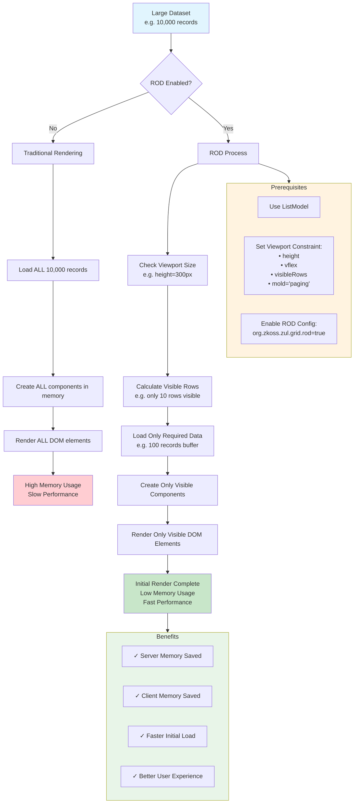
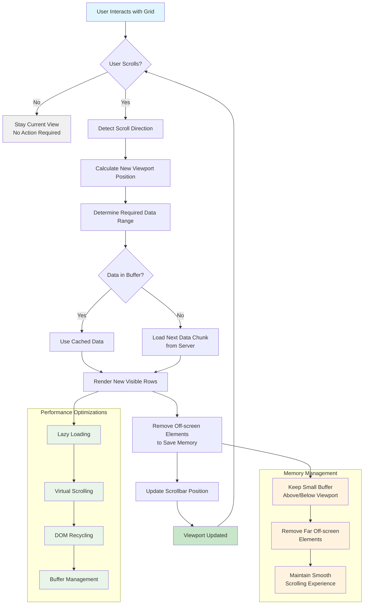

# ZK Render on Demand (ROD) - Flow Diagrams

## Initial Rendering Process

## Scroll Handling Process

## Key Components Explained:

1. **Data Loading**: Instead of loading all 10,000 records, ROD loads only what's needed (e.g., 100 records buffer)
2. **Component Creation**: Only creates components for visible rows, not the entire dataset
3. **DOM Rendering**: Renders only visible elements in the browser
4. **Dynamic Loading**: As user scrolls, new data chunks are loaded and rendered
5. **Memory Management**: Off-screen elements are removed to save memory
