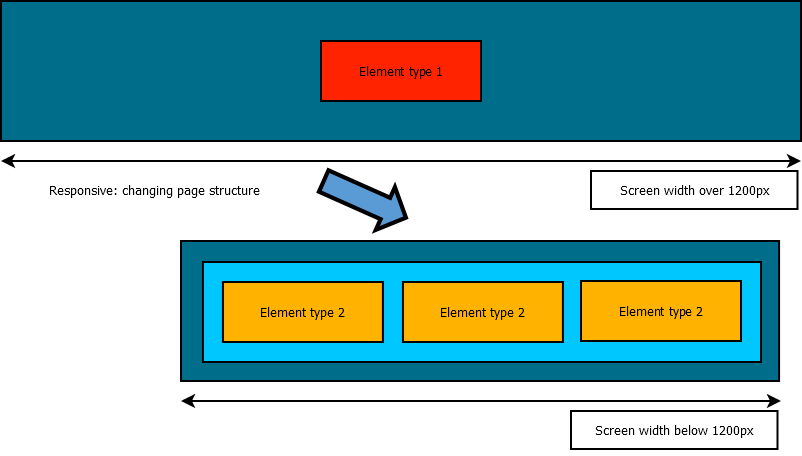

While a fluid layout make a UI usable in any screen resolution, some
user experiences may require widely different layout and designs
depending on the type or size of the devices used to browse the
application. In this case, adaptive design is recommended as it can be
used to switch between layouts based on browser width.

This is different from a fluid design. An adaptive design changes the
structure of the page. A fluid page will simply change the display
properties of its content without changing the content organization or
nature. Responsiveness through an adaptive design requires more design
effort to generate a full set of page states. The result is a much wider
range of possibilities to adapt the page design to be relevant on any
device type and/or size.



# ZK MVC Client Info event and composer

The onClientInfo event is used to relay client information such as
device dimensions, orientation, and pixel ratio to the server. The event
also sends updates if these values change while browsing the page. This
event will fire during page initialization and whenever the client
properties change, for example, change of tablet orientation or when
desktop browser resized. More information of this event can be found in
the [ClientInfoEvent
documentation]({{site.baseurl}}/zk_component_ref/tablet_devices/events/clientinfoevent).

This event can be leveraged in the MVC pattern, using a controller to
alter the page structure based on the information returned from the
client.

Below is an implementation example based on the following requirement:

- User will select a value through a 3-choices control.
- The control will be a drop-down on large desktop screens.
- The control will not be a drop-down on mobile devices or smaller
  desktop screens.

As designers, we can choose that a dropdown component will displayed on
“large” devices (width \>= 1200px), but will be replaced by 3 radio
buttons on smaller devices. The underlying data model is reused between
these two UI states. When transitioning to a different state we can use
this technique to initialize the new UI objects based on the previous UI
state data. This is possible because the page's state is stored in the
controller. When templates are created, they are reuse the same model
object as the previous template.

In the MVC pattern, the component tree is modified directly by the
composer. When the onClientInfo listener is triggered, the composer will
test if the responsive state has changed. If necessary, it will remove
children from the anchor component and add the relevant new structure to
the page.

Registering the ClientInfo event listener on the page's root component
to define actions upon changes on client properties:

```java
//ClientInfoEvent is used to perform actions when client size (or orientation) is changed
comp.addEventListener(Events.ON_CLIENT_INFO, new EventListener<ClientInfoEvent>() {
    public void onEvent(ClientInfoEvent event) throws Exception {
    ...
});
```

Full example available on
[Github](https://github.com/zkoss/zkbooks/blob/master/developersreference/developersreference/src/main/java/org/zkoss/reference/developer/responsiveDesign/ZkResponsiveComposer.java#L40)

# MVVM media queries and Shadow components



The same structure can be created following the MVVM pattern using the
[@MatchMedia](http://books.zkoss.org/zk-mvvm-book/8.0/syntax/matchmedia.html)
annotation introduced in ZK 8.0.2 and [Shadow
Elements](http://books.zkoss.org/zk-mvvm-book/8.0/syntax/shadow_elements.html)
introduced in ZK 8.0.0

The MVVM is a natural fit for this task, since it already provides a
clear separation between data and view. On the ViewModel side, the
@MatchMedia annotation will trigger whenever the associated media query
condition is fulfilled.

[More information on Media
Queries](https://developer.mozilla.org/en-US/docs/Web/CSS/Media_Queries)

The UI state is represented by a single ViewModel field and control the
view. On the view side, Shadow Elements are used to instantiate and
cleanup the relevant UI elements for each state.

The MVVM design pattern provides a clear separation between the View
(the different UI templates to be used) and the ViewModel (the state of
the page). As the ViewModel is not replaced when switching between
templates, this greatly simplifies the effort on maintaining the client
state. Any bound value stored in the ViewModel is available to every
possible template.

Using @MatchMedia to perform actions when media query conditions are
fulfilled:

```java
    @NotifyChange("layoutState")
    @MatchMedia("all and (min-width: 1200px)")
    public void handleBigLayout(){
        //Action to perform when media query is fullfiled
        ...
    }
```

Full example available on
[Github](https://github.com/zkoss/zkbooks/blob/master/developersreference/developersreference/src/main/java/org/zkoss/reference/developer/responsiveDesign/ZKResponsiveViewModel.java#L26)

# Full responsiveness: Integrating Fluid with Adaptive Design

Fluid and adaptive designs can be integrated to create a more granular
UI experience. A template generated using responsive design can
incorporate fluid design elements to subdivide this template’s display
options.

For example, based on the [fluid design
examples]({{site.baseurl}}/zk_dev_ref/responsive_design/fluid_design),
we can add bootstrap grid entries for extra-small, small and medium
states to the small layout generated in ZK.


In this case, we add fluid transitions to the MVVM adaptive example to
build three fluid state on top of two adaptive states. The same adaptive
code is implemented to switch between a large template using dropdown
and a small template using radio buttons.

In turn, the small template is subdivided into 3 fluid states based on
Bootstrap Grid. These three states are extra small, small and medium and
use the notation xs, sm and md.

This effectively creates four responsive states:

- Big template
- Small template - bootstrap medium
- Small template - bootstrap small
- Small template - bootstrap extra small

The transition between these states is handled either by requesting page
information from the server (adaptive) or by rearranging view elements
at client side (fluid).

The adaptive transition is more powerful, as the page structure and
components can be completely recreated to match the device needs.
However, doing so requires a request cycle to the server. On the other
hand, fluid transition have localized effects but is performed entirely
at client side.

Integrating both fluid and adaptive design to build a fully responsive
document:

```xml
<div id="content" height="80px" sclass="panel">
    <!--    Replacing templates: responsive design -->
    <apply template="@load(vm.layoutState)">
        <template name="bigLayout">
            <listbox model="@init(vm.selectionModel)" mold="select"/>
        </template>
        <template name="smallLayout">
            <radiogroup sclass="panel" height="60px" model="@init(vm.selectionModel)">
                    <template name="model">
                        <!--    Integrating Bootsrtrap grid system: fluid design -->
                        <radio sclass="col-xs-12 col-sm-6 col-md-4" label="@load(each)" value="@load(each)"></radio>
                    </template>
            </radiogroup>
        </template>
    </apply>
</div>
```

Full example available on
[Github](https://github.com/zkoss/zkbooks/blob/master/developersreference/developersreference/src/main/webapp/responsiveDesign/adaptiveDesign/3-mvvmbootstrapintegration.zul)
