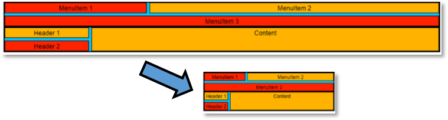
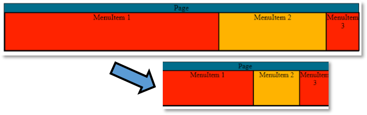
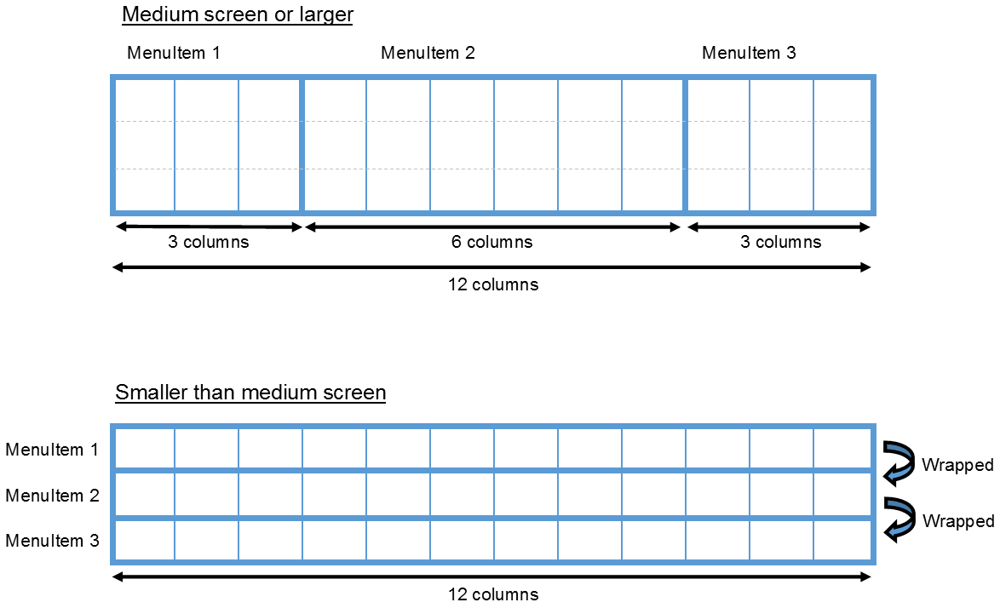

A fluid design can take many forms. From a simple width=”100%” on the
page container to always fit the screen, to detailed rule sets of styles
to be applied depending on specific browser states and conditions.

Depending on the desired UI experience, a fluid design can be enough for
an application to feel well balanced regardless of the size or device
used to browse its content. Elements can automatically wrap from
multiple items per line to a vertical table fitting on mobile.
Containers can shrink and expand to avoid leaving empty spaces or having
to restrict the user to a few expected browser dimensions.

# ZK Flex

Other than setting a attribute, the simplest tool in ZK to create a
fluid design is flexing. ZK components hold the hflex and vflex
attributes which can be used to set horizontal flex and vertical
flexing.

## ZK CSS flexbox

 Starting in ZK 9, ZK flex uses css
flexbox to render flex components, with the exception of
hflex/vflex="min"

In-depth information regarding flexing in ZK can be found in the [Hflex and Vflex section]({{site.baseurl}}/zk_dev_ref/ui_patterns/hflex_and_vflex).

## Using ZK flex

Component flexing is calculated in browser by the JavaScript client
engine, or using CSS flexbox. Flexing containers will expand and shrink
based on their initial size as well as their siblings flexing
information. When a parent of a flex-enabled component is resized, a new
size calculation is triggered for this element. The resulting width and
height is then set directly on the node.

Example: ZK flex used to proportionally increase or decrease the size of
UI elements:


In this example, menuitem1 and menuitem 2 will grow and shrink together
to maintain a 1/3rd to 2/3rd width ratio.

```xml
<div id="menuitem1" hflex="1" sclass="box content1">
    MenuItem 1
</div>
<div id="menuitem2" hflex="2" sclass="box content2">
    MenuItem 2
</div>
```

[Git source](https://github.com/zkoss/zkbooks/blob/master/developersreference/developersreference/src/main/webapp/responsiveDesign/fluidDesign/1-zkflex.zul)

# CSS flexible box

The modern CSS3 standard have introduced the CSS flexible box style set.
Browsers implementing this standard can implement native flexing through
style definition. It can be used to declare initial sizes, growing and
shrinking ratios, incuding other flexing related properties.

CSS flex is processed by the browser’s styles interpreter directly,
rather than the JavaScript engine. More information on CSS flexible box
can be found [1](https://www.w3schools.com/css/css3_flexbox.asp%7Chere)

Example: CSS flex box used to proportionally grow or shrink UI elements:


In this example, menuitem1 and menuitem2 style attributes are defined to
make these elements grow and shrink with a 2 to 1 ratio. With a flex
value of 0, menuitem3 become static and will not resize.

Note: This example doesn't use ZK components, in order to demonstrate
that CSS flex and ZK are not dependent on each-other.

```xml
<style>
    .panel{
        height:80px;
        width:100%;
        display:flex;
    }
</style>
...
<div class="panel">
    <div style="flex:2;" width="200px" [..]>MenuItem 1</div>
    <div style="flex:1;" width="200px" [..]>MenuItem 2</div>
    <div style="flex:0;" width="200px" [..]>MenuItem 3</div>
</div>
```

[Git source](https://github.com/zkoss/zkbooks/blob/master/developersreference/developersreference/src/main/webapp/responsiveDesign/fluidDesign/2-cssflex.jsp)

# Bootstrap grid

Client-side frameworks can be leveraged to add fluidity to an existing
layout. For example, the bootstrap grid system provides a convenient
class-based system to define resizing rules for elements.

Bootstrap grid is only a small fragment of the complete bootstrap
framework. As it is modular in nature, it can easily be integrated in
any page output by ZK Framework. The grid system is a set of predefined
CSS rules which can be applied to UI elements. These rules are designed
to provide convenient key classes which will apply specific behaviors to
their target components with the goal of displaying UI elements on a
virtual grid.

More information about the bootstrap grid system can be found
[here](https://getbootstrap.com/docs/4.0/layout/grid/)

The grid system uses a 12 columns layout which can be used to
proportionally grow or shrink each item based on the number of columns
used.


For this first bootstrap grid example, we will only use 3 DOM classes:

Container: Define a container which will automatically resize with the
browser window. The container element width will be as stable as
possible, but will also try to be reasonably close to the current
browser width.

Row: Define a sub-container inside which elements will automatically
wrap if the total number of columns used to display the content of the
row exceed 12.

Cell: Elements to be used inside a row. Their width is defined by the
css class "col-\[responsive category\]-\[columns\]" define a block
inside a row, which will span \[columns\] columns. the \[responsive
category\] indicates when this definition should be used. In this
example, we are defining all from xs (extra small). This mean, apply
this rule from extra-small browsers or larger (i.e. all browsers sizes).

Example: Bootstrap grid framework used to make UI elements flexible:


In this example, menuitem1 is defined to use 2 columns, and menuitem2 is
defined to use 6 columns of the 12 columns available in bootstrap grid
system.

```xml
<div class="box content1 col-xs-2">MenuItem 1</div>
<div class="box content2 col-xs-6">MenuItem 2</div>
```

[Git source](https://github.com/zkoss/zkbooks/blob/master/developersreference/developersreference/src/main/webapp/responsiveDesign/fluidDesign/3-bootstrapflex.jsp)

# CSS Media queries

Introduced in CSS3, media queries can be used to define specific rules
based on screen definition. They can be used to activate any CSS rules
relevant to UI states. A default use for media queries is to set
boundaries between two or more states, and styles relevant for each
state.

For example, we can define a large state (width \>= 800px) where content
is displayed on a line and grows as needed, and a smaller state (width
\< 800px) in which content is displayed vertically and always use all
the horizontal space.

Example: Media query used to set two different style sets based on the
screen width


In this example, menuitem1 is defined to use 2 columns, and menuitem2 is
defined to use 6 columns of the 12 columns available in bootstrap grid
system.

```xml
@media(min-width:1200px){
    .content1{
        [style set 1]
[...]
@media(max-width:1199px){
    .content1, .content2{
        [style set 2]
```

[Git source](https://github.com/zkoss/zkbooks/blob/master/developersreference/developersreference/src/main/webapp/responsiveDesign/fluidDesign/4-mediaquery.jsp)

# Media queries in CSS Bootstrap grid

Like the flex example above, the bootstrap grid system can be used to
easily to implement a set of media query based UI states, and switch
between them. Still built on the 12 columns grid system, we can define
our state such as:

- Extra-small (from width:0px to the next state defined): using the
  col-xs-N classes
- Medium (from width:760px to the next state defined): using the
  col-md-N classes

Using both together let us define 2 states: Width \>= 760px: medium
screen or larger \< 760px: smaller than medium screen.



We can use these classes to create the arrange of contents on a single
line, with a larger central item (6 columns) and 2 smaller outer items
(3 columns each) on the medium state, and switch to each item using 12
columns (all available space) in the extra-small state.

Example: Bootstrap grid framework used to define a set of behaviors
based on screen width.


In this example, menuitem1 will use 12 columns on width ranging from
extra small to medium, then switch to using 3 columns on medium screens
or larger.

```xml
<div class="box content1 col-xs-12 col-md-3">MenuItem 1</div>
```

[Git source](https://github.com/zkoss/zkbooks/blob/master/developersreference/developersreference/src/main/webapp/responsiveDesign/fluidDesign/5-bootstrapmediaquery.jsp)

# Applying the bootstrap grid system to ZK components

## Loading the bootstrap grid stylesheet

Additional stylesheets can be loaded on a page-by-page basis using
processing instructions, or style components.

```xml
<?link rel="stylesheet" href="/resources/bootstrap/css/bootstrap.css"?>
```

Alternatively, if the style is used in all pages, it can be deployed
globally [through language definition]({{site.baseurl}}/zk_client_side_ref/language_definition/stylesheet),
in lang-addon.xml:

```xml
<stylesheet href="/resources/bootstrap/css/bootstrap.css" type="text/css"/>
```

## Declaring DOM classes on ZK components

ZK components can receive additional DOM classes using the
[sclass](ZK_Style_Customization_Guide/ZK_CSS_Class_Design/Sclass)
attribute in zul (or setSclass(...) method in Java). This is an easy way
to add rendering information to be used by the bootstrap grid system, or
other client-side responsive providers.

```xml
<div id="top" sclass="box panel container"> <!-- container DOM class -->
    <div sclass="row"> <!-- row DOM class -->
        <div id="menuitem1" sclass="box content1 col-xs-12 col-md-6"> <!-- col-xs-12 and col-md-6 DOM class -->
...
```

[Git source](https://github.com/zkoss/zkbooks/blob/master/developersreference/developersreference/src/main/webapp/responsiveDesign/fluidDesign/6-fluidDesignInZul.zul)
