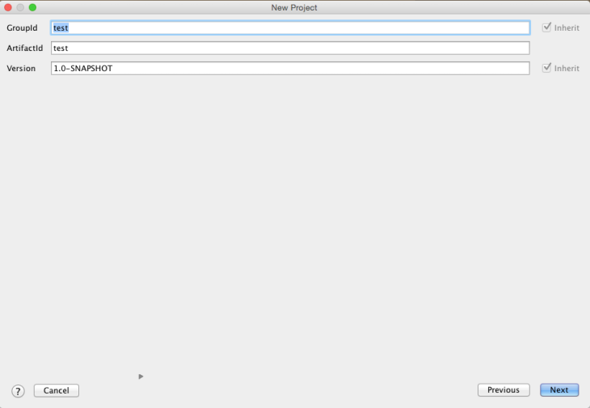
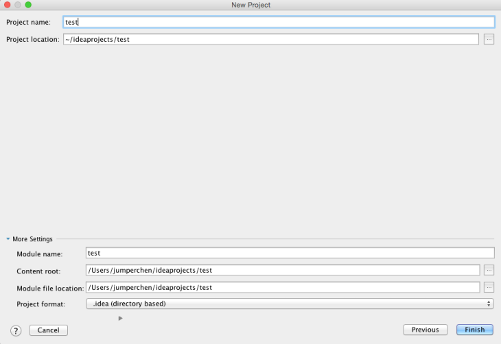
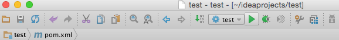
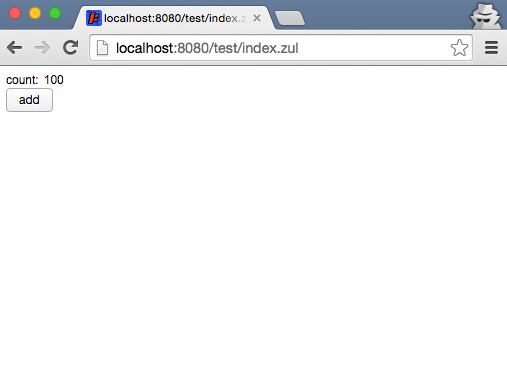

[ZKIdea](https://plugins.jetbrains.com/plugin/7855) is an IntelliJ
plugin for ZK application development contributed by Mr. Jumper Chen.

# Install ZK IntelliJ Plugin

## Install IntelliJ

1.  Download the latest IntelliJ IDE from
    [here](https://www.jetbrains.com/idea/)  
      

## Install ZK plugin

1.  Start IntelliJ  
      
2.  On IntelliJ's main menu bar, select File \> Settings \> Plugins.  
    Or from the welcome screen: select Configure \> Plugins  
      
3.  Type **ZK** into the search bar, and then install it.  
      
      
4.  After installation, restart IntelliJ when prompted to activate the
    plugin.

# Create a New ZK Project

1.  On IntelliJ main menu bar, select File \> "New Project" \> Maven  
      
2.  On the New Project wizard, select a "Project SDK", check "Create
    from archetype", scroll to the end of the list, select a ZK
    archetype, and press "Next" to create a project.  
      
      
3.  Fill in the information about your project and press "Next".  
      
      
4.  Check all the information about your project and press "Next".  
      
      
5.  Fill in the project location and press "Finish".  
      
      

# Run the ZK Project

1.  On IntelliJ main menu bar, select Run \> "Edit Configurations"  
      
2.  Press the plus icon "+" to add a maven runtime  
      
      
3.  Fill in the project information and type "jetty:run" into the
    "Command Line" field, and then press "Apply" and "OK"  
      
      
4.  Press the green run button to run a jetty server with the project  
      
      
5.  Visit the link "<http://localhost:8080/test/index.zul>" on your
    browser  
      
      
