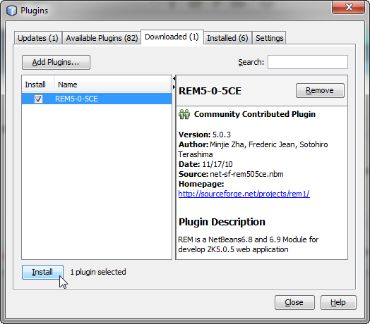
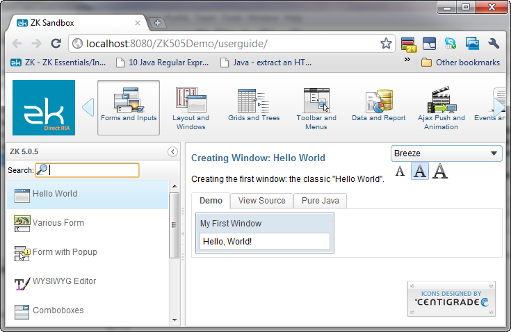

# Maven Recommended

The recommended way to use ZK in NetBeans is to import a maven project.
Reference [ this
document](ZK_Installation_Guide/Setting_up_IDE/Maven/Resolving_ZK_Framework_Artifacts_via_Maven)
for sample pom file.

# Install NetBeans REM

[REM](http://rem1.sourceforge.net/) is a NetBeans module for ZK
application development contributed by Mr. Sotohiro Terashima.

## Install NetBeans

[Download the latest NetBeans
IDE](https://netbeans.apache.org/download/index.html) and install

## Install REM plugin

1.  [Download the latest REM
    plugin](http://sourceforge.net/projects/rem1/files/)  
      
2.  Start NetBeans  
      
3.  On NetBeans' main menu bar, select Tools \> Plugins.  
      
4.  Click on the "Downloaded" tab, followed by "Add Plugins" to open the
    file explore  
      
      
5.  Navigate to where REM is downloaded and select the REM plugin  
      
6.  Click "Install" and follow the NetBeans plugin manager prompts  
      
      

# Create a New ZK Project

1.  On NetBeans main menu bar, select "New Project"  
      
2.  On the New Project wizard under "Categories", select "Java Web"  
      
      
3.  Confirm and create a new ZK project.  
      
      
4.  Select the ZK project folder, and right click "Run" to deploy the
    project on Glassfish  
      
      

# Deploy the ZK Demo Project

1.  On NetBeans main menu bar, select "New Project"  
      
2.  On the New Project wizard under "Categories", expand the "Samples"
    folder and select "Java Web"  
      
      
3.  Select "ZK505 Demo Project" under "Projects"  
      
4.  Select the ZK demo project and right click to select "Run" to deploy
    the ZK demo  
      
      

