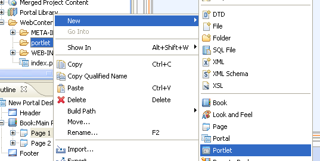
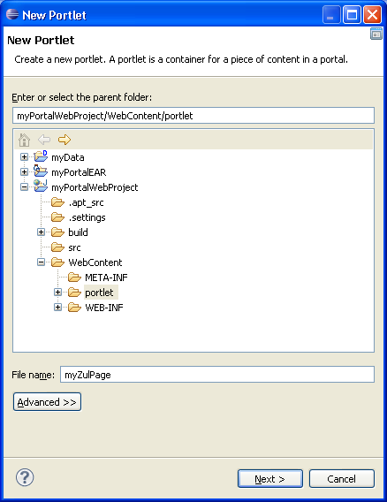
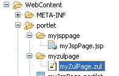
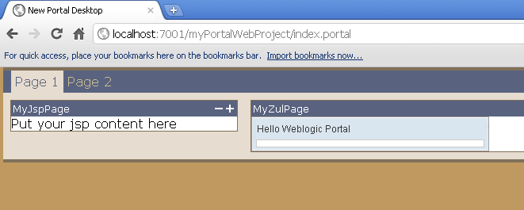

# Introduction

Weblogic Portal provides several types of portlets, if you want to
convert an existing zul page into a portlet, you can consider using a
JSP portlet.

# Add JSP/HTML Portlet

1.  Right click on *portlet* folder \> \[New\] \> \[Portlet\]

    
2.  Give a file name then click *Next*.
      
   
    
    
    
3.  Select **JSP/HTML Portlet** then click *Next*.
      
   
    
    
    
4.  Check *Minmizable* and *Maximizable* and you can define *title* and
    *zul page location* then click *Create*.
      
   
    
    
    

# Add Zul page to your webapp

- Create myZulPage.zul in the *WebContent/portlet/myzulpage* folder.
    
 
  
  
  

# Add portlet to portal page

1.  Drag *myZulPage.portlet* to "Page 1" in the index.portal.
      
   
    
    
    
2.  Done.
      
   
    
    
    

# Run the weblogic server

- Run the server and access your application in the following link,
  [<http://localhost:7001/myPortalWebProject/index.portal>](http://localhost:7001/myPortalWebProject/index.portal).
    
 
  
  
  

