# Setting up Websphere Portal

- Download Websphere Portal from
  [IBM](http://www14.software.ibm.com/webapp/download/byproduct.jsp?pgel=ibmhzn1&cm_re=masthead-_-supdl-_-dl-trials)
- Follow the installation guide
  [here](http://www-10.lotus.com/ldd/portalwiki.nsf/dx/Installing_wp7)
  to install
- Browse <http://localhost:10039/wps/portal> and set up admin account
  and password

# Create ZK portlet project

`since 6.0.1`

- [Create a ZK project by ZK Studio](quick_start/Create_and_Run_Your_First_ZK_Application_with_Eclipse_and_ZK_Studio)
- Add the following portlet.xml file under /WEB-INF

```xml
<?xml version="1.0" encoding="UTF-8"?>
<portlet-app version="2.0"
    xmlns="http://java.sun.com/xml/ns/portlet/portlet-app_2_0.xsd"
    xmlns:xsi="http://www.w3.org/2001/XMLSchema-instance"
    xsi:schemaLocation="http://java.sun.com/xml/ns/portlet/portlet-app_2_0.xsd 
                                        http://java.sun.com/xml/ns/portlet/portlet-app_2_0.xsd">
    <portlet>
        <portlet-name>zk</portlet-name>
        <display-name>zk</display-name>
        <portlet-class>org.zkoss.zk.ui.http.DHtmlLayoutPortlet</portlet-class>
        <init-param>
            <name>zk_page</name>
            <value>/index.zul</value> <!-- the main page of portlet -->
        </init-param>
        <expiration-cache>0</expiration-cache>
        <supports>
            <mime-type>text/html</mime-type>
        </supports>
        <portlet-info>
            <title>zk</title>
            <short-title>zk</short-title>
            <keywords>zk</keywords>
        </portlet-info>
        <security-role-ref>
            <role-name>administrator</role-name>
        </security-role-ref>
        <security-role-ref>
            <role-name>guest</role-name>
        </security-role-ref>
        <security-role-ref>
            <role-name>power-user</role-name>
        </security-role-ref>
        <security-role-ref>
            <role-name>user</role-name>
        </security-role-ref>
    </portlet>
</portlet-app>
```

- Export the project as a war file

# Deploy ZK portlet in WebSphere Portal 7

- Browse <http://localhost:10039/wps/portal> and login with admin
  account
- Click *Administration* tab at the top of the page

  


- Select *Web Module* then click the *install* button.

  


- Click *Choose File* button to select the war file then press the
  *Next* button.

  


- Check the war information and choose *Start application*, then click
  the *Finish* button.

  


- Go back to *Home* page

  


- Add a new tab page by clicking *Action* -\> *EditPage*

  


- Click *New Page* then enter "Page name" and "Friendly URL Name"

  


- Add the deployed portlet to the created new page by clicking *Action*
  -\> *EditPage*.
- Click *Customize* -\> *All* -\> in the search box, enter the portlet
  name defined in portlet.xml

  


- Drag and drop the portlet into the created new page and click *Save &
  Exit* button.

  


- ZK project is now deployed in a Websphere Portal

  


# Deploy ZK portlet in WebSphere Portal 8

- Browse <http://localhost:10039/wps/portal> and login with admin
  account
- Click *Administration* tab at the top of the page

  

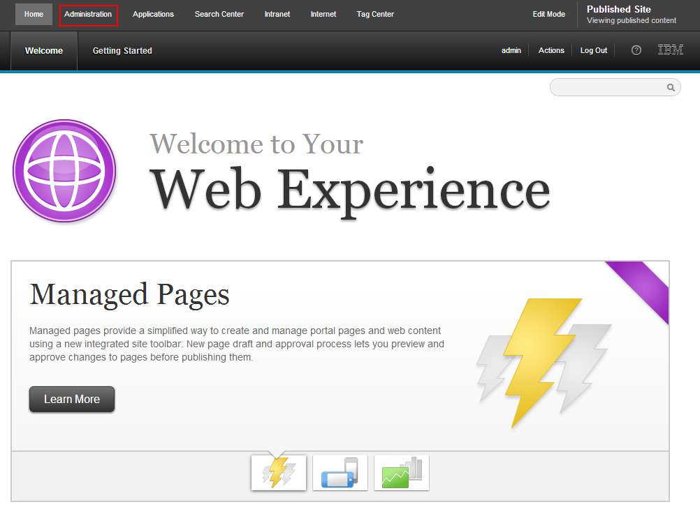


- Select *Web Module* then click the *install* button.

  

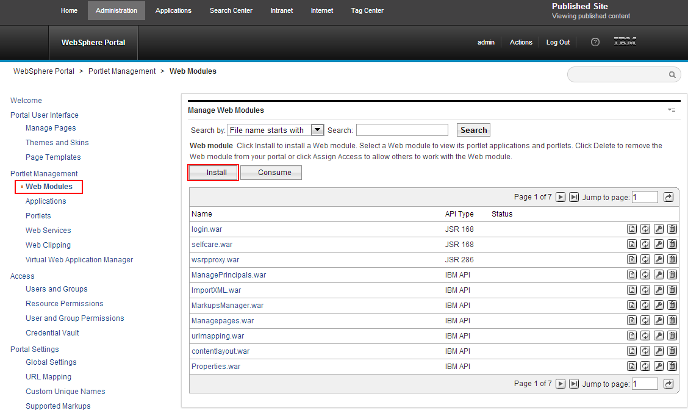


- Click *Choose File* button to select the war file then press the
  *Next* button.

  

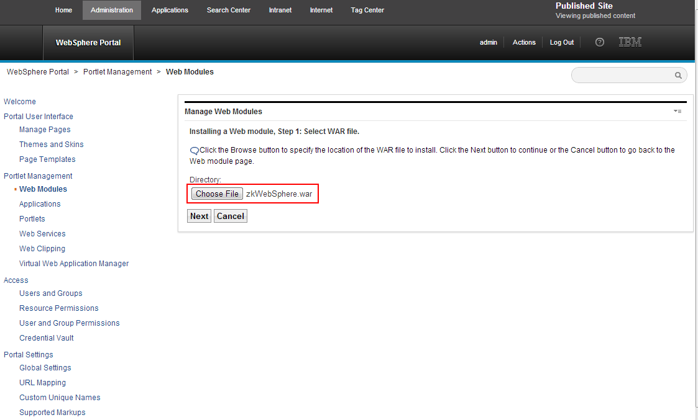


- Check the war information and choose *Start application*, then click
  the *Finish* button.

  

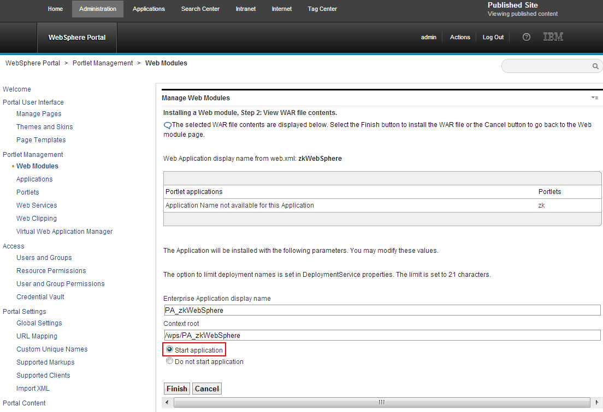


- Go back to *Home* page

  

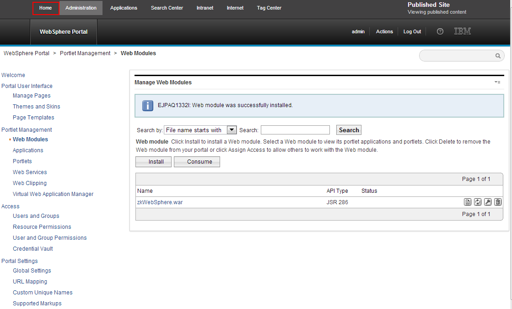


- Click *Edit Mode*

  

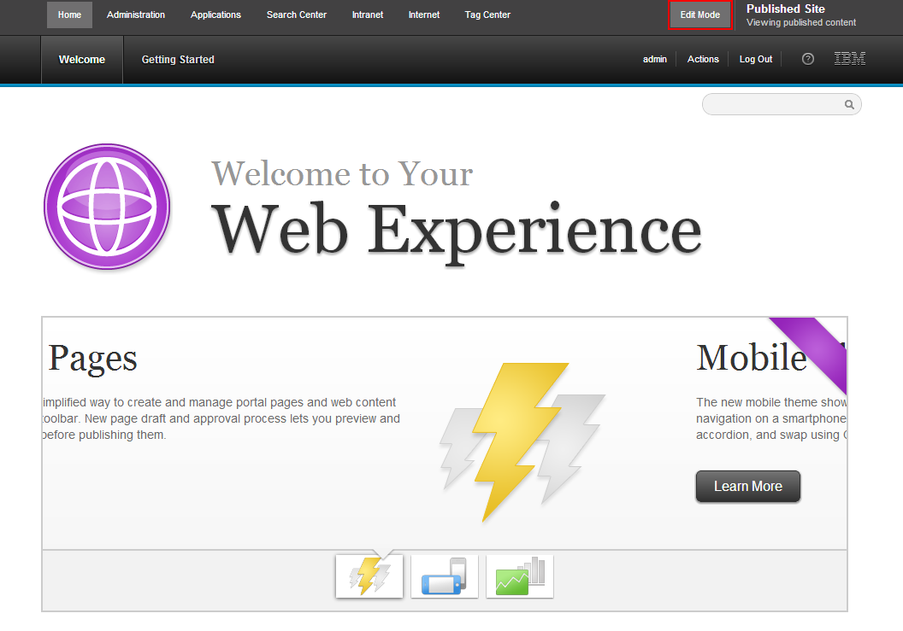


- Click *New Sibling Page*

  

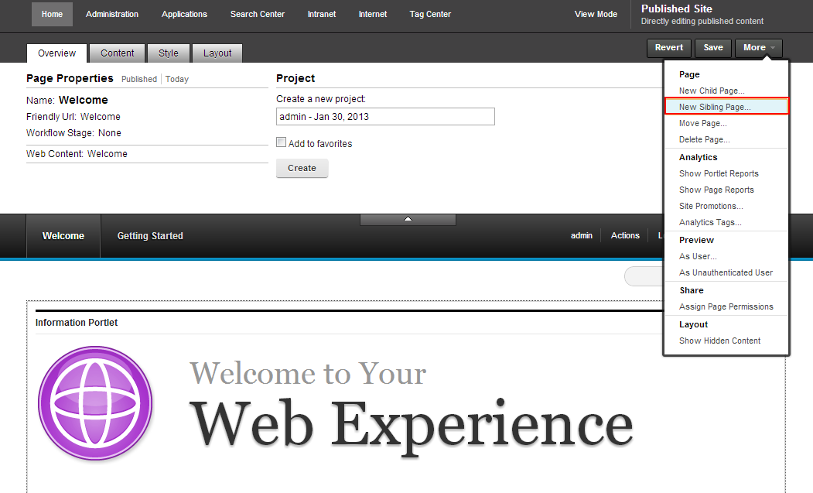


- Enter "Page name" and "Friendly URL Name"

  

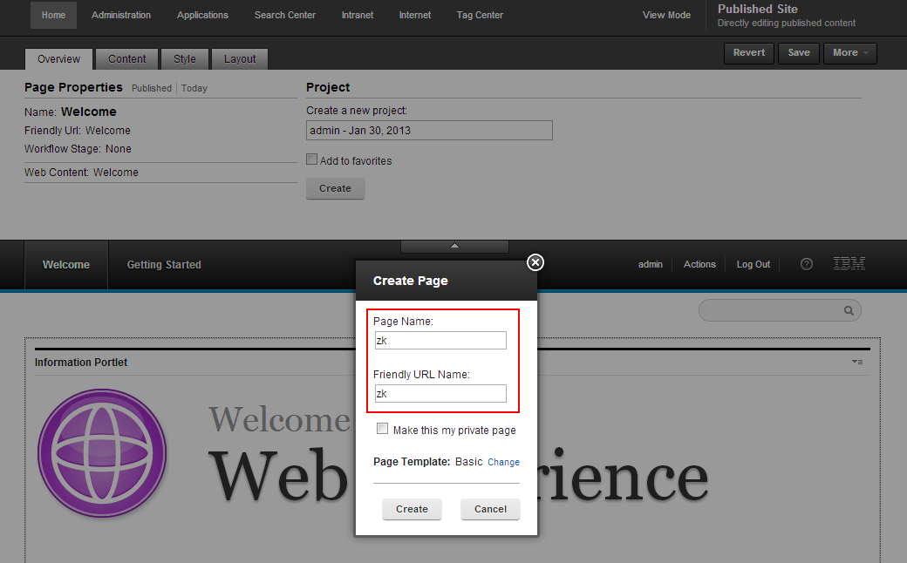


- Click *Content* -\> *All* -\> in the search box, enter the portlet
  name defined in portlet.xml

  

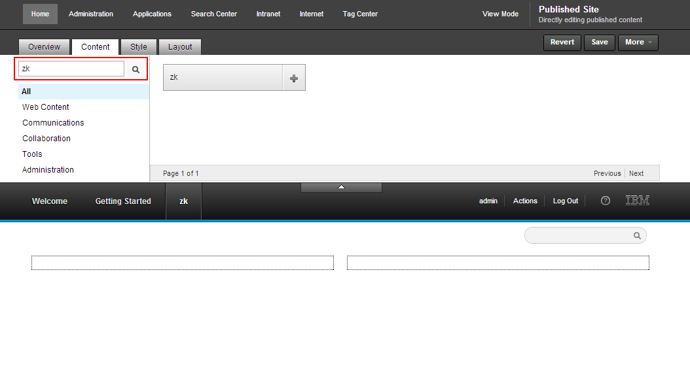


- Drag and drop the portlet into the created new page and click *Save*
  button.

  

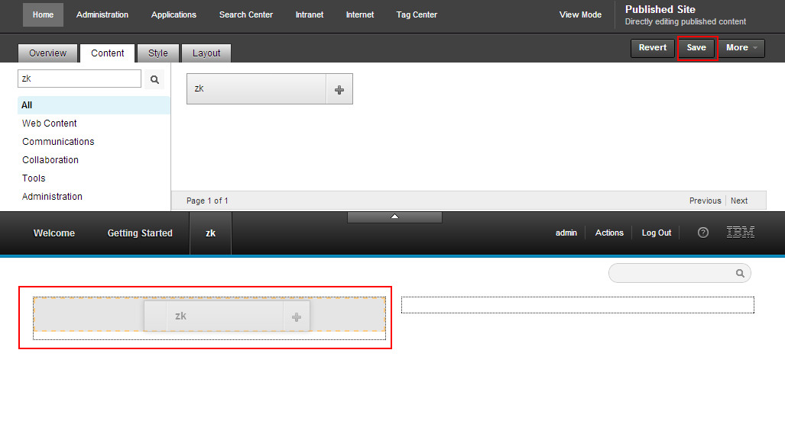


- ZK project is now deployed in a Websphere Portal

  

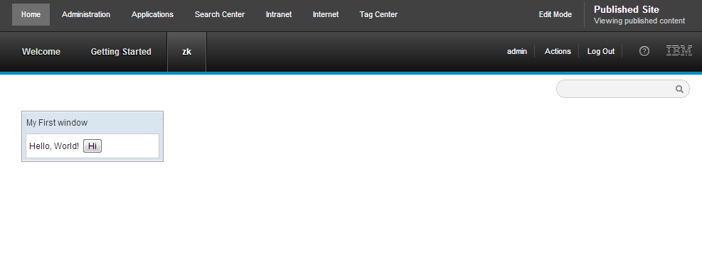


