If you are not familiar with the concept of pivot table, this section
will kindly guide you through.

## The Basic

Suppose you have a table of data of flight ticket sales record like
this,

<figure>

<figcaption>ZKPivotEsn_raw_table_03s.png</figcaption>
</figure>

and someone asks you "Hey, how did Antonio do this week? How much did he
sell from each airline?"

You read through the table, highlight all entries with Antonio involved,
categorize them by airlines, and sum up the selling prices.

<figure>

<figcaption>ZKPivotEsn_raw_table_04s.png</figcaption>
</figure>

This is a typical scenario when you work with business data, and this is
where a pivot table comes into play.

For example, you can let ZK Pivottable sums up all the selling prices
per agent, per airline, and arrange agents on the row, airline on the
column, then you automatically have the desired data summary on
Antonio's row.

<figure>
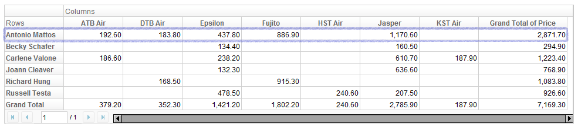
<figcaption>ZKPivotEsn_work_pivot_03.png</figcaption>
</figure>

Taking a closer look, the number in each cell comes from summing up the
values of all price entries of given agent and airline:

<figure>
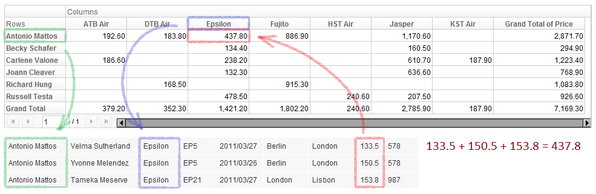
<figcaption>ZKPivotEsn_work_pivot_06.png</figcaption>
</figure>

We call *Agent, Airline* and *Price* **fields**, and more precisely
speaking, *Agent* is a **row field**, *Airline* is a **column field**,
and *Price* is a **data field**.

## Row and column headers

The computer screen is 2-dimensional after all, so what if we want to
summarize data by more than 2 criteria?

Pivottable can accept multiple fields on columns and rows. You can think
of it as Auxheaders of Grid. For example, if you want to have *Agent*
and *Customer* on the rows, *Airline* and *Flight* on the columns, this
is what you will get:

<figure>
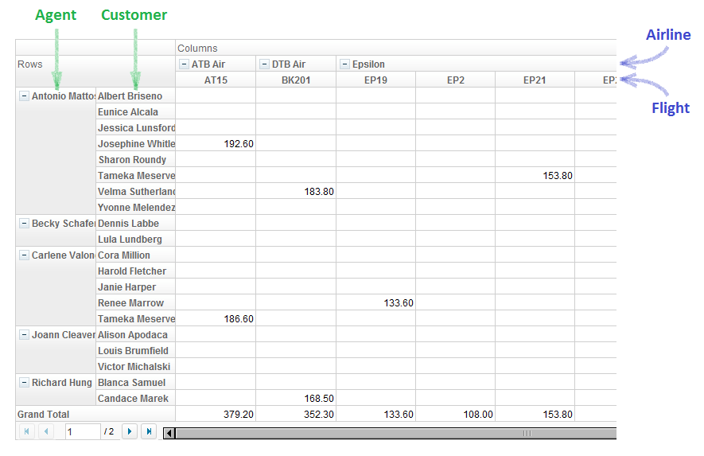
<figcaption>ZKPivotEsn_work_pivot_13.png</figcaption>
</figure>

You can also think of row and column fields as categorization layers of
data. On the X dimension, the data are categorized firstly by *Airline*,
then by *Flight*. While on the Y dimension, they are categorized by
*Agent* then *Customer*. Each of these two categories (row and column)
has a tree structure. We call them **row header tree** and **column
header tree**, respectively.

<figure>
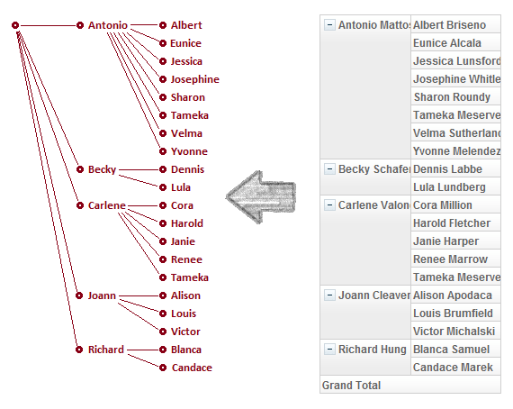
<figcaption>ZKPivotEsn_work_pivot_14.png</figcaption>
</figure>

In addition, it is quite easy to imagine, if you click on the minus sign
on any of the row or column header node, you can close the node so the
data will be contracted into a single row or column.

<figure>
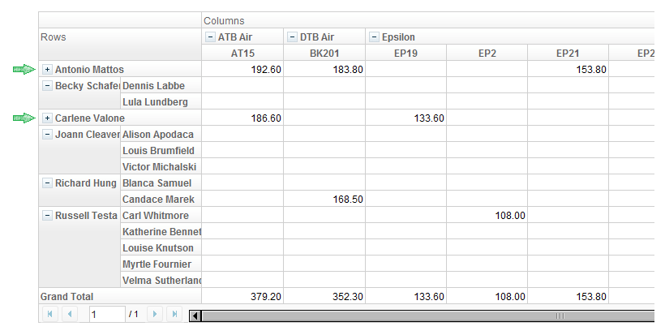
<figcaption>ZKPivotEsn_work_pivot_15.png</figcaption>
</figure>

## Data fields

We can have multiple row fields and column fields in a Pivottable, so
how about data fields? Yes, we can surely have more than one data
fields. Suppose we have *Price* and *Mileage* as data fields, you will
see:

<figure>
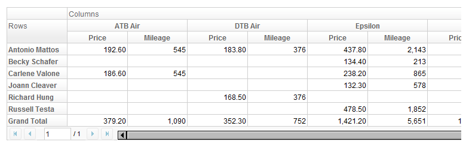
<figcaption>ZKPivotEsn_work_pivot_16.png</figcaption>
</figure>

By default, the data fields are displayed by column, but you can also
have them arranged on rows.

<figure>
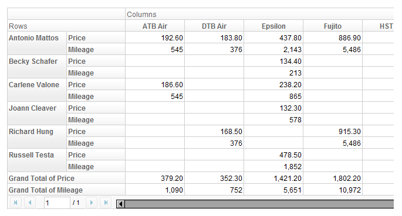
<figcaption>ZKPivotEsn_work_pivot_17.png</figcaption>
</figure>

We call this property **data field orientation**, or **data
orientation** in short. In the former case, the data orientation is
"column", while in the latter, it is "row".

## Summary and subtotal

So far we have seen *Price* and *Mileage* as data fields, and the data
cell values are sums of a subset from raw data. What if a data field is
not numeric? How can we sum them up? In this case, Pivottable is smart
enough to replace the concept of **Sum** by **Count**. For example, if
you put *Price* and *Customer* as data fields, you will see:

<figure>
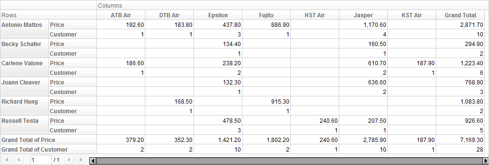
<figcaption>ZKPivotEsn_work_pivot_18.png</figcaption>
</figure>

Thus, to be generic, rather than calling the displayed values "sum", we
call them **summary**, which could be a sum, a count, or even anything
defined by user.

In additional to changing summary, we can also attach a row or column
for **subtotal** on each header node. For example, if we let *Agent* and
*Customer* be row fields, and want a subtotal of as **Average** on
*Agent* layer, we will see:

<figure>
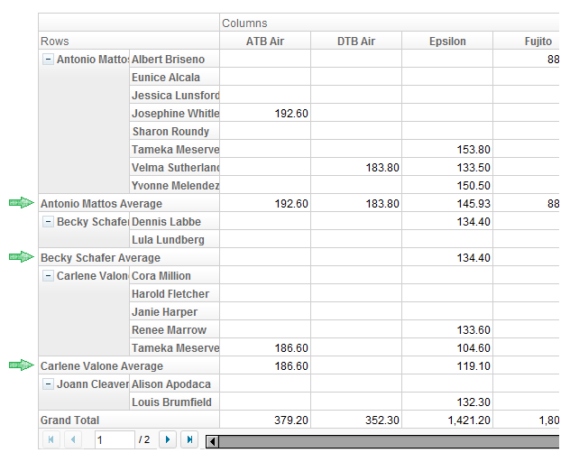
<figcaption>ZKPivotEsn_work_pivot_19.png</figcaption>
</figure>

## Trivia

For a better reading experience throughout the rest of this books, we
also define the follow terms: **data area**, **row area**, **column
area**, **data title**, **row title**, and **column title**.

<figure>
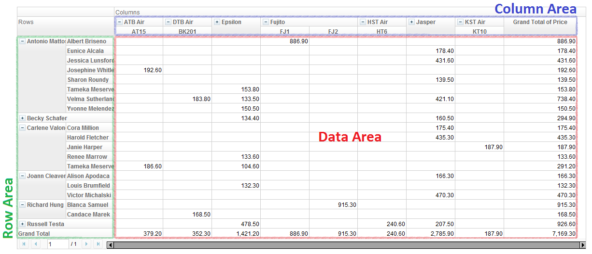
<figcaption>ZKPivotEsn_work_pivot_09.png</figcaption>
</figure>

<figure>
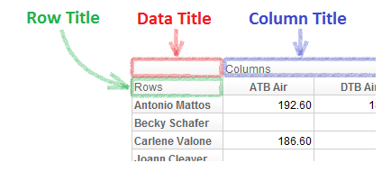
<figcaption>ZKPivotEsn_work_pivot_08.png</figcaption>
</figure>

The six regions defined above cover all the areas in a Pivottable except
paging and scroll bar.

- Each of data title, row title, and column title is also called a
  **title cell**.
- A cell in data area is called a **data cell**.

#
