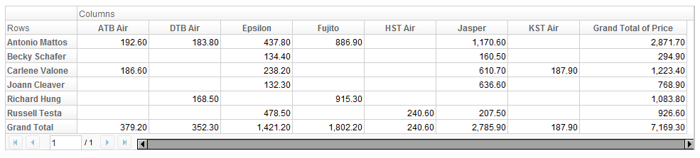
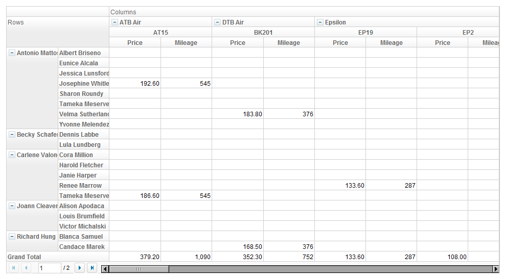

Pivottable takes a model for its data population. Analogous to ListModel
for Grid component, the model interface we use for Pivottable is
PivotModel.

However, unlike Grid or Listbox, due to the logic of pivot table, we
cannot specify data as children components of a Pivottable, so you
always need to prepare a PivotModel prior to using Pivottable.

## Construct a PivotModel

<javadoc directory="zkpvt">org.zkoss.pivot.impl.TabularPivotModel</javadoc>
is a standard implementation of
<javadoc directory="zkpvt">org.zkoss.pivot.PivotModel</javadoc>. It's
constructor takes an Iterable and a String List, for raw data and column
labels respectively.

``` java
    public TabularPivotModel(Iterable<? extends List<?>> 
        data, List<String> columns) { ... }
```

Here is a simple example of constructing a TabularPivotModel.

``` java
    public static TabularPivotModel getModel() {
        return new TabularPivotModel(getData(), getColumns());
    }
    private static final long TODAY = new Date().getTime();
    private static final long DAY = 1000 * 60 * 60 * 24;
    private static Date dt(int i){
        return new Date(TODAY + i * DAY);
    }
    // raw data
    public static List<List<Object>> getData() {
        Object[][] objs = new Object[][] {
                { "Carlene Valone", "Tameka Meserve",    "ATB Air", "AT15",  dt(-7), "Berlin",     "Paris",     186.6, 545  },
                { "Antonio Mattos", "Sharon Roundy",     "Jasper",  "JS1",   dt(-5), "Frankfurt",  "Berlin",    139.5, 262  },
                { "Russell Testa",  "Carl Whitmore",     "Epsilon", "EP2",   dt(-3), "Dublin",     "London",    108.0, 287  },
                { "Antonio Mattos", "Velma Sutherland",  "Epsilon", "EP5",   dt(-1), "Berlin",     "London",    133.5, 578  },
                { "Carlene Valone", "Cora Million",      "Jasper",  "JS30",  dt(-4), "Paris",      "Frankfurt", 175.4, 297  },
                { "Richard Hung",   "Candace Marek",     "DTB Air", "BK201", dt(-5), "Manchester", "Paris",     168.5, 376  },
                { "Antonio Mattos", "Albert Briseno",    "Fujito",  "FJ1",   dt(-7), "Berlin",     "Osaka",     886.9, 5486 },
                { "Russell Testa",  "Louise Knutson",    "HST Air", "HT6",   dt(-2), "Prague",     "London",    240.6, 643  },
                { "Antonio Mattos", "Jessica Lunsford",  "Jasper",  "JS9",   dt(-4), "Munich",     "Lisbon",    431.6, 1222 },
                // more rows...
                { "Russell Testa",  "Velma Sutherland",  "Epsilon", "EP4",   dt(-7), "London",     "Berlin",    155.7, 578  }
        };
        
        List<List<Object>> list = new ArrayList<List<Object>>();
        for(Object[] a : objs)
            list.add(Arrays.asList(a));
        return list;
    }
    
    // column labels
    public static List<String> getColumns() {
        return Arrays.asList(new String[]{
                "Agent", "Customer", "Airline", "Flight", "Date", "Origin", "Destination", "Price", "Mileage"
        });
    }
```

### Determine fields on rows and columns

In addition to providing data, you also need to specify how you want to
categorize it. For example, given the previously constructed
TabularPivotModel

``` java
// what to show on column headers (how you categorize the x-axis)
model.setFieldType("Airline", PivotField.Type.COLUMN);

// what to show on row headers (how you categorize the y-axis)
model.setFieldType("Agent", PivotField.Type.ROW);

// which field to show in data cell
model.setFieldType("Price", PivotField.Type.DATA);
```

Here we don't set a Calculator, the [default calculator "sum or
count"](https://www.zkoss.org/javadoc/latest/zkpvt/org/zkoss/pivot/impl/TabularPivotField.html#DEFAULT_CALCULATOR)
will be used.

This will result in a Pivottable that looks like



Of course, to utilize the power of Pivottable, you can specify multiple
fields as column, row, and data fields.

``` java
// columns are categorized by Airline, then Flight
model.setFieldType("Airline", PivotField.Type.COLUMN);
model.setFieldType("Flight", PivotField.Type.COLUMN);

// rows are categorized by Agent, then Customer
model.setFieldType("Agent", PivotField.Type.ROW);
model.setFieldType("Customer", PivotField.Type.ROW);

// show sum of Price and Mileage in each cell, if any
model.setFieldType("Price", PivotField.Type.DATA);
model.setFieldType("Mileage", PivotField.Type.DATA);
```

Now the Pivottable shall look like



Note:

- If you do not specify any fields on row or column, the model will
  still work (as it makes sense for the model). In this case, only grand
  total row/column will be shown.
- You need **at least one data field**.

Hint: If you can't wait to play around with the component, you can jump
to [ next
section](ZK_Pivottable_Essentials/Working_With_Pivottable/Create_Pivottable)
and come back to read further if necessary.

 

### Summary and Subtotals

After adding fields on a PivotModel, you can change the summary type for
the data, or set subtotals to rows or columns.

For example, to change summary type:

``` java
// assume "Price" and "Mileage" were added as data fields
TabularPivotField field = model.getField("Price");
model.setFieldSummary(field, StandardCalculator.AVERAGE);
// now the values in data cells are averages of Prices, instead of sums
// Mileage values are still sum, not average
```

Note:

- [TabularPivotField](http://www.zkoss.org/javadoc/latest/zkpvt/org/zkoss/pivot/impl/TabularPivotField.html)
  is an implementation of
  [PivotField](http://www.zkoss.org/javadoc/latest/zkpvt/org/zkoss/pivot/PivotField.html)
  that comes with
  [TabularPivotModel](http://www.zkoss.org/javadoc/latest/zkpvt/org/zkoss/pivot/impl/TabularPivotModel.html)
- [TabularPivotField](http://www.zkoss.org/javadoc/latest/zkpvt/org/zkoss/pivot/impl/TabularPivotField.html)
  provides a default summary, which sums up raw values if they are
  numeric, or count their numbers otherwise.
- A summary is represented by interface
  [Calculator](http://www.zkoss.org/javadoc/latest/zkpvt/org/zkoss/pivot/Calculator.html).
- [Calculators](http://www.zkoss.org/javadoc/latest/zkpvt/org/zkoss/pivot/Calculators.html)
  is a utility class which provides a set of predefined
  [Calculator](http://www.zkoss.org/javadoc/latest/zkpvt/org/zkoss/pivot/Calculator.html).

To set subtotals on column or row, you have to specify on a column field
or row field:

``` java
// assume "Agent", "Customer" are column fields
TabularPivotField field = model.getField("Agent");
model.setFieldSubtotals(field, new Calculator[]{
        StandardCalculator.AVERAGE, StandardCalculator.COUNT
});
// now when you open a header node of Agent, there will be two subtotal columns
```

Note:

- By default,
  [TabularPivotField](http://www.zkoss.org/javadoc/latest/zkpvt/org/zkoss/pivot/impl/TabularPivotField.html)
  has no subtotal on each field.
- Setting subtotals on a field is only effective if it is a column or
  row field, and it is NOT the last field among column or row fields.
- Subtotals are shown only when the corresponding node is open. When the
  node is closed, it's underlying data are summarized by data field's
  summary.
- Setting subtotals on a field does not affect other fields. In other
  words, if you have *A, B, C* as column fields and specify a subtotal
  on *B*, then *A* has no subtotal.

 

### Header Grouping

On row and column, we categorize data by fields in the given order, but
sometimes you may want to group by a coarser fashion. For example, you
may have a field of dates, but you want to categorize the data just by
month.

In this case we can specify a GroupHandler to the field:

``` java
// suppose "Date" is a column field, whose value is a Java Date object
TabularPivotField field = model.getField("Date");
field.setGroupHandler(new GroupHandler(){
    public Object getGroup(Object data) {
        SimpleDateFormat format = new SimpleDateFormat("yyyy/MM");
        return format.format((Date) data);
    }
});
// now it converts the Date to a String of format "yyyy/MM" for comparison, so the data will be categorized by month
```

 

### Header Sorting

You can provide a custom comparator on each field to sort the nodes on
the corresponding level of header tree. For example:

``` java
// for Customer field, compare their last names, and then their first names
model.setFieldKeyComparator("Customer", new Comparator<Object>() {
    public int compare(Object k1, Object k2) {
        String s1 = (String) k1;
        String s2 = (String) k2;
        int i1 = s1.lastIndexOf(' ');
        int i2 = s2.lastIndexOf(' ');
        int cmp = s1.substring(i1 + 1).compareTo(s2.substring(i2 + 1));
        if (cmp != 0)
            return cmp;
        String fname1 = i1 < 0 ? "" : s1.substring(0, i1).trim();
        String fname2 = i2 < 0 ? "" : s2.substring(0, i2).trim();
        return fname1.compareTo(fname2);
    }
});
```

You can set the comparator on any type of fields, including data fields
and usused fields, but the comparator is only in effect on row and
column fields.

The setFieldKeyOrder method is a shortcut of the method above, which is
equivalent to setting the comparator to one of the defaults.

``` java
// sets the comparator to the default one with descending natural order
model.setFieldKeyOrder("Date", false);
// sets the comparator to the default one with ascending natural order
// this is the default setting
model.setFieldKeyOrder("Date", true); 
```

 

## Use data from database

To use data from database, simply prepare the List by an SQL query.

``` java
// you can get webapp from Desktop
public List<List<Object>> getData(WebApp webapp, final String[] columns) throws SQLException {    
    final boolean selectStar = columns == null || columns.length == 0;
    final List<List<Object>> list = new ArrayList<List<Object>>();
    Connection conn = null;
    try {
        // use your own database name, table name, etc
        conn = DriverManager.getConnection("jdbc:h2:" + webapp.getRealPath("/WEB-INF/h2db/mydb"), "myname", "mypwd");
        Statement stmt = conn.createStatement();
        String query = "SELECT " + (selectStar ? "*" : join(columns)) + " FROM mytable";
        //query += " WHERE ... "; // add your own WHERE clause to filter
        ResultSet res = stmt.executeQuery(query);
        while (res.next()) {
            List<Object> row = new ArrayList<Object>();
            for (String col : columns)
                row.add(res.getObject(col));
            list.add(row);
        }
        res.close();
    
    } finally {
        if (conn != null && !conn.isClosed())
            conn.close();
    }
}

// helper //
private static String join(String ... strs) {
    if (strs.length == 0)
        return "";
    StringBuilder sb = new StringBuilder(strs[0]);
    for (int i = 1; i < strs.length; i++)
        sb.append(", ").append(strs[i]);
    return sb.toString();
}
```

 

## Filtering input data

To filter the input data of a TabularPivotModel, you can either prepare
it by yourself (in the case of data from database), or use the utility
class PivotModels to help:

``` java
Iterable<List<Object>> data = ... // your input data
Iterable<List<Object>> filteredData = PivotModels.filter
(data, new Filter<List<Object>>() {
    public boolean keep(List<Object> row) {
        return row.get(0) != null; // filter out rows with null value on first column.
    }
});
```

 

## Version History

| Version | Date | Content |
|---------|------|---------|
|         |      |         |
