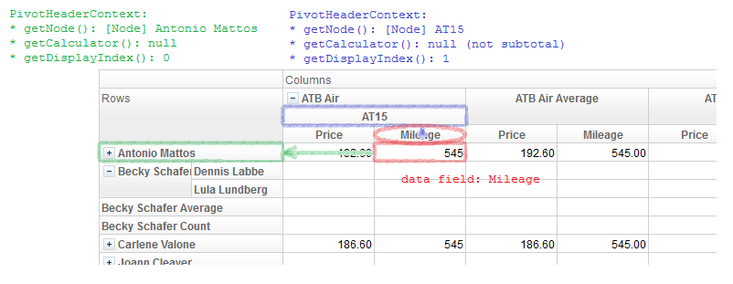
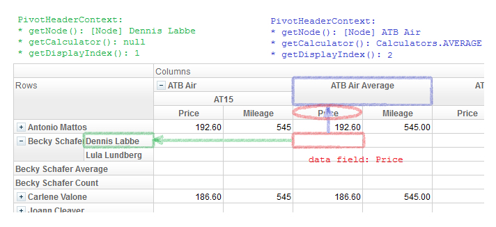

The rendering of Pivottable is defined by a PivotRenderer. You set your
custom renderer by calling `setPivotRenderer()` method on Pivottable, or
just use the default PivotRenderer.

PivotRenderer determines:

- How data Object in each cell (either in column, row, or data field) is
  converted to String for display
- Column and Row sizes

In addition, you can implement PivotRendererExt (which extends from
PivotRenderer), which determines:

- Custom sclass (CSS class) and/or style on data cells.

## SimplePivotRenderer

We have provided
[org.zkoss.pivot.impl.SimplePivotRenderer](https://www.zkoss.org/javadoc/latest/zkpvt/org/zkoss/pivot/impl/SimplePivotRenderer.html),
a basic implementation of
[org.zkoss.pivot.PivotRendererExt](https://www.zkoss.org/javadoc/latest/zkpvt/org/zkoss/pivot/PivotRendererExt.html),
to be the default renderer and a skeleton class to extend from.

```java
public class SimplePivotRenderer implements PivotRendererExt {
    
    private DecimalFormat _fnf = new DecimalFormat("##,###.00");
    private DecimalFormat _nnf = new DecimalFormat("##,###");
    
    @Override
    public String renderCell(Number data, Pivottable table, 
            PivotHeaderContext rowContext, PivotHeaderContext columnContext,
            PivotField dataField) {
        return data == null ? "" :
                data instanceof Integer ? _nnf.format(data) : _fnf.format(data);
    }
    
    @Override
    public int getColumnSize(Pivottable table, PivotHeaderContext colc, 
            PivotField field) {
        return colc.isGrandTotal() && field != null ? 150 : 100;
    }
    
    @Override
    public int getRowSize(Pivottable table, PivotHeaderContext rowc, 
            PivotField field) {
        return 20;
    }
    
    @Override
    public String renderField(Object data, Pivottable table, PivotField field) {
        return field.getType() == PivotField.Type.DATA ?
                field.getTitle() : data == null ? "(null)" : String.valueOf(data);
    }
    
    @Override
    public String renderGrandTotalField(Pivottable table, PivotField field) {
        if (field == null) return "Grand Total";
        return "Grand Total of " + field.getTitle();
    }
    
    @Override
    public String renderSubtotalField(Object data, Pivottable table, 
            PivotField field, Calculator calculator) {
        String calLabel = calculator.getLabel();
        String dataLabel = data == null ? "Null" : data.toString();
        return dataLabel + " " + calLabel;
    }
    
    @Override
    public String renderDataField(PivotField field) {
        return field.getFieldName();
    }
    
    @Override
    public String renderCellSClass(Number data, Pivottable table,
            PivotHeaderContext rowContext, PivotHeaderContext columnContext,
            PivotField dataField) {
        return null;
    }
    
    @Override
    public String renderCellStyle(Number data, Pivottable table,
            PivotHeaderContext rowContext, PivotHeaderContext columnContext,
            PivotField dataField) {
        return null;
    }
    
}
```

You can customize the rendering for following things:

### Data display

To customize data display, override `renderCell()`, `renderField()`,
`renderGrandTotalField()`, and `renderSubtotalField` respectively.

### Column and row sizes

To customize the initial size of columns and rows, override
`getColumnSize()` and `getRowSize()`.

### Custom CSS

To provide custom CSS class or custom style on data cell, override
`renderCellSClass()` or `renderCellStyle()`.

Samples of such customization can be found in the source code of
Pivottable demo.

 

## PivotHeaderContext

This class is commonly used in the arguments of PivotRenderer (or
PivotRendererExt, PivotUIEvent, etc) methods. It represents a position
(a slot) on either row or column axis. For example, the following method
in PivotRenderer has two PivotHeaderContext object, for row and column
respectively:

```java
    public String renderCellSClass(Object data, Pivottable table,
            PivotHeaderContext rowContext, PivotHeaderContext columnContext,
            PivotField dataField) {
        ...
    }
```

The header contexts and data fields corresponding to a cell are
illustrated as the following:





 

## Hide the Icon

You can also hilde the +/- icon by css as needed. e.g.,

Hide the '-' icon

```css
.z-pivottable-icon-expd {
    display: none;
}
```

Hide both '+' and '-' icon

```css
.z-pivottable-icon {
    display: none;
}
```

#
