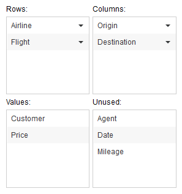
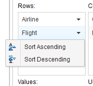
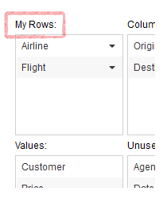
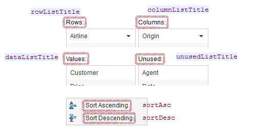

You can change page, open/close node, or resize columns on the
Pivottable component itself. However, for UI flexibility, the component
itself does not provide control unit for other APIs, like to change
pivot fields, toggle data field orientation, or sort the headers.

## Simple controls

The following properties on Pivottable are very straightforward to wire
up:

- data field orientation
- whether to show row/column grand totals

For example,

```xml
<pivottable id="pivot" />
<checkbox label="Enable grand total for columns" 
    onCheck='pivot.setGrandTotalForColumns(self.isChecked())' />
<checkbox label="Enable grand total for rows" 
    onCheck='pivot.setGrandTotalForRows(self.isChecked())' />
<radiogroup id="dataOrient">
    Data field orientation:
    <radio id="colOrient" label="column" 
        onCheck='pivot.setDataFieldOrient("column")' />
    <radio id="rowOrient" label="row" 
        onCheck='pivot.setDataFieldOrient("row")' />
</radiogroup>
```

 

## Use PivotFieldControl to handle field setting

Compared to the others, field setting UI is much trickier to compose.
Thus we have provided a macro component to simply the work.

ZUL:

```xml
<pivottable id="pivot" />
<pivot-field-control id="pfc" height="300px" /
><!-- Remember to specify height -->
```

Composer:

```java
public class PivotController extends GenericForwardComposer {
    private Pivottable pivot;
    private TabularPivotModel _model;
    private PivotFieldControl pfc;
    
    public void doAfterCompose(Component comp) throws Exception {
        super.doAfterCompose(comp);
        
        _model = MyPivotModelFactory.getModel(); // construct your pivot model
        pivot.setModel(_model);
        pfc.setModel(_model);
        
    }
}
```

It will look like:



The fields in the four area are draggable. You can move them to other
pools, so the model and pivot table will be updated accordingly.

Sort options are available on row and column fields.



 

## Customize PivotFieldControl

### Layout

You can specify layout on PivotFieldControl:

```xml
<pivot-field-control height="300px" width="300px" layout="square" />
<!-- square is the default layout -->
<pivot-field-control height="600px" width="150px" layout="vertical" />
<pivot-field-control height="150px" height="600px" layout="horizontal" />
```

vertical:


horizontal:


### Labels

You can customize labels appeared in the macro, either by custom
attributes or label files (which affect all the PivotFieldControl
components in the application).

Setting by custom attributes, you shall do like the following:

ZUL

```xml
<pivot-field-control id="pfc" height="300px">
    <custom-attributes rowListTitle="My Rows:" />
</pivot-field-control>
```

Or, to set the label by label files, you need to add a prefix
`pivot.fieldControl.` to the key:

zk-label.properties<reference>For more information, please refer to [ZK Developer's Reference: Labels]({{site.baseurl}}/zk_dev_ref/internationalization/labels).</reference>

```perl
pivot.fieldControl.rowListTitle=My Rows
```

Then you shall see the label is changed:



All the available keys are defined as the following:



> ------------------------------------------------------------------------
>
> <references/>

#
