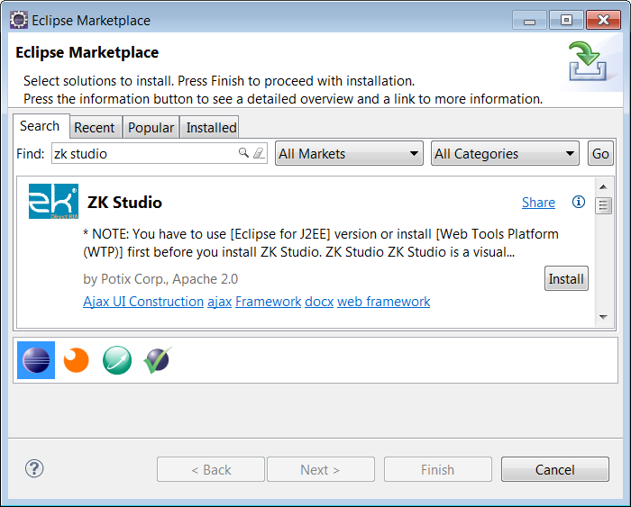

# Prerequisite

There are some software you need to install before installing ZK Studio.

## Java SE Development Kit (JDK)

Java version 6 or later is required in order to run Eclipse with ZK
Studio, you can download it from [Oracle official
site](http://www.oracle.com/technetwork/java/javase/downloads).

## Eclipse IDE for Java EE Developers

ZK Studio is an Eclipse Plug-in, therefore you must install Eclipse. We
recommend the **Eclipse IDE for Java EE Developers** package.

**Install:**

Installation is done simply by extracting the downloaded zip file to a
proper local folder. To make sure Eclipse can run on your system,
execute `eclipse.exe` (in Windows) or `eclipse` (in Unix or Linux). You
can locate these files in your extracted eclipse folder.

**Tips:**

1.  We recommend modifying some parameters in the configuration file
    `eclipse.ini` which will result in performance gain, please refer
    [here](http://www.eclipsezone.com/eclipse/forums/t61618.html) and
    [here](http://blog.xam.dk/archives/68-Eclipse-and-memory-settings.html).
2.  We also recommend setting Eclipse's default JRE to JDK, please refer
    to the "Setup/Preferences" section in [WTP Tutorials – Building and
    Running a Web
    Application](http://www.eclipse.org/webtools/community/tutorials/BuildJ2EEWebApp/BuildJ2EEWebApp.html).

## Application Servers

Before developing web applications in Java using ZK Framework, you need
to install an application server. Apache Tomcat is one of the most
popular web containers. Tomcat versions 6 and 7 are supported and can be
downloaded at [Apache Tomcat](http://tomcat.apache.org).

**Install:**

  
Download the zip file of Tomcat distribution and extract it to a proper
location (with no illegal characters or space in the path). Tomcat
requires configuration before it can be used with Eclipse, this process
is described in the following link [ Running the ZK
Project]({{site.baseurl}}/zk_studio_essentials/begin_your_first_zk_project/create_a_new_zk_project#Running_the_ZK_Project).

**Tips:**

  
If you not only want to develop web applications, but also need to
deploy them on Apache Tomcat, links to the official installation
instructions for directly running Apache Tomcat in your environment are
provided below:

- Tomcat 7: <http://tomcat.apache.org/tomcat-7.0-doc/setup.html>
- Tomcat 6: <http://tomcat.apache.org/tomcat-6.0-doc/setup.html>

# Install ZK Studio

ZK Studio can be installed in several ways. We recommend to install
through Marketplace.

## Marketplace (Since Eclipse 3.6)

Marketplace is the easiest way to install plugins. Go to menu **\[Help\]
\> \[Eclipse Markpetplace\]** and search **"zk studio"** you'll find
**ZK Studio** to install.



## Update Site

1.  Open Eclipse, click the **\[Help\]** menu and select **\[Install New
    Software...\]**. A install window will popup, and then click **Add**
      
    

      
2.  Name the site as **"ZK Studio"** and copy corresponding update
    site's URL into **Location** field and click **OK**.
      
    The URL of ZK Studio for Eclipse 4.2 and later:
    <http://studio.zkoss.org/resource/plugins/eclipse_4_2>

    The URL of ZK Studio for Eclipse 3.7:
    <http://studio.zkoss.org/resource/plugins/eclipse_3_7>

    

      
3.  Expand the update entry of ZK Studio, check **ZK Studio** and then
    click **Next**
      
    

    The Eclipse Installation System will now attempt to retrieve
    information from the update site. This will take some time depending
    on your eclipse environment, please be patient.
4.  Click **Next** on the pop-up install wizard dialog.
      


Check **"I accept the terms of the license agrement"** and click **Finish** on the wizard dialog.


      

The Installation process will now begin.


If there is a pop-up dialog with unsigned content warning, please click **OK** to continue.


      
5.  Once the installation is complete, please restart Eclipse as
    prompted.
      


## Offline Installation

1.  Download the offline installation zip file from [ZK Studio download page](http://www.zkoss.org/download/zkstudio).
2.  The step is the same as step 1 we do for [ Update Site](#_Update_Site). Open Eclipse, click **\[Help\]**
    menu and select **\[Install New Software...\]**. An install window
    will popup, click **Add**
3.  Click **Archive...** to open a file explorer. Then, use file
    explorer to choose downloaded file and click "OK" to install.
      


## Activate ZK Studio

**Removed** since ZK Studio 2.0.4.

ZK Studio 2.0.4 and later doesn't require activation.

# Visual Editor

Visual Editor is a deprecated feature, it is no longer included in ZK
Studio. There are several alternatives:

- install [run jetty run
  plugin](https://marketplace.eclipse.org/content/run-jetty-run) for
  eclipse
- [jetty Maven
  plugin](https://www.eclipse.org/jetty/documentation/9.3.x/jetty-maven-plugin.html)

Add the plugin below in a pom.xml.

```xml
    <build>
        <plugins>
            <plugin>
                <groupId>org.eclipse.jetty</groupId>
                <artifactId>jetty-maven-plugin</artifactId>
                <version>9.4.8.v20171121</version>
                <configuration>
                    <webAppConfig>
                        <contextPath>/${project.artifactId}</contextPath>
                        <allowDuplicateFragmentNames>true</allowDuplicateFragmentNames>
                    </webAppConfig>
                    <scanIntervalSeconds>5</scanIntervalSeconds>
                </configuration>
            </plugin>
        </plugins>
    </build>
```

Run the goal with

`mvn jetty:run`

- [Gradle
  gretty](http://akhikhl.github.io/gretty-doc/Getting-started.html)
- [jetty-runner](https://mvnrepository.com/artifact/org.eclipse.jetty/jetty-runner)
- [webapp-runner (Tomcat)](https://github.com/jsimone/webapp-runner)

All jetty plugins (or runner) above can quickly start your project in an
IDE in seconds without packaging a project as WAR. When you change a zul
or a Java class, you don't need to restart the jetty server. It will
hot-reload the newly-compiled class. So that you can view the result
with your browser, just like Visual Editor can do.

# Troubleshooting

## Can't activate in Spring Tool Suite

Spring tool suite 2.6 and later may ask that encrypt/decrypt library
must be signed by trusted source. So with STS, in order to activate ZK
Studio you need to modify java.security file to enable the license
management of ZK Studio, i.e. the Bouncy Castle Cryptography Provider.

First you need to check your jvm version. For Ubuntu/Debian users, run

```text
$ update-java-alternatives –l
```

You should be seeing:

```text
java-6-sun 63 /usr/lib/jvm/java-6-sun
```

To get your Bouncy Castle running correctly:

- 1.Search for java.security in /path_to_your_jvm/jre/lib/security
- 2.Should look like:

```text
#......
# (some info)
#......
security.provider.1=sun.security.provider.Sun
security.provider.2=sun.security.rsa.SunRsaSign
security.provider.3=com.sun.net.ssl.internal.ssl.Provider
…
security.provider.8=sun.security.smartcardio.SunPCSC
```

- 3.Add
  security.provider.X=org.bouncycastle.jce.provider.BouncyCastleProvider
  as the last provider. In the sample above you will add

```text
security.provider.9=org.bouncycastle.jce.provider.BouncyCastleProvider
```

- 4\. Visit Bouncy Castle
  (http://www.bouncycastle.org/latest_releases.html) and search for
  bcprov-jdkxx-xxx.jar according to your JVM version. Add it to
  /path_to_your_jvm/jre/lib/ext
- 5.Remove any other undesired bcprov-jdkxx-xxx.jar from your class
  path.

After you have successfully run the Bouncy Castle Cryptography Provider
you should be able to activate ZK Studio. If there is still an issue
please contact info@zkoss.org for further assistance.

## WTP not installed

If you get the following error message while installing ZK Studio, that
means you are not using Eclipse for JavaEE Developers, and you need to
install [Eclipse WTP](http://www.eclipse.org/webtools) plug-in manually
or download Eclipse for JavaEE Developers.

    Cannot complete the install because one or more required items could not be found.
    Software currently installed: ZK Studio Eclipse Plugins 0.9.6.v200912041237 (org.zkoss.eclipse.feature.group 0.9.6.v200912041237)
    Missing requirement: ZK Studio Storage Plug-in 0.9.6.v200912041237 (org.zkoss.eclipse.zks 0.9.6.v200912041237) requires 'bundle org.eclipse.wst.common.project.facet.ui 0.0.0' but it could not be found
    Cannot satisfy dependency:  From: ZK Studio Eclipse Plugins 0.9.6.v200912041237 (org.zkoss.eclipse.feature.group 0.9.6.v200912041237)
    To: org.zkoss.eclipse.ve [0.9.6.v200912041237]
    Cannot satisfy dependency:  From: ZK Studio Visual Editor Plug-in 0.9.6.v200912041237 (org.zkoss.eclipse.ve 0.9.6.v200912041237)
    To: bundle org.zkoss.eclipse.zks 0.0.0

## Still have problem?

Please contact <info@zkoss.org> if there's any issue after referencing
the above note.
