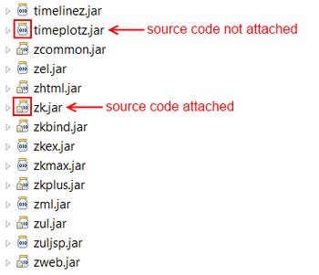
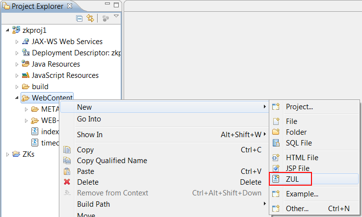
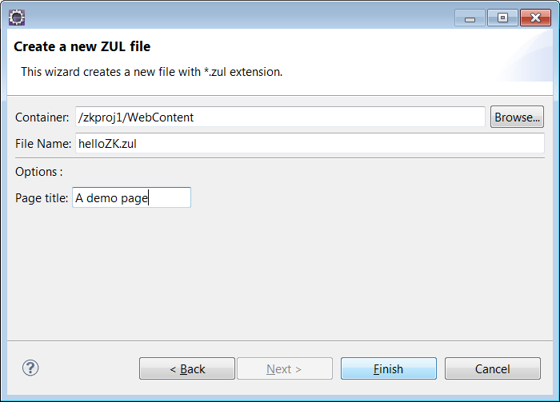
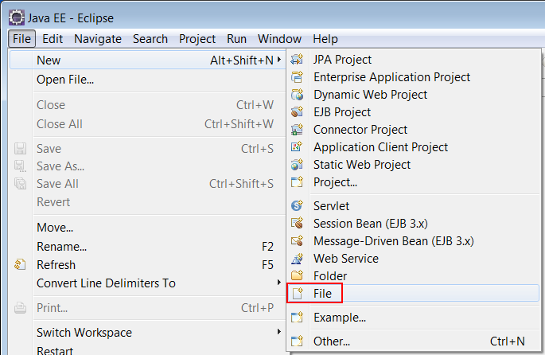

## Video Guide

<http://www.youtube.com/watch?v=Gm0IfIYa2PU&NR=1>

# Create a New ZK Project

1.  Click **\[File\]/\[New\]/\[Other...\]/\[ZK Project\]** in Eclipse
    main menu.
      
    

      
2.  Type the project name. Eclipse will automatically include the
    default ZK package configured in the ZK Package preferences,
    however, you can select another installed ZK release by "ZK
    Verstion" drop-down list. Then, click **Next**.
      
    

      
3.  You can modify the **Source folders** and **Default output folder**
    if you like. Then, click **Next**.
      
    

      
4.  You can modify **Context root** or **Content directory** if you
    like. Then, Click **Finish**.
      
    

      
5.  After clicking **Finish**, the New Project Wizard will setup the ZK
    Project ready for development.

**Tips:**

1.  The project icon's top right corner includes a ZK mark which
    indicates that it has ZK Studio supported:
      
    
2.  The ZK package source code will be automatically attached to the
    related jar files
      
    

# Creating a New ZUL File

## Using the ZUL File Wizard

1.  There are two ways to open the New ZUL File Wizard:
    - Right click on a dynamic web project in "Project Explorer" view or
      "Package Explorer" view and select **\[New\]/\[ZUL\]**.
        
      

      
      

    - Click **\[File\]/\[New\]/\[Other\]** in Eclipse's main menu and
      select "ZUL" under "ZK" node then click **Next**.
        
      

      
      
2.  Type the file name and optional page title, click **Finish**.
      
    

      
3.  The newly created ZUL File will be opened in ZUL Editor.

## Using the File Wizard

You can create new ZUL file by selecting the
**\[File\]/\[New\]/\[File\]** in Eclipse's main menu.

  

However, you have to enter the "**.zul**" extension by yourself and the
newly create zul file will not contain any sample code.

  

# Running the ZK Project

1\. Right click on the **MyApp** project in explorer and in the Menu
dialog select **Run As / Run on Server**

2\. If you have not defined a server before, Eclipse will show a dialog
with "Manually define a new server" option selected. Then Select
**Apache / Tomcat v6.0 Server** in the "server type" area and then click
**Finish**. If you haven't created a corresponding "server runtime
environment", please refer to [WTP Tutorials – Building and Running a Web Application](http://www.eclipse.org/webtools/community/tutorials/BuildJ2EEWebApp/BuildJ2EEWebApp.html).

3\. Eclipse will display the result in its internal browser or you can
view the result in your browser.

**Tips:**

  
There is a detailed step-by-step tutorial on using Tomcat with Eclipse
here: <http://www.coreservlets.com/Apache-Tomcat-Tutorial/eclipse.html>
