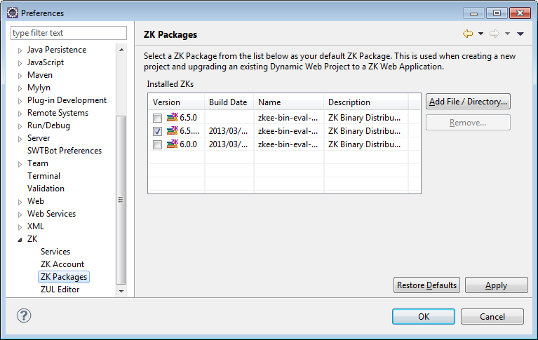

The global preference for ZK Studio can be accessed by selecting
**\[Window\]/\[Preferences\]** from Eclipse's main menu and select "ZK"
from the tree on the left hand side.

# Services

**Error Reporter**

  
ZK Studio can send its error log to us in order to improve the quality
and performance of future ZK Studio versions. Check this to enable
sending of the error log. If you have to connect the internet through
proxy, you may setup proxy URL and port to make it work.

# ZK Account

This page shows the activation status of your ZK account. You can
directly activate your ZK Forum account here. 

For more information, please refer to [ Activate ZK Studio]({{site.baseurl}}/zk_studio_essentials/installation#Activate_ZK_Studio)

# ZK Packages

On the ZK Packages preferences page, checking an imported ZK Package can
make it become the default package. This default package will then be
automatically used for any new ZK web application. If you don't select a
default ZK package, ZK Studio will automatically choose the latest
version of your imported ZK Packages.

Another way to import ZK package is through ZK Storage view, please
refer to [Configure ZK Binary Distribution]({{site.baseurl}}/zk_studio_essentials/zks#Configure_ZK_Binary_Distribution)

# ZUL Editor

This page is used to configure ZUL Editor.

- **Use plugin's built in zul.xsd**
    
  The content assist feature for components requires a *zul.xsd* file to
  work properly, and by default it will load the *zul.xsd* that is
  already included in ZK Studio. If this option is unchecked, ZK Studio
  will use the *zul.xsd* from the ZK website.

<!-- -->

- **Auto detect zscript for IMPORT and DECLARATION statement**
    
  By checking this, you don't have to deliberately add extra
  **//@IMPORT** and **//@DELARATION** statement to help zscript parser.
  Content assist and syntax checking should work well without such
  statement.

<!-- -->

- **Enable automatic content assist**
    
  If you check this option, upon typing in the ZUL Editor, the content
  assist will automatically show a list of possible candidates. If this
  is not checked you will need to use the keyboard shortcut to invoke
  content assist.

<!-- -->

- **Auto content assist triggers**
    
  Set what character will auto invoke content assist in the ZUL Editor.
  The default value is the same as Eclipse Java Development Tools(JDT)'s
  value.

<!-- -->

- **Enable MVVM annotation expression validation**
    
  If you uncheck this option, Studio will not validate data binding
  expressions in a ZUL and data binding expression syntax error will not
  be showed.
