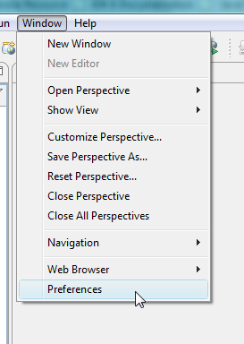
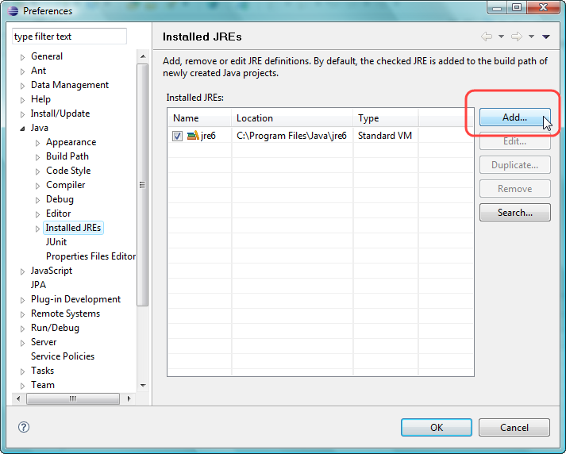
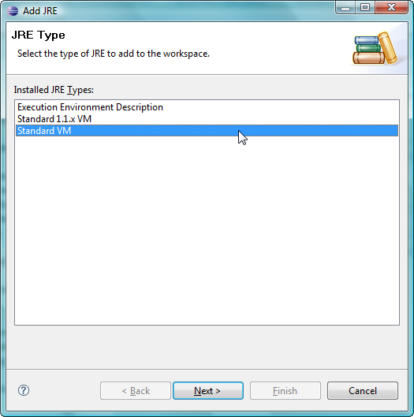
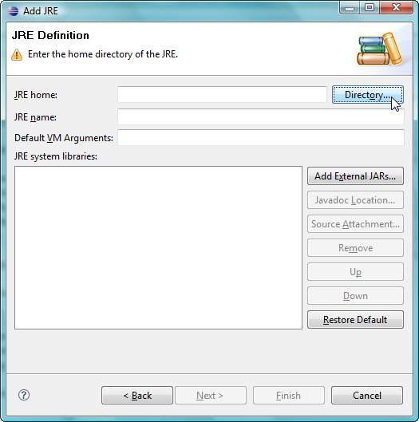
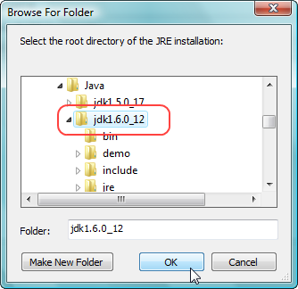
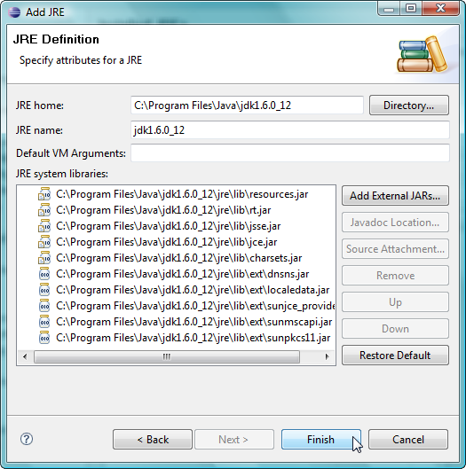
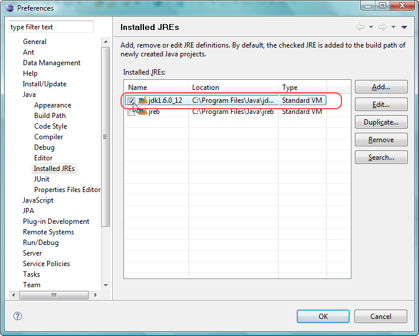

# Introduction

This document will guide you to set up Eclipse IDE and use Java
Development Kit (JDK) as the default JRE. For using [ZK 
Framework](https://www.zkoss.org/product/zk) 9.5.0, you have to use Java
**1.8** or later.

# Setup Default JRE as JDK

1.  Once you have started Eclipse, click **Window > Preference**:  
      
      
2.  Select Java/Install JREs on the left, click the Add... button on the
    right side.  
      
      
3.  On the first page of popup wizard, select "Standard VM", then click
    Next.  
      
      
4.  Click **Directory...**  
      
      
5.  Select JDK's path then press OK.  
      
      
6.  On the next page, verify the the JRE name and it's System libraries are
    recognized properly by Eclipse itself, then click Finish.  
      
      
7.  Check the just created JRE entry on the list, then press OK.  
    
