# Foreword

ZK framework's architecture allows you to use any database. Here we just
give you some hints on how you can connect to MySQL in Eclipse, and such
configuration is independent of ZK framework.

To see a simple ZK-based example with a database, please check [ZK Essentials](/zk_essentials/jpa_integration/index)

# Prerequisite

**1.** The [Data Tools Platform
(DTP)](http://www.eclipse.org/datatools/) is required for setup DB
connection, the **Eclipse IDE for Java EE Developers** distribution of
Eclipse we mentioned in this book has already included DTP, so in most case it is not necessary to do extra Eclipse DTP plug-in installation.

**2.** Download [MySQL Connector/J](http://dev.mysql.com/downloads/connector/j/):  
choose "Platform independent" and download the zip version extract the zip file to a
proper location.

**Note.** Different versions of Eclipse may have different settings.
Please reference Eclipse official documents if the samples/links listed
in this page are not matching what you are using.

# Setup Database Connection in MySQL

1.  Open Data Source Explorer via **Window \ Show View \ Other... \ Data Management \ Data Source Explorer**:  
    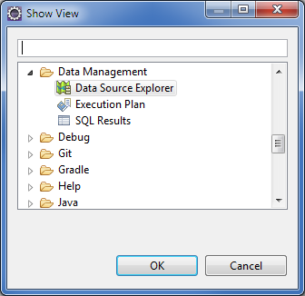  
      
2.  Right click the Database Connection folder, select **New...**.  
    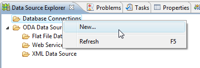  
      
3.  Select the Database you suppose to connect ( *MySQL 5.1* as the
    example in this document), you can type custom name and description
    for mnemonic, click **Next**.  
    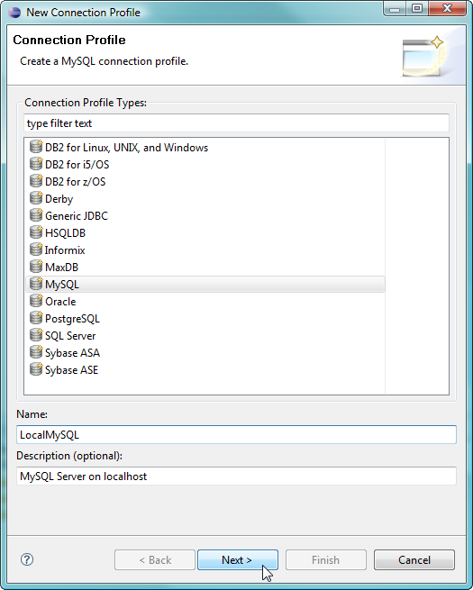  
      
4.  On next page, click the **New Driver Definition** icon next to the
    **Drivers:** listbox.  
    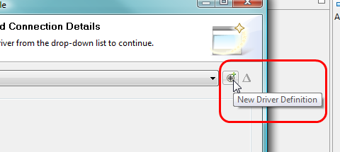  
      
5.  In the popup window, select the Database Version in *Name/Type*
    tab.  
    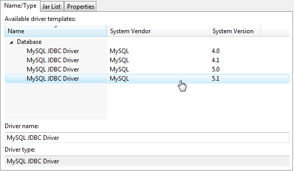  
      

Switch to *Jar List* tab, click **Clear All**
to clear the default false jar file location.  
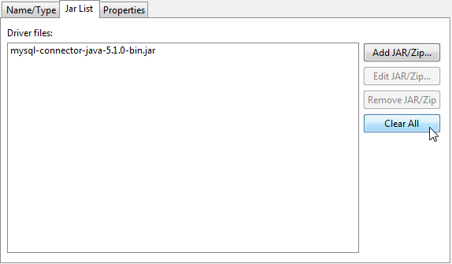  
  
then click **Add JAR/Zp...**.  
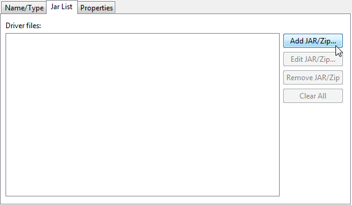  
  
Locate the jar file inside the folder that just extracted from
downloaded MySQL Connector/J zip file.  
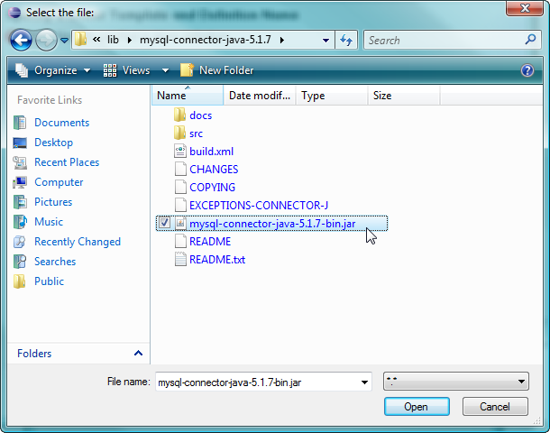  
  
Switch to '"Properties" tab, modify the database connection setting
according to your MySQL Database configuration, then click **OK**.

*Note:* The JDBC URL format for MySQL Connector/J is as follows, with items in
square brackets (`[]`) being optional:

```text
    jdbc:mysql://[host:port],[host:port].../[database][?propertyName1][=propertyValue1][&propertyName2][=propertyValue2]...
```

If the hostname is not specified, it defaults to 127.0.0.1. If the port
is not specified, it defaults to 3306, the default port number for MySQL
servers. In above image the database name is **`test`**
```text
    jdbc:mysql://localhost:3306/test
```
  
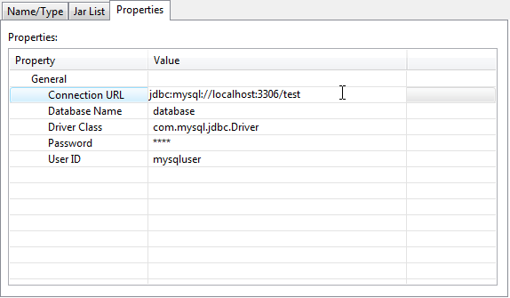  

To verify if the setup is functional, click **Test
Connection**.  
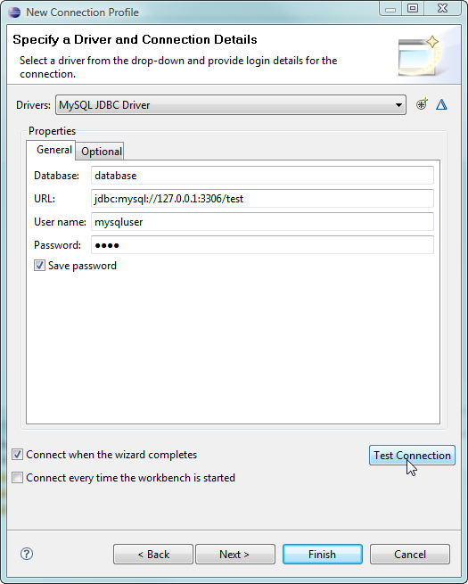  
  
It should pop up a Ping succeeded message, Click
 **OK** to continue.  
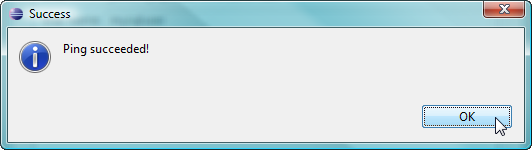  
  
Note: Make sure the MySQL database is up and running. If it is not
running, the Test Connection will fail. If you don't know how to find if
MySQL is running then please [google
search](https://www.google.com/search?q=how+to+check+if+MySQL+is+running)
it  
  
Press **Finish** to
close the setup wizard window, And you should be able to see there's a
Database icon in the Database Connections folder.  
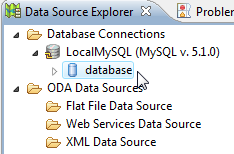  
  

# Note

1.  Firewall of the System that install Database or security setting of
    the Database may prevent you from connect the DB successfully.
2.  If you had specify the right **MySQL Connector/J** jar file before,
    then Step **4** & **5** can be skipped, you can directly modify the
    following field to match your MySQL Database configuration:  
      
    then proceed the subsequent steps to finish setup.
