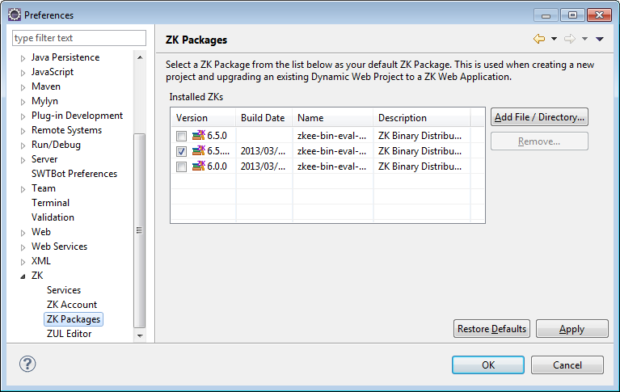

ZKs stands for **ZK Storage**. It is the mechanism by which ZK studio
manages ZK releases that your ZK project or ZK studio may use. You can
see the contents of ZK Storage in the **ZK Storage View**

# ZK Binary Distribution Management

## Browse & Install ZK Binary Releases Directly

To browse and install ZK binary releases, open ZK Storage view and click
**Download and Install**. The Storage View can be opened by clicking
**\[Window\]/\[Show View\]/\[Other\]** and selecting **ZK / ZK Storage
View**.

Click on the icon, and the Installation dialog will popup where you can
browse and select.

After clicking **Start**, the installation process will be triggered and
selected releases will appear in your ZK Storage.

### Import ZK Binary Distribution From Local File System

To download the latest ZK release, please visit [ZK Download Page](http://www.zkoss.org/download/zk).

To import a ZK release from local file system, open the **ZK Storage
View** and click on the **import** icon to import a ZK archive (for
example, zk-bin-3.6.1.zip) into ZK Storage.

The Storage View can be opened by clicking **\[Window\]/\[Show
View\]/\[Other\]** and selecting **ZK / ZK Storage View**.

Step 1: Click **Import** in ZK Storage View.

Step 2: Click **File Import** and a file dialog will appear, choose the
ZK archive file you have downloaded, and click **Finish** to import.

Step 3: You can see that the imported ZK release appears under "ZK
Releases" item.

To remove a ZK release, simply right click on it and click **Delete a
Package**.

### Configure ZK Binary Distribution

In **ZK/ZK Packages** of Eclipse preference page (select the menu
**\[Window\]/\[Preference\]**), you can select default package on the
list of "Installed ZKs" for a ZK web application you will create later.
ZK Studio will automatically choose the latest version of those imported
ZK Packages as the default package. You can remove unwanted ZK package
by selecting the row in **ZK Package** then click **Remove**.

