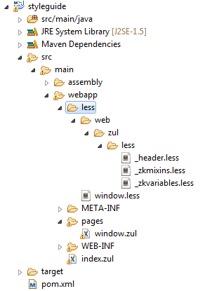

We have introduced how to execute [ partial customization with
sclass](ZK_Style_Customization_Guide/Look_and_Feel_Customization/Partical_customize_with_Sclass_and_Zclass)
for specific components. Now we will introduce how to customize
component style by LESS and make it the default style inside a project.
Subsections are detailed samples on how you can customize components.

# Before you Start

Modern browsers (such as Chrome, Firefox with Firebug) provide useful
debugging tools. By pressing F12, you will be able to see the complete
DOM structure and all required information for doing Component
Customization. If any information is not given in the documentation, use
the developer tool.

# Prepare ZKLess Servlet and ZKLess Dependencies

- Before start customizing your own component styles, first, follow the
  instruction, [compile LESS to DSP during development
  phase]({{site.baseurl}}/zk_style_customization_guide/Integrate_with_LESS/How_ZK_works_with_LESS/Compile_LESS#Compile_LESS_to_DSP_during_Development_phase)
  to have your ZKLess Servlet ready.

<!-- -->

- Second, download \_header, \_zkvariables, and \_zkmixins from
  [github](https://github.com/zkoss/zk/tree/master/zul/src/archive/web/zul/less)
  and put them into *project/less/web/zul/less*

:\* The project structure should look like this:

  
  
<figure>

<figcaption>Zkless_servlet_scaffod.png</figcaption>
</figure>

# Step to Customize Component by LESS

Here we will use **Window** component as an example to demonstrate how
to customize a component.

- 1\. Link to [ Window
  Component](ZK_Style_Customization_Guide/Look_and_Feel_Customization/Customize_Component/Window)
  page or use browser's developer tool to check the DOM structure.
- 2\. Create **window.less** file under **less** folder in ZK web
  project.

:\* The project structure (here we use maven project)

  
  


- 3\. Tweak window style and Check window style at runtime by ZK Less
  Servlet.

:\* Modify **window.less** to customize look and feel of the Window
component, for example, change its background color and padding by
re-defining LESS variables as follows:

<div style="margin-left: 3em">

``` css
@import "~./zul/less/_header.less";

@windowBackgroundColor: #D9E5EF;
@windowFramePadding: 8px;

/* omitted */
```

</div>

:\* Follow this [
instruction](ZK_Style_Customization_Guide/Integrate_with_LESS/How_ZK_works_with_LESS/Compile_LESS#Compile_LESS_to_DSP_during_Development_phase)
to add ZKLessServlet to web.xml to compile less at runtime.

:\* Use **window.less** in **window.zul** page as follows to check the
style modification.

<div style="margin-left: 3em">

``` xml
<?link rel="stylesheet" href="../less/window.less"?>
<zk>
    <window title="Customize Window">
        Window Content
    </window>
</zk>
```

</div>

:\* Once the server is started, **window.less** will be compiled into
**window.css.dsp** in the same folder.

:\* Continue to customize Window component and check the style changes
by simply refreshing the browser.

- 4\. Use final style in production.
  - Remove <code>
    <?link rel="stylesheet" href="../less/window.less"?>

    </code> in **window.zul** page.
  - Remove ZK Less Servlet settings in web.xml.
  - [ Enable DSP Loader
    Servlet](ZK_Developer's_Reference/Supporting_Utilities/DSP)
    in web.xml
  - Put window.css.dsp files (can be found under **less** folder)
    wherever you want. Then add the following settings in zk.xml file.

<div style="margin-left: 3em">

``` xml
<desktop-config>
    <theme-uri>/less/window.css.dsp</theme-uri>
</desktop-config>
```

</div>
