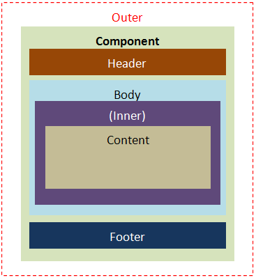

The naming pattern of the DOM structure is used to describe components
which are composed of more than one part. The following recommended
naming patterns are to clarify the DOM structure of ZK components, not a
limitation.

# Layout Elements

The following naming patterns are based on component layout. For
example, "*z-window-**header***" means header part of window component.

| Image | Description |
|-------|-------------|
|  | -**outer**: the exterior of the specified component like splitter in vbox and hbox -**header**: the header content, like grid, tree, listbox, and so on. -**body**: the body content, like grid, tree, listbox, and so on. -**inner**: the interior of the specified component, like slider and tab. -**content**: like window's contentSclass or groupbox's contentSclass -**footer**: describes the footer content, like grid, tree, listbox, and so on. -**noheader**: no header element. -**noborder**: no border element. |

# Orient and Position Elements

The following naming patterns are based on component orientation and
positions. For example, "*z-menubar-**horizontal***" means the menubar
component is in horizontal orientation.

  
\-**vertical**:

  
vertical aspect, like menubar.

\-**horizontal**:

  
horizontal aspect, like menubar.

\-**start**:

  
beginning aspect, like toolbar.

\-**center**:

  
center aspect, like toolbar.

\-**end**:

  
ending aspect, like toolbar.

# Other Elements

The following naming patterns are based on component look and feel and
some interaction. For example, "*z-combobox-**button***" is the
drop-down button of combobox component.

  
\-**faker**:

  
faker element to mark a reference point at browser side, like grid,
listbox, and tree.

\-**text**:

  
text area.

\-**input**:

  
input element.

\-**separator**:

  
separator element.

\-**image**:

  
image area specified by comoponent's API.

\-**icon**

  
for component interaction

\-**popup**:

  
pop-up element, like datebox, combobox, and so on.

\-**button**:

  
a button.

# Tool Icons

The following naming patterns are based on component interactions. For
example, "*z-panel-**close***" is a closed icon of panel component.

| Switch | Resize | Split |
|:------:|:------:|:-----:|
| -**close**: describes an icon which is closed, like tree, group, an so on. -**collapse**: describes a collapsible icon, like panel. -**collapsed**: describes a collapsible icon which is collapsed, like panel. -**expand**: describes an expandable icon, like panel. -**expanded**: describes an expandable icon which is expanded, like panel. | -**maximize**: describes a maximizable icon. -**maximized**: describes a maximizable icon which is maximized. -**minimize**: describes a minimizable icon. | -**splitter**: describes a splittable icon. -**nosplitter**: describes a non-splittable icon. |

