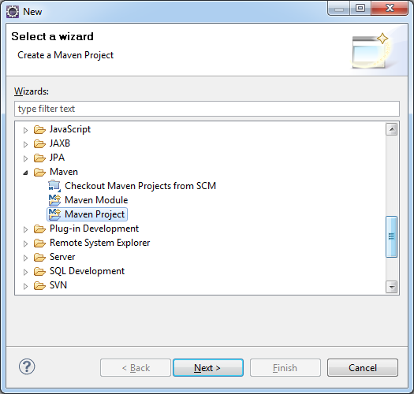

# Introduction

In this guide, we will demonstrate how to create a new look and feel of
ZK components with [Atlantic](http://github.com/zkoss/atlantic) theme as
an example. Atlantic theme incorporates the flat design which is very
different from the default trendy design(e.g. Breeze theme). Here we
will explain the theme creation procedures step by step.

# Prerequisites

1.  Eclipse with maven plug-in installed (see [ installation guide]({{site.baseurl}}/zk_installation_guide/quick_start/create_and_run_your_first_zk_application_with_eclipse_and_maven)).
2.  ZK maven archetype installed (see [ installation guide]({{site.baseurl}}/zk_installation_guide/quick_start/create_and_run_your_first_zk_application_with_eclipse_and_maven#Add_ZK_Maven_Archetype)).
3.  Create a demo project by ZK maven archetype to check the design.
4.  Familiar with LESS.
5.  Familiar with ZK Component's DOM structure.

# Create Theme Project with ZK Maven Archetype

- **\[File\]** -\> **\[New\]** -\> **\[Other\]** --\> **\[Maven
  Project\]**

  


- Make sure **Create a simple project** is unchecked in the first screen
  of the New Maven Project wizard and click **Next \>** button.

  


- From the **Select an Archetype** screen, select ZK Maven Archetype
  from the catalog dropdown list. Then Select ***zk-archetype-theme***
  from the list.

  


- Next, fill in details for ***Group Id***, ***Artifact Id***,
  ***Version*** and ***Package***, and in Properties, fill in ***zk
  version***, ***theme-name**'' and***theme-listener-class**''.

  


- The created project structure.

  
Here we can see all the LESS files from default trendy design are
generated at the same time


# Customize Look and Feel based on Flat Design

Here is the sample design for Mesh (grid, listbox and tree) Element.


Following steps make up a common customization method for accomplishing
a new look and feel using LESS

1.  Flat design does not use any gradient backgrounds, we therefore
    suggest to remove all gradient background related variables found in
    **\_zkvariables.less** file.
2.  Define new variables for this design.
3.  Find **grid.less** file within the project and change the style to
    adopt the design.
4.  Right click on Atlantic project and execute **Run As \> Maven
    install** to compile LESS and generate theme jar file.
5.  Check the real look of grid component in the demo project mentioned
    in prerequisites.
    - Add dependency in demo project's pom.xml file
      ```xml
      <dependency>
          <groupId>org.zkoss.theme</groupId>
          <artifactId>atlantic</artifactId>
          <version>0.0.1-SNAPSHOT</version>
      </dependency>
      ```
    - Set preferred theme in demo project's zk.xml file
      ```xml
      <library-property>
          <name>org.zkoss.theme.preferred</name>
          <value>atlantic</value>
      </library-property>
      ```
    - Follow this [ instruction]({{site.baseurl}}/zk_installation_guide/quick_start/create_and_run_your_first_zk_application_with_eclipse_and_maven#Run_the_application)
      to start up the demo project and check the style.
6.  Repeat Step 1 to 5 for every component and elements.

# Package and Use the Theme

After the theme is completely tuned based on flat design, right click on
the Atlantic project and execute **Run As \> Maven install** to generate
theme jar file. You can then use the theme jar (see [ usage instruction]({{site.baseurl}}/zk_dev_ref/theming_and_styling/zk_official_themes#Installation))
in other ZK web projects as well.


