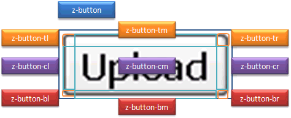
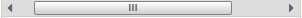

# Tip 1: Box Sizing

To improve performance at client side, we use the **border-box** model
for all components in ZK 7 instead of the **content-box** model. It
means a specified CSS property - width/min-width and height/min-height -
on the element will consider border width.

## Upgrade Example

In ZK 6.5, assuming you have specified a DIV with a fixed width, `102px`
including borders (2px) like:

```css
.z-div {
    border: 1px solid #000000;
    width: 100px;
}
```

However, after upgrading to ZK 7 or above, the DIV width will become
**100px** since all CSS class names start with the prefix `z-` get
`box-sizing: border-box` applied by default. If you want to keep the DIV
width as 102px in ZK 7, modify the original style as follows:

```css
.z-div {
    border: 1px solid #000000;
    width: 102px;
}
```

or

```css
.z-div {
    border: 1px solid #000000;
    width: 100px;
    box-sizing: content-box;
}
```

# Tip 2: Component Mold

Since we are no longer supporting browsers that don't support CSS 3 in
ZK 7, some components' molds are now sharing the same DOM structure with
their default mold to improve performance. However, you do not need to
change your Component.setMold() code since ZK handles this
transparently.


## Upgrade sample

In this
[smalltalk](https://www.zkoss.org/wiki/Small_Talks/2011/December/Customize_Look_and_Feel_of_ZK_Components_Using_CSS3)
we showed you how to customize the **button** component using CSS 3 with
the *os* mold based on ZK 6.5. Originally the style for an os mold
button was overridden using the class *z-button-os*.

```css
.z-button-os {
    color: #FFFFFF;
    font-weight: bold;
    /* omitted */
}
```

While in ZK 6.5, the button has 2 separate mold implementations (trendy
and os), now in ZK7 both molds share the same markup using the same CSS
class "z-button" (default mold). Here the new style override:

```css
.z-button {
    color: #FFFFFF;
    font-weight: bold;
    /* omitted */
}
```

## Brief Summary

Based on the above, when upgrading from ZK 6.5 to ZK 7.0, it is required
to modify the CSS class names (from z-component-mold to z-component) in
most situations. Check [ Tip 2 Appendix](#Tip_2_Appendix) for
the complete list of affected components.


# Tip 3: Component Zclass

Some components' zclass-es consist of several parts (separated by dashes
"-"), for instance, the zclass of the Window component with embedded
mode is "*z-window-embedded*" and the CSS class of its header part is
"*z-window-embedded-header*". All other modes have corresponding classes
following the pattern *z-window-**mode**-header*. In order to make it
easier to customize, we separate it into two CSS classes with "*zclass
modeclass*" pattern.

For example,

```html
<div class="z-window z-window-embedded">
    <div class="z-window-header"></div>
    <div class="z-window-content"></div>
</div>
```

Then, if you want to customize the content part of window for all modes,
simply override CSS class *z-window-content*.


## Upgrade sample

In this [
smalltalk](https://www.zkoss.org/wiki/Small_Talks/2011/December/Customize_Look_and_Feel_of_ZK_Components_Using_CSS3)
we showed how to customize window component's close icon for all modes
as follows:

```css
.z-window-embedded-close,
.z-window-overlapped-close,
.z-window-popup-close,
.z-window-highlighted-close,
.z-window-modal-close {
    background: url('../img/wnd-icon.png') no-repeat scroll 0 0;
}
.z-window-embedded-close-over,
.z-window-overlapped-close-over,
.z-window-popup-close-over,
.z-window-highlighted-close-over,
.z-window-modal-close-over {
    background: url('../img/wnd-icon.png') no-repeat scroll 0 -16px;
}
```

In ZK 7, you can remove *-mode* part for all modes.

```css
.z-window-close {
    background: url('../img/wnd-icon.png') no-repeat scroll 0 0;
}
.z-window-close:hover {
    background: url('../img/wnd-icon.png') no-repeat scroll 0 -16px;
}
```

## Brief Summary

To adapt this change for ZK 7, check [ Tip 3
Appendix](#Tip_3_Appendix) for the complete list of related
changes eliminating CSS classes.


# Tip 4: DOM Structure

In ZK 6.5, several components use a 3 x 3 grid structure(see image
bellow) to achieve the rounded corner style. In ZK 7, we applied CSS 3,
therefore, the complex 3 x 3 grid structure is no longer needed.




## Upgrade Sample

In this
[smalltalk](https://www.zkoss.org/wiki/Small_Talks/2011/December/Customize_Look_and_Feel_of_ZK_Components_Using_CSS3)
we showed how to customize the **window** component using CSS 3 based on
3 x 3 grid structure. Originally we had to override several CSS classes
(z-component-**tl**, z-component-**tm**, z-component-**tr**, and etc.)
to add rounded corners to the window head (line 9).

```css
.z-window-embedded-tl,
.z-window-embedded-tm,
.z-window-embedded-tr {
    /* omitted */
}
.z-window-embedded-hl,
.z-window-embedded-hm,
.z-window-embedded-hr {
    border-radius: 4px 4px 0 0;
    /* omitted */
}
.z-window-embedded-cl,
.z-window-embedded-cm,
.z-window-embedded-cr {
    /* omitted */
}
.z-window-embedded-bl,
.z-window-embedded-bm,
.z-window-embedded-br {
    /* omitted */
}
```

In ZK 7, the DOM structure of the window component is simplified.

```html
<div class="z-window">
    <div class="z-window-header"></div>
    <div class="z-window-content"></div>
</div>
```

Therefore, it is sufficient to just override the *z-window* class, to
add rounded corners:

```css
.z-window {
    border-radius: 4px 4px 0 0;
    /* omitted */
}
```

## Brief Summary

To check the style after we removed 3 x 3 grid structure in ZK 7, we
recommend you to use developer tools provided by browsers such as
Firebug for FireFox, Developer Tools for Chrome to check new DOM
structure first, then move your existing customization style into the
new CSS class. Check [ Tip 4 Appendix](#Tip_4_Appendix) for
the complete list that removes the 3 x 3 (or 3x1) grid structure..


# Tip 5: CSS Class Naming

In ZK 6.5, we use abbreviations for CSS class names which can be hard to
understand what it represents sometimes. Hence, to make it more semantic
in ZK 7, we use the full-naming pattern on CSS class names. For example,

<table>
<thead>
<tr class="header">
<th><center>
<p>6.5</p>
</center></th>
<th><center>
<p>7.0</p>
</center></th>
</tr>
</thead>
<tbody>
<tr class="odd">
<td><p>z-component-<strong>ver</strong></p></td>
<td><p>z-component-<strong>vertical</strong></p></td>
</tr>
<tr class="even">
<td><p>z-component-<strong>cnt</strong></p></td>
<td><p>z-component-<strong>content</strong></p></td>
</tr>
<tr class="odd">
<td><p>z-component-<strong>seld</strong></p></td>
<td><p>z-component-<strong>selected</strong></p></td>
</tr>
<tr class="even">
<td><p>z-component<strong>-over</strong></p></td>
<td><p>z-component<strong>:hover</strong></p></td>
</tr>
<tr class="odd">
<td><p>z-component<strong>-disd</strong>''</p></td>
<td><p>z-component<strong>[disabled]</strong></p></td>
</tr>
</tbody>
</table>

Here we can see not only abbreviations have been changed to full names,
but we also use CSS selectors like**:hover** and the attribute selector
like **\[disabled\]** to make it more intuitive.

## Upgrade Sample

In this [smalltalk](https://www.zkoss.org/wiki/Small_Talks/2012/March/Customize_Look_and_Feel_of_ZK_Components_Using_CSS3_-_Part_2)
we demonstrate how to customize comboitem style when it is selected by
overriding CSS class *z-comboitem-seld* in ZK 6.5 as follows:

```css
.z-combobox-pp .z-comboitem-over,
.z-combobox-pp .z-comboitem-seld {
    color: #2BCCDA;
    background-color: #000000;
}
```

In ZK 7, the CSS class name is change to full name
*z-comboitem-selected*, therefore, you have to modify it as follows:

```css
.z-combobox-popup .z-comboitem:hover,
.z-combobox-popup .z-comboitem-selected {
    color: #2BCCDA;
    background-color: #000000;
}
```

## Brief Summary

In most situations, to upgrade to ZK 7.0 from ZK 6.5 based on these
changes is to modify CSS class names with full naming patterns (from
z-component-*shortname* to z-component-*fullname*). Check [ Tip 5
Appendix](#Tip_5_Appendix) for the complete list of ZK 7 CSS
class naming rule.


# Tip 6: Image Icons and Font Icons

In order to reduce page loading time, we use font icons in ZK 7 to
replace original image icons. There are a lot of web icon fonts on the
market, here we integrate in ZK 7 with [Font Awesome
4.0.1](http://fortawesome.github.io/Font-Awesome/). Thus, it is easy to
use font icons in ZK application by simply replace prefix **fa** to
**z-icon**, for example, *z-icon-caret-up* represents a [triangle arrow
up](http://fortawesome.github.io/Font-Awesome/icon/caret-up/) font icon.


## Upgrade Sample

In this [
smalltalk](https://www.zkoss.org/wiki/Small_Talks/2012/March/Customize_Look_and_Feel_of_ZK_Components_Using_CSS3_-_Part_2),
we customize combobox button with custom image as follows:

```css
.z-combobox-btn {
    background: url('../img/combo-btn.png') no-repeat;
}
```

However, after upgrade to ZK 7, you can see not only the image showed,
the font icon that ZK 7 uses by default also shows up. To disable the
font icon you can override the font icon CSS class as follows:

```css
.z-combobox-button {
    background: url('../img/combo-btn.png') no-repeat;
}
.z-combobox-icon {
    display: none;
}
```

or

```css
.z-combobox-button {
    background: url('../img/combo-btn.png') no-repeat;
}
.z-combobox-icon.z-icon-caret-down:before {
    content: '';
}
```


# Tip 7: Scrollbar

Since ZK 7, we provide custom scrollbar for Grid, Listbox and Tree
component by default, which means you can also customize scrollbar
style. Here we will demonstrate how to style it. Or, if you do not wish
to custom your scrollbar, we will also demonstrate how to disable it and
use browser default scrollbar instead.


## Customize Scrollbar Style

The custom scrollbar consists of two buttons to click for scrolling
left/right, an indicator to represent current scroll position and a rail
to slide indicator. Therefore, we need to override CSS class as follows:

```css
/* Two buttons to click for scrolling left/right */
.z-scrollbar-left, .z-scrollbar-right {
    background: #FFFFFF;
    color: #3AA4C3;
}
.z-scrollbar-left:hover, .z-scrollbar-right:hover {
    background: #3AA4C3;
    color: #FFFFFF;
}
/* An indicator to represent current scroll position */
.z-scrollbar-horizontal .z-scrollbar-indicator {
    background: #3AA4C3;
    border: none;
    top: 2px;
}
/* A rail to slide indicator */
.z-scrollbar-horizontal .z-scrollbar-rail {
    background: #FFFFFF;
}
/* remove font icon */
.z-scrollbar-horizontal .z-scrollbar-icon {
    display: none;
}
```

You can check the customized result.

|  | ZK 7 default scrollbar style |
|  | Customized scrollbar style |

## Use Browser Default scrollbar

To disable custom scrollbar provided by ZK 7. Add the library property
called *org.zkoss.zul.nativebar* in zk.xml and set it to true.

```xml
<library-property>
    <name>org.zkoss.zul.nativebar</name>
    <value>true</value>
</library-property>
```

**Note**: the value of org.zkoss.zul.nativebar is true by default (since
7.0.2)

# Tip 2 Appendix

<table>
<thead>
<tr class="header">
<th><p> Component</p></th>
<th><p> ZK 6.5 mold</p></th>
<th><p> ZK 7 mold</p></th>
</tr>
</thead>
<tbody>
<tr class="odd">
<td><p> Button</p></td>
<td><p> os<br />
trendy</p></td>
<td><p> default</p></td>
</tr>
<tr class="even">
<td><p> Textbox<br />
Intbox<br />
Decimalbox<br />
Longbox<br />
Doublebox<br />
Combobox<br />
Bandbox<br />
Datebox<br />
Timebox<br />
Spinner<br />
Doublespinner</p></td>
<td><p> default<br />
rounded</p></td>
<td><p> default</p></td>
</tr>
<tr class="odd">
<td><p> Splitter</p></td>
<td><p> default<br />
os</p></td>
<td><p> default</p></td>
</tr>
<tr class="even">
<td><p> Tabbox</p></td>
<td><p> accordion<br />
accordion-lite</p></td>
<td><p> accordion</p></td>
</tr>
</tbody>
</table>

# Tip 2 Appendix

<table>
<thead>
<tr class="header">
<th><p> Component</p></th>
<th><p> ZK 6.5 mold</p></th>
<th><p> ZK 7 mold</p></th>
</tr>
</thead>
<tbody>
<tr class="odd">
<td><p> Button</p></td>
<td><p> os<br />
trendy</p></td>
<td><p> default</p></td>
</tr>
<tr class="even">
<td><p> Textbox<br />
Intbox<br />
Decimalbox<br />
Longbox<br />
Doublebox<br />
Combobox<br />
Bandbox<br />
Datebox<br />
Timebox<br />
Spinner<br />
Doublespinner</p></td>
<td><p> default<br />
rounded</p></td>
<td><p> default</p></td>
</tr>
<tr class="odd">
<td><p> Splitter</p></td>
<td><p> default<br />
os</p></td>
<td><p> default</p></td>
</tr>
<tr class="even">
<td><p> Tabbox</p></td>
<td><p> accordion<br />
accordion-lite</p></td>
<td><p> accordion</p></td>
</tr>
</tbody>
</table>

# Tip 3 Appendix

<table>
<thead>
<tr class="header">
<th><p> Component</p></th>
<th><p> ZK 6.5 sample</p></th>
<th><p> ZK 7 sample</p></th>
</tr>
</thead>
<tbody>
<tr class="odd">
<td><p> Splitter</p></td>
<td><p> z-splitter-hor<br />
z-splitter-ver</p></td>
<td><p> z-splitter z-splitter-horizontal<br />
z-splitter z-splitter-vertical</p></td>
</tr>
<tr class="even">
<td><p> Slider</p></td>
<td><p> z-slider-hor<br />
z-slider-ver</p></td>
<td><p> z-slider z-slider-horizontal<br />
z-slider z-slider-vertical</p></td>
</tr>
<tr class="odd">
<td><p> Menubar</p></td>
<td><p> z-menubar-hor<br />
z-menubar-ver</p></td>
<td><p> z-menubar z-menubar-horizontal<br />
z-menubar z-menubar-vertical</p></td>
</tr>
<tr class="even">
<td><p> Toolbar</p></td>
<td><p> z-toolbar-tabs</p></td>
<td><p> z-toolbar z-toolbar-tabs</p></td>
</tr>
<tr class="odd">
<td><p> Combobutton</p></td>
<td><p> z-combobutton-toolbar</p></td>
<td><p> z-combobutton z-combobutton-toolbar</p></td>
</tr>
<tr class="even">
<td><p> Separator</p></td>
<td><p> z-separator-horizontal<br />
z-separator-vertical</p></td>
<td><p> z-separator z-separator-horizontal<br />
z-separator z-separator-vertical</p></td>
</tr>
<tr class="odd">
<td><p> Groupbox</p></td>
<td><p> z-groupbox-3d</p></td>
<td><p> z-groupbox z-groupbox-3d</p></td>
</tr>
<tr class="even">
<td><p> Tabbox</p></td>
<td><p> z-tabbox<br />
<br />
z-tabbox-ver<br />
<br />
z-tabbox-accordion</p></td>
<td><p> z-tabbox z-tabbox-top<br />
z-tabbox z-tabbox-bottom<br />
z-tabbox z-tabbox-left<br />
z-tabbox z-tabbox-right<br />
z-tabbox z-tabbox-accordion</p></td>
</tr>
<tr class="odd">
<td><p> Window</p></td>
<td><p> z-window-embedded<br />
z-window-modal<br />
z-window-highlighted<br />
z-window-overlapped<br />
z-window-popup</p></td>
<td><p> z-window z-window-embedded<br />
z-window z-window-modal<br />
z-window z-window-highlighted<br />
z-window z-window-overlapped<br />
z-window z-window-popup</p></td>
</tr>
</tbody>
</table>

# Tip 2 Appendix

<table>
<thead>
<tr class="header">
<th><p> Component</p></th>
<th><p> ZK 6.5 mold</p></th>
<th><p> ZK 7 mold</p></th>
</tr>
</thead>
<tbody>
<tr class="odd">
<td><p> Button</p></td>
<td><p> os<br />
trendy</p></td>
<td><p> default</p></td>
</tr>
<tr class="even">
<td><p> Textbox<br />
Intbox<br />
Decimalbox<br />
Longbox<br />
Doublebox<br />
Combobox<br />
Bandbox<br />
Datebox<br />
Timebox<br />
Spinner<br />
Doublespinner</p></td>
<td><p> default<br />
rounded</p></td>
<td><p> default</p></td>
</tr>
<tr class="odd">
<td><p> Splitter</p></td>
<td><p> default<br />
os</p></td>
<td><p> default</p></td>
</tr>
<tr class="even">
<td><p> Tabbox</p></td>
<td><p> accordion<br />
accordion-lite</p></td>
<td><p> accordion</p></td>
</tr>
</tbody>
</table>

# Tip 3 Appendix

<table>
<thead>
<tr class="header">
<th><p> Component</p></th>
<th><p> ZK 6.5 sample</p></th>
<th><p> ZK 7 sample</p></th>
</tr>
</thead>
<tbody>
<tr class="odd">
<td><p> Splitter</p></td>
<td><p> z-splitter-hor<br />
z-splitter-ver</p></td>
<td><p> z-splitter z-splitter-horizontal<br />
z-splitter z-splitter-vertical</p></td>
</tr>
<tr class="even">
<td><p> Slider</p></td>
<td><p> z-slider-hor<br />
z-slider-ver</p></td>
<td><p> z-slider z-slider-horizontal<br />
z-slider z-slider-vertical</p></td>
</tr>
<tr class="odd">
<td><p> Menubar</p></td>
<td><p> z-menubar-hor<br />
z-menubar-ver</p></td>
<td><p> z-menubar z-menubar-horizontal<br />
z-menubar z-menubar-vertical</p></td>
</tr>
<tr class="even">
<td><p> Toolbar</p></td>
<td><p> z-toolbar-tabs</p></td>
<td><p> z-toolbar z-toolbar-tabs</p></td>
</tr>
<tr class="odd">
<td><p> Combobutton</p></td>
<td><p> z-combobutton-toolbar</p></td>
<td><p> z-combobutton z-combobutton-toolbar</p></td>
</tr>
<tr class="even">
<td><p> Separator</p></td>
<td><p> z-separator-horizontal<br />
z-separator-vertical</p></td>
<td><p> z-separator z-separator-horizontal<br />
z-separator z-separator-vertical</p></td>
</tr>
<tr class="odd">
<td><p> Groupbox</p></td>
<td><p> z-groupbox-3d</p></td>
<td><p> z-groupbox z-groupbox-3d</p></td>
</tr>
<tr class="even">
<td><p> Tabbox</p></td>
<td><p> z-tabbox<br />
<br />
z-tabbox-ver<br />
<br />
z-tabbox-accordion</p></td>
<td><p> z-tabbox z-tabbox-top<br />
z-tabbox z-tabbox-bottom<br />
z-tabbox z-tabbox-left<br />
z-tabbox z-tabbox-right<br />
z-tabbox z-tabbox-accordion</p></td>
</tr>
<tr class="odd">
<td><p> Window</p></td>
<td><p> z-window-embedded<br />
z-window-modal<br />
z-window-highlighted<br />
z-window-overlapped<br />
z-window-popup</p></td>
<td><p> z-window z-window-embedded<br />
z-window z-window-modal<br />
z-window z-window-highlighted<br />
z-window z-window-overlapped<br />
z-window z-window-popup</p></td>
</tr>
</tbody>
</table>

# Tip 4 Appendix

<table>
<thead>
<tr class="header">
<th><p> Component</p></th>
<th><p> ZK 6.5 DOM structure</p></th>
<th><p> ZK 7 DOM structure</p></th>
</tr>
</thead>
<tbody>
<tr class="odd">
<td><p> Button</p></td>
<td><p> Trendy mold</p>
<div class="sourceCode" id="cb1"><pre
class="sourceCode html"><code class="sourceCode html"><span id="cb1-1"><a href="#cb1-1" aria-hidden="true" tabindex="-1"></a><span class="kw">&lt;span</span> <span class="er">class</span><span class="ot">=</span><span class="st">&quot;z-button&quot;</span><span class="kw">&gt;</span></span>
<span id="cb1-2"><a href="#cb1-2" aria-hidden="true" tabindex="-1"></a>    <span class="kw">&lt;table&gt;</span></span>
<span id="cb1-3"><a href="#cb1-3" aria-hidden="true" tabindex="-1"></a>        <span class="kw">&lt;tr&gt;</span></span>
<span id="cb1-4"><a href="#cb1-4" aria-hidden="true" tabindex="-1"></a>            <span class="kw">&lt;td</span> <span class="er">class</span><span class="ot">=</span><span class="st">&quot;z-button-tl&quot;</span><span class="kw">&gt;</span></span>
<span id="cb1-5"><a href="#cb1-5" aria-hidden="true" tabindex="-1"></a>                <span class="kw">&lt;button</span> <span class="er">class</span><span class="ot">=</span><span class="st">&quot;z-button&quot;</span> <span class="kw">/&gt;</span></span>
<span id="cb1-6"><a href="#cb1-6" aria-hidden="true" tabindex="-1"></a>            <span class="kw">&lt;td</span> <span class="er">class</span><span class="ot">=</span><span class="st">&quot;z-button-tm&quot;</span><span class="kw">&gt;&lt;/td&gt;</span></span>
<span id="cb1-7"><a href="#cb1-7" aria-hidden="true" tabindex="-1"></a>            <span class="kw">&lt;td</span> <span class="er">class</span><span class="ot">=</span><span class="st">&quot;z-button-tr&quot;</span><span class="kw">&gt;&lt;/td&gt;</span></span>
<span id="cb1-8"><a href="#cb1-8" aria-hidden="true" tabindex="-1"></a>        <span class="kw">&lt;/tr&gt;</span></span>
<span id="cb1-9"><a href="#cb1-9" aria-hidden="true" tabindex="-1"></a>        <span class="kw">&lt;tr&gt;</span></span>
<span id="cb1-10"><a href="#cb1-10" aria-hidden="true" tabindex="-1"></a>            <span class="kw">&lt;td</span> <span class="er">class</span><span class="ot">=</span><span class="st">&quot;z-button-cl&quot;</span><span class="kw">&gt;&lt;/td&gt;</span></span>
<span id="cb1-11"><a href="#cb1-11" aria-hidden="true" tabindex="-1"></a>            <span class="kw">&lt;td</span> <span class="er">class</span><span class="ot">=</span><span class="st">&quot;z-button-cm&quot;</span><span class="kw">&gt;&lt;/td&gt;</span></span>
<span id="cb1-12"><a href="#cb1-12" aria-hidden="true" tabindex="-1"></a>            <span class="kw">&lt;td</span> <span class="er">class</span><span class="ot">=</span><span class="st">&quot;z-button-cr&quot;</span><span class="kw">&gt;&lt;/td&gt;</span></span>
<span id="cb1-13"><a href="#cb1-13" aria-hidden="true" tabindex="-1"></a>        <span class="kw">&lt;/tr&gt;</span></span>
<span id="cb1-14"><a href="#cb1-14" aria-hidden="true" tabindex="-1"></a>        <span class="kw">&lt;tr&gt;</span></span>
<span id="cb1-15"><a href="#cb1-15" aria-hidden="true" tabindex="-1"></a>            <span class="kw">&lt;td</span> <span class="er">class</span><span class="ot">=</span><span class="st">&quot;z-button-bl&quot;</span><span class="kw">&gt;&lt;/td&gt;</span></span>
<span id="cb1-16"><a href="#cb1-16" aria-hidden="true" tabindex="-1"></a>            <span class="kw">&lt;td</span> <span class="er">class</span><span class="ot">=</span><span class="st">&quot;z-button-bm&quot;</span><span class="kw">&gt;&lt;/td&gt;</span></span>
<span id="cb1-17"><a href="#cb1-17" aria-hidden="true" tabindex="-1"></a>            <span class="kw">&lt;td</span> <span class="er">class</span><span class="ot">=</span><span class="st">&quot;z-button-br&quot;</span><span class="kw">&gt;&lt;/td&gt;</span></span>
<span id="cb1-18"><a href="#cb1-18" aria-hidden="true" tabindex="-1"></a>        <span class="kw">&lt;/tr&gt;</span></span>
<span id="cb1-19"><a href="#cb1-19" aria-hidden="true" tabindex="-1"></a>    <span class="kw">&lt;/table&gt;</span></span>
<span id="cb1-20"><a href="#cb1-20" aria-hidden="true" tabindex="-1"></a><span class="kw">&lt;/span&gt;</span></span></code></pre></div></td>
<td>
<div class="sourceCode" id="cb2"><pre
class="sourceCode html"><code class="sourceCode html"><span id="cb2-1"><a href="#cb2-1" aria-hidden="true" tabindex="-1"></a><span class="kw">&lt;button</span> <span class="er">class</span><span class="ot">=</span><span class="st">&quot;z-button&quot;</span> <span class="kw">/&gt;</span></span></code></pre></div></td>
</tr>
<tr class="even">
<td><p> Caption</p></td>
<td>
<div class="sourceCode" id="cb3"><pre
class="sourceCode html"><code class="sourceCode html"><span id="cb3-1"><a href="#cb3-1" aria-hidden="true" tabindex="-1"></a><span class="kw">&lt;table</span> <span class="er">class</span><span class="ot">=</span><span class="st">&quot;z-caption&quot;</span><span class="kw">&gt;</span></span>
<span id="cb3-2"><a href="#cb3-2" aria-hidden="true" tabindex="-1"></a>    <span class="kw">&lt;tr&gt;</span></span>
<span id="cb3-3"><a href="#cb3-3" aria-hidden="true" tabindex="-1"></a>        <span class="kw">&lt;td</span> <span class="er">class</span><span class="ot">=</span><span class="st">&quot;z-caption-l&quot;</span><span class="kw">&gt;&lt;/td&gt;</span></span>
<span id="cb3-4"><a href="#cb3-4" aria-hidden="true" tabindex="-1"></a>        <span class="kw">&lt;td</span> <span class="er">class</span><span class="ot">=</span><span class="st">&quot;z-caption-r&quot;</span><span class="kw">&gt;&lt;/td&gt;</span></span>
<span id="cb3-5"><a href="#cb3-5" aria-hidden="true" tabindex="-1"></a>    <span class="kw">&lt;/tr&gt;</span></span>
<span id="cb3-6"><a href="#cb3-6" aria-hidden="true" tabindex="-1"></a><span class="kw">&lt;/table&gt;</span></span></code></pre></div></td>
<td>
<div class="sourceCode" id="cb4"><pre
class="sourceCode html"><code class="sourceCode html"><span id="cb4-1"><a href="#cb4-1" aria-hidden="true" tabindex="-1"></a><span class="kw">&lt;div</span> <span class="er">class</span><span class="ot">=</span><span class="st">&quot;z-caption&quot;</span><span class="kw">&gt;</span></span>
<span id="cb4-2"><a href="#cb4-2" aria-hidden="true" tabindex="-1"></a>    <span class="kw">&lt;div</span> <span class="er">class</span><span class="ot">=</span><span class="st">&quot;z-caption-content&quot;</span><span class="kw">&gt;&lt;/div&gt;</span></span>
<span id="cb4-3"><a href="#cb4-3" aria-hidden="true" tabindex="-1"></a><span class="kw">&lt;/div&gt;</span></span></code></pre></div></td>
</tr>
<tr class="odd">
<td><p> Combobutton</p></td>
<td>
<div class="sourceCode" id="cb5"><pre
class="sourceCode html"><code class="sourceCode html"><span id="cb5-1"><a href="#cb5-1" aria-hidden="true" tabindex="-1"></a><span class="kw">&lt;span</span> <span class="er">class</span><span class="ot">=</span><span class="st">&quot;z-combobutton&quot;</span><span class="kw">&gt;</span></span>
<span id="cb5-2"><a href="#cb5-2" aria-hidden="true" tabindex="-1"></a>    <span class="kw">&lt;table&gt;</span></span>
<span id="cb5-3"><a href="#cb5-3" aria-hidden="true" tabindex="-1"></a>        <span class="kw">&lt;tr&gt;</span></span>
<span id="cb5-4"><a href="#cb5-4" aria-hidden="true" tabindex="-1"></a>            <span class="kw">&lt;td</span> <span class="er">class</span><span class="ot">=</span><span class="st">&quot;z-combobutton-tl&quot;</span><span class="kw">&gt;</span></span>
<span id="cb5-5"><a href="#cb5-5" aria-hidden="true" tabindex="-1"></a>                <span class="kw">&lt;button</span> <span class="er">class</span><span class="ot">=</span><span class="st">&quot;z-combobutton&quot;</span> <span class="kw">/&gt;</span></span>
<span id="cb5-6"><a href="#cb5-6" aria-hidden="true" tabindex="-1"></a>            <span class="kw">&lt;td</span> <span class="er">class</span><span class="ot">=</span><span class="st">&quot;z-combobutton-tm&quot;</span><span class="kw">&gt;&lt;/td&gt;</span></span>
<span id="cb5-7"><a href="#cb5-7" aria-hidden="true" tabindex="-1"></a>            <span class="kw">&lt;td</span> <span class="er">class</span><span class="ot">=</span><span class="st">&quot;z-combobutton-tr&quot;</span><span class="kw">&gt;&lt;/td&gt;</span></span>
<span id="cb5-8"><a href="#cb5-8" aria-hidden="true" tabindex="-1"></a>        <span class="kw">&lt;/tr&gt;</span></span>
<span id="cb5-9"><a href="#cb5-9" aria-hidden="true" tabindex="-1"></a>        <span class="kw">&lt;tr&gt;</span></span>
<span id="cb5-10"><a href="#cb5-10" aria-hidden="true" tabindex="-1"></a>            <span class="kw">&lt;td</span> <span class="er">class</span><span class="ot">=</span><span class="st">&quot;z-combobutton-cl&quot;</span><span class="kw">&gt;&lt;/td&gt;</span></span>
<span id="cb5-11"><a href="#cb5-11" aria-hidden="true" tabindex="-1"></a>            <span class="kw">&lt;td</span> <span class="er">class</span><span class="ot">=</span><span class="st">&quot;z-combobutton-cm&quot;</span><span class="kw">&gt;&lt;/td&gt;</span></span>
<span id="cb5-12"><a href="#cb5-12" aria-hidden="true" tabindex="-1"></a>            <span class="kw">&lt;td</span> <span class="er">class</span><span class="ot">=</span><span class="st">&quot;z-combobutton-cr&quot;</span><span class="kw">&gt;</span></span>
<span id="cb5-13"><a href="#cb5-13" aria-hidden="true" tabindex="-1"></a>              <span class="kw">&lt;div&gt;</span></span>
<span id="cb5-14"><a href="#cb5-14" aria-hidden="true" tabindex="-1"></a>                <span class="kw">&lt;div</span> <span class="er">class</span><span class="ot">=</span><span class="st">&quot;z-combobutton-btn-img&quot;</span> <span class="kw">/&gt;</span></span>
<span id="cb5-15"><a href="#cb5-15" aria-hidden="true" tabindex="-1"></a>              <span class="kw">&lt;/div&gt;</span></span>
<span id="cb5-16"><a href="#cb5-16" aria-hidden="true" tabindex="-1"></a>            <span class="kw">&lt;/td&gt;</span></span>
<span id="cb5-17"><a href="#cb5-17" aria-hidden="true" tabindex="-1"></a>        <span class="kw">&lt;/tr&gt;</span></span>
<span id="cb5-18"><a href="#cb5-18" aria-hidden="true" tabindex="-1"></a>        <span class="kw">&lt;tr&gt;</span></span>
<span id="cb5-19"><a href="#cb5-19" aria-hidden="true" tabindex="-1"></a>            <span class="kw">&lt;td</span> <span class="er">class</span><span class="ot">=</span><span class="st">&quot;z-combobutton-bl&quot;</span><span class="kw">&gt;&lt;/td&gt;</span></span>
<span id="cb5-20"><a href="#cb5-20" aria-hidden="true" tabindex="-1"></a>            <span class="kw">&lt;td</span> <span class="er">class</span><span class="ot">=</span><span class="st">&quot;z-combobutton-bm&quot;</span><span class="kw">&gt;&lt;/td&gt;</span></span>
<span id="cb5-21"><a href="#cb5-21" aria-hidden="true" tabindex="-1"></a>            <span class="kw">&lt;td</span> <span class="er">class</span><span class="ot">=</span><span class="st">&quot;z-combobutton-br&quot;</span><span class="kw">&gt;&lt;/td&gt;</span></span>
<span id="cb5-22"><a href="#cb5-22" aria-hidden="true" tabindex="-1"></a>        <span class="kw">&lt;/tr&gt;</span></span>
<span id="cb5-23"><a href="#cb5-23" aria-hidden="true" tabindex="-1"></a>    <span class="kw">&lt;/table&gt;</span></span>
<span id="cb5-24"><a href="#cb5-24" aria-hidden="true" tabindex="-1"></a><span class="kw">&lt;/span&gt;</span></span></code></pre></div></td>
<td>
<div class="sourceCode" id="cb6"><pre
class="sourceCode html"><code class="sourceCode html"><span id="cb6-1"><a href="#cb6-1" aria-hidden="true" tabindex="-1"></a><span class="kw">&lt;span</span> <span class="er">class</span><span class="ot">=</span><span class="st">&quot;z-combobutton&quot;</span><span class="kw">&gt;</span></span>
<span id="cb6-2"><a href="#cb6-2" aria-hidden="true" tabindex="-1"></a>    <span class="kw">&lt;span</span> <span class="er">class</span><span class="ot">=</span><span class="st">&quot;z-combobutton-content&quot;</span><span class="kw">&gt;</span></span>
<span id="cb6-3"><a href="#cb6-3" aria-hidden="true" tabindex="-1"></a>        <span class="kw">&lt;span</span> <span class="er">class</span><span class="ot">=</span><span class="st">&quot;z-combobutton-text&quot;</span> <span class="kw">/&gt;</span></span>
<span id="cb6-4"><a href="#cb6-4" aria-hidden="true" tabindex="-1"></a>        <span class="kw">&lt;span</span> <span class="er">class</span><span class="ot">=</span><span class="st">&quot;z-combobutton-button&quot;</span><span class="kw">&gt;</span></span>
<span id="cb6-5"><a href="#cb6-5" aria-hidden="true" tabindex="-1"></a>            <span class="kw">&lt;i</span> <span class="er">class</span><span class="ot">=</span><span class="st">&quot;z-combobutton-icon&quot;</span> <span class="kw">/&gt;</span></span>
<span id="cb6-6"><a href="#cb6-6" aria-hidden="true" tabindex="-1"></a>        <span class="kw">&lt;/span&gt;</span></span>
<span id="cb6-7"><a href="#cb6-7" aria-hidden="true" tabindex="-1"></a>    <span class="kw">&lt;/span&gt;</span></span>
<span id="cb6-8"><a href="#cb6-8" aria-hidden="true" tabindex="-1"></a><span class="kw">&lt;/span&gt;</span></span></code></pre></div></td>
</tr>
<tr class="even">
<td><p> Textbox<br />
Intbox<br />
Decimalbox<br />
Longbox<br />
Doublebox</p></td>
<td><p> rounded mold</p>
<div class="sourceCode" id="cb7"><pre
class="sourceCode html"><code class="sourceCode html"><span id="cb7-1"><a href="#cb7-1" aria-hidden="true" tabindex="-1"></a><span class="kw">&lt;i</span> <span class="er">class</span><span class="ot">=</span><span class="st">&quot;z-component-rounded&quot;</span><span class="kw">&gt;</span></span>
<span id="cb7-2"><a href="#cb7-2" aria-hidden="true" tabindex="-1"></a>    <span class="kw">&lt;input</span> <span class="er">class</span><span class="ot">=</span><span class="st">&quot;z-component-rounded-inp&quot;</span> <span class="kw">/&gt;</span></span>
<span id="cb7-3"><a href="#cb7-3" aria-hidden="true" tabindex="-1"></a>    <span class="kw">&lt;i</span> <span class="er">class</span><span class="ot">=</span><span class="st">&quot;z-component-rounded-right-edge&quot;</span> <span class="kw">/&gt;</span></span>
<span id="cb7-4"><a href="#cb7-4" aria-hidden="true" tabindex="-1"></a><span class="kw">&lt;/i&gt;</span></span></code></pre></div></td>
<td>
<div class="sourceCode" id="cb8"><pre
class="sourceCode html"><code class="sourceCode html"><span id="cb8-1"><a href="#cb8-1" aria-hidden="true" tabindex="-1"></a><span class="kw">&lt;input</span> <span class="er">class</span><span class="ot">=</span><span class="st">&quot;z-component&quot;</span> <span class="kw">/&gt;</span></span></code></pre></div></td>
</tr>
<tr class="odd">
<td><p> Groupbox</p></td>
<td>
<div class="sourceCode" id="cb9"><pre
class="sourceCode html"><code class="sourceCode html"><span id="cb9-1"><a href="#cb9-1" aria-hidden="true" tabindex="-1"></a><span class="kw">&lt;div</span> <span class="er">class</span><span class="ot">=</span><span class="st">&quot;z-groupbox&quot;</span><span class="kw">&gt;</span></span>
<span id="cb9-2"><a href="#cb9-2" aria-hidden="true" tabindex="-1"></a>    <span class="kw">&lt;div</span> <span class="er">class</span><span class="ot">=</span><span class="st">&quot;z-groupbox-tl&quot;</span><span class="kw">&gt;</span></span>
<span id="cb9-3"><a href="#cb9-3" aria-hidden="true" tabindex="-1"></a>        <span class="kw">&lt;div</span> <span class="er">class</span><span class="ot">=</span><span class="st">&quot;z-groupbox-tr&quot;</span><span class="kw">&gt;&lt;/div&gt;</span></span>
<span id="cb9-4"><a href="#cb9-4" aria-hidden="true" tabindex="-1"></a>    <span class="kw">&lt;/div&gt;</span></span>
<span id="cb9-5"><a href="#cb9-5" aria-hidden="true" tabindex="-1"></a>    <span class="kw">&lt;div</span> <span class="er">class</span><span class="ot">=</span><span class="st">&quot;z-groupbox-hl&quot;</span><span class="kw">&gt;</span></span>
<span id="cb9-6"><a href="#cb9-6" aria-hidden="true" tabindex="-1"></a>        <span class="kw">&lt;div</span> <span class="er">class</span><span class="ot">=</span><span class="st">&quot;z-groupbox-hr&quot;</span><span class="kw">&gt;</span></span>
<span id="cb9-7"><a href="#cb9-7" aria-hidden="true" tabindex="-1"></a>            <span class="kw">&lt;div</span> <span class="er">class</span><span class="ot">=</span><span class="st">&quot;z-groupbox-hm&quot;</span><span class="kw">&gt;</span></span>
<span id="cb9-8"><a href="#cb9-8" aria-hidden="true" tabindex="-1"></a>                <span class="kw">&lt;div</span> <span class="er">class</span><span class="ot">=</span><span class="st">&quot;z-groupbox-header&quot;</span><span class="kw">&gt;&lt;/div&gt;</span></span>
<span id="cb9-9"><a href="#cb9-9" aria-hidden="true" tabindex="-1"></a>            <span class="kw">&lt;/div&gt;</span></span>
<span id="cb9-10"><a href="#cb9-10" aria-hidden="true" tabindex="-1"></a>        <span class="kw">&lt;/div&gt;</span></span>
<span id="cb9-11"><a href="#cb9-11" aria-hidden="true" tabindex="-1"></a>    <span class="kw">&lt;/div&gt;</span></span>
<span id="cb9-12"><a href="#cb9-12" aria-hidden="true" tabindex="-1"></a>    <span class="kw">&lt;div</span> <span class="er">class</span><span class="ot">=</span><span class="st">&quot;z-groupbox-cnt&quot;</span><span class="kw">&gt;&lt;/div&gt;</span></span>
<span id="cb9-13"><a href="#cb9-13" aria-hidden="true" tabindex="-1"></a><span class="kw">&lt;/div&gt;</span></span></code></pre></div></td>
<td>
<div class="sourceCode" id="cb10"><pre
class="sourceCode html"><code class="sourceCode html"><span id="cb10-1"><a href="#cb10-1" aria-hidden="true" tabindex="-1"></a><span class="kw">&lt;div</span> <span class="er">class</span><span class="ot">=</span><span class="st">&quot;z-groupbox&quot;</span><span class="kw">&gt;</span></span>
<span id="cb10-2"><a href="#cb10-2" aria-hidden="true" tabindex="-1"></a>    <span class="kw">&lt;div</span> <span class="er">class</span><span class="ot">=</span><span class="st">&quot;z-groupbox-header&quot;</span><span class="kw">&gt;&lt;/div&gt;</span></span>
<span id="cb10-3"><a href="#cb10-3" aria-hidden="true" tabindex="-1"></a>    <span class="kw">&lt;div</span> <span class="er">class</span><span class="ot">=</span><span class="st">&quot;z-groupbox-content&quot;</span><span class="kw">&gt;&lt;/div&gt;</span></span>
<span id="cb10-4"><a href="#cb10-4" aria-hidden="true" tabindex="-1"></a><span class="kw">&lt;/div&gt;</span></span></code></pre></div></td>
</tr>
<tr class="even">
<td><p> Panel</p></td>
<td>
<div class="sourceCode" id="cb11"><pre
class="sourceCode html"><code class="sourceCode html"><span id="cb11-1"><a href="#cb11-1" aria-hidden="true" tabindex="-1"></a><span class="kw">&lt;div</span> <span class="er">class</span><span class="ot">=</span><span class="st">&quot;z-panel&quot;</span><span class="kw">&gt;</span></span>
<span id="cb11-2"><a href="#cb11-2" aria-hidden="true" tabindex="-1"></a>    <span class="kw">&lt;div</span> <span class="er">class</span><span class="ot">=</span><span class="st">&quot;z-panel-tl&quot;</span><span class="kw">&gt;</span></span>
<span id="cb11-3"><a href="#cb11-3" aria-hidden="true" tabindex="-1"></a>        <span class="kw">&lt;div</span> <span class="er">class</span><span class="ot">=</span><span class="st">&quot;z-panel-tr&quot;</span><span class="kw">&gt;&lt;/div&gt;</span></span>
<span id="cb11-4"><a href="#cb11-4" aria-hidden="true" tabindex="-1"></a>    <span class="kw">&lt;/div&gt;</span></span>
<span id="cb11-5"><a href="#cb11-5" aria-hidden="true" tabindex="-1"></a>    <span class="kw">&lt;div</span> <span class="er">class</span><span class="ot">=</span><span class="st">&quot;z-panel-hl&quot;</span><span class="kw">&gt;</span></span>
<span id="cb11-6"><a href="#cb11-6" aria-hidden="true" tabindex="-1"></a>        <span class="kw">&lt;div</span> <span class="er">class</span><span class="ot">=</span><span class="st">&quot;z-panel-hr&quot;</span><span class="kw">&gt;</span></span>
<span id="cb11-7"><a href="#cb11-7" aria-hidden="true" tabindex="-1"></a>            <span class="kw">&lt;div</span> <span class="er">class</span><span class="ot">=</span><span class="st">&quot;z-panel-hm&quot;</span><span class="kw">&gt;</span></span>
<span id="cb11-8"><a href="#cb11-8" aria-hidden="true" tabindex="-1"></a>                <span class="kw">&lt;div</span> <span class="er">class</span><span class="ot">=</span><span class="st">&quot;z-panel-header&quot;</span><span class="kw">&gt;&lt;/div&gt;</span></span>
<span id="cb11-9"><a href="#cb11-9" aria-hidden="true" tabindex="-1"></a>            <span class="kw">&lt;/div&gt;</span></span>
<span id="cb11-10"><a href="#cb11-10" aria-hidden="true" tabindex="-1"></a>        <span class="kw">&lt;/div&gt;</span></span>
<span id="cb11-11"><a href="#cb11-11" aria-hidden="true" tabindex="-1"></a>    <span class="kw">&lt;/div&gt;</span></span>
<span id="cb11-12"><a href="#cb11-12" aria-hidden="true" tabindex="-1"></a>    <span class="kw">&lt;div</span> <span class="er">class</span><span class="ot">=</span><span class="st">&quot;z-panel-body&quot;</span><span class="kw">&gt;</span></span>
<span id="cb11-13"><a href="#cb11-13" aria-hidden="true" tabindex="-1"></a>        <span class="kw">&lt;div</span> <span class="er">class</span><span class="ot">=</span><span class="st">&quot;z-panel-cl&quot;</span><span class="kw">&gt;</span></span>
<span id="cb11-14"><a href="#cb11-14" aria-hidden="true" tabindex="-1"></a>            <span class="kw">&lt;div</span> <span class="er">class</span><span class="ot">=</span><span class="st">&quot;z-panel-cr&quot;</span><span class="kw">&gt;</span></span>
<span id="cb11-15"><a href="#cb11-15" aria-hidden="true" tabindex="-1"></a>                <span class="kw">&lt;div</span> <span class="er">class</span><span class="ot">=</span><span class="st">&quot;z-panel-cm&quot;</span><span class="kw">&gt;</span></span>
<span id="cb11-16"><a href="#cb11-16" aria-hidden="true" tabindex="-1"></a>                    <span class="kw">&lt;div</span> <span class="er">class</span><span class="ot">=</span><span class="st">&quot;z-panelchildren&quot;</span><span class="kw">&gt;&lt;/div&gt;</span></span>
<span id="cb11-17"><a href="#cb11-17" aria-hidden="true" tabindex="-1"></a>                <span class="kw">&lt;/div&gt;</span></span>
<span id="cb11-18"><a href="#cb11-18" aria-hidden="true" tabindex="-1"></a>            <span class="kw">&lt;/div&gt;</span></span>
<span id="cb11-19"><a href="#cb11-19" aria-hidden="true" tabindex="-1"></a>        <span class="kw">&lt;/div&gt;</span></span>
<span id="cb11-20"><a href="#cb11-20" aria-hidden="true" tabindex="-1"></a>        <span class="kw">&lt;div</span> <span class="er">class</span><span class="ot">=</span><span class="st">&quot;z-panel-fl&quot;</span><span class="kw">&gt;</span></span>
<span id="cb11-21"><a href="#cb11-21" aria-hidden="true" tabindex="-1"></a>            <span class="kw">&lt;div</span> <span class="er">class</span><span class="ot">=</span><span class="st">&quot;z-panel-fr&quot;</span><span class="kw">&gt;</span></span>
<span id="cb11-22"><a href="#cb11-22" aria-hidden="true" tabindex="-1"></a>                <span class="kw">&lt;div</span> <span class="er">class</span><span class="ot">=</span><span class="st">&quot;z-panel-fm&quot;</span><span class="kw">&gt;&lt;/div&gt;</span></span>
<span id="cb11-23"><a href="#cb11-23" aria-hidden="true" tabindex="-1"></a>            <span class="kw">&lt;/div&gt;</span></span>
<span id="cb11-24"><a href="#cb11-24" aria-hidden="true" tabindex="-1"></a>        <span class="kw">&lt;/div&gt;</span></span>
<span id="cb11-25"><a href="#cb11-25" aria-hidden="true" tabindex="-1"></a>        <span class="kw">&lt;div</span> <span class="er">class</span><span class="ot">=</span><span class="st">&quot;z-panel-bl&quot;</span><span class="kw">&gt;</span></span>
<span id="cb11-26"><a href="#cb11-26" aria-hidden="true" tabindex="-1"></a>            <span class="kw">&lt;div</span> <span class="er">class</span><span class="ot">=</span><span class="st">&quot;z-panel-br&quot;</span><span class="kw">&gt;&lt;/div&gt;</span></span>
<span id="cb11-27"><a href="#cb11-27" aria-hidden="true" tabindex="-1"></a>        <span class="kw">&lt;/div&gt;</span></span>
<span id="cb11-28"><a href="#cb11-28" aria-hidden="true" tabindex="-1"></a>    <span class="kw">&lt;/div&gt;</span></span>
<span id="cb11-29"><a href="#cb11-29" aria-hidden="true" tabindex="-1"></a><span class="kw">&lt;/div&gt;</span></span></code></pre></div></td>
<td>
<div class="sourceCode" id="cb12"><pre
class="sourceCode html"><code class="sourceCode html"><span id="cb12-1"><a href="#cb12-1" aria-hidden="true" tabindex="-1"></a><span class="kw">&lt;div</span> <span class="er">class</span><span class="ot">=</span><span class="st">&quot;z-panel&quot;</span><span class="kw">&gt;</span></span>
<span id="cb12-2"><a href="#cb12-2" aria-hidden="true" tabindex="-1"></a>    <span class="kw">&lt;div</span> <span class="er">class</span><span class="ot">=</span><span class="st">&quot;z-panel-head&quot;</span><span class="kw">&gt;</span></span>
<span id="cb12-3"><a href="#cb12-3" aria-hidden="true" tabindex="-1"></a>        <span class="kw">&lt;div</span> <span class="er">class</span><span class="ot">=</span><span class="st">&quot;z-panel-header&quot;</span><span class="kw">&gt;&lt;/div&gt;</span></span>
<span id="cb12-4"><a href="#cb12-4" aria-hidden="true" tabindex="-1"></a>    <span class="kw">&lt;/div&gt;</span></span>
<span id="cb12-5"><a href="#cb12-5" aria-hidden="true" tabindex="-1"></a>    <span class="kw">&lt;div</span> <span class="er">class</span><span class="ot">=</span><span class="st">&quot;z-panel-body&quot;</span><span class="kw">&gt;</span></span>
<span id="cb12-6"><a href="#cb12-6" aria-hidden="true" tabindex="-1"></a>        <span class="kw">&lt;div</span> <span class="er">class</span><span class="ot">=</span><span class="st">&quot;z-panelchildren&quot;</span><span class="kw">&gt;&lt;/div&gt;</span></span>
<span id="cb12-7"><a href="#cb12-7" aria-hidden="true" tabindex="-1"></a>    <span class="kw">&lt;/div&gt;</span></span>
<span id="cb12-8"><a href="#cb12-8" aria-hidden="true" tabindex="-1"></a><span class="kw">&lt;/div&gt;</span></span></code></pre></div></td>
</tr>
<tr class="odd">
<td><p> Window</p></td>
<td>
<div class="sourceCode" id="cb13"><pre
class="sourceCode html"><code class="sourceCode html"><span id="cb13-1"><a href="#cb13-1" aria-hidden="true" tabindex="-1"></a><span class="kw">&lt;div</span> <span class="er">class</span><span class="ot">=</span><span class="st">&quot;z-window&quot;</span><span class="kw">&gt;</span></span>
<span id="cb13-2"><a href="#cb13-2" aria-hidden="true" tabindex="-1"></a>    <span class="kw">&lt;div</span> <span class="er">class</span><span class="ot">=</span><span class="st">&quot;z-window-tl&quot;</span><span class="kw">&gt;</span></span>
<span id="cb13-3"><a href="#cb13-3" aria-hidden="true" tabindex="-1"></a>        <span class="kw">&lt;div</span> <span class="er">class</span><span class="ot">=</span><span class="st">&quot;z-window-tr&quot;</span><span class="kw">&gt;&lt;/div&gt;</span></span>
<span id="cb13-4"><a href="#cb13-4" aria-hidden="true" tabindex="-1"></a>    <span class="kw">&lt;/div&gt;</span></span>
<span id="cb13-5"><a href="#cb13-5" aria-hidden="true" tabindex="-1"></a>    <span class="kw">&lt;div</span> <span class="er">class</span><span class="ot">=</span><span class="st">&quot;z-window-hl&quot;</span><span class="kw">&gt;</span></span>
<span id="cb13-6"><a href="#cb13-6" aria-hidden="true" tabindex="-1"></a>        <span class="kw">&lt;div</span> <span class="er">class</span><span class="ot">=</span><span class="st">&quot;z-window-hr&quot;</span><span class="kw">&gt;</span></span>
<span id="cb13-7"><a href="#cb13-7" aria-hidden="true" tabindex="-1"></a>            <span class="kw">&lt;div</span> <span class="er">class</span><span class="ot">=</span><span class="st">&quot;z-window-hm&quot;</span><span class="kw">&gt;</span></span>
<span id="cb13-8"><a href="#cb13-8" aria-hidden="true" tabindex="-1"></a>                <span class="kw">&lt;div</span> <span class="er">class</span><span class="ot">=</span><span class="st">&quot;z-window-header&quot;</span><span class="kw">&gt;&lt;/div&gt;</span></span>
<span id="cb13-9"><a href="#cb13-9" aria-hidden="true" tabindex="-1"></a>            <span class="kw">&lt;/div&gt;</span></span>
<span id="cb13-10"><a href="#cb13-10" aria-hidden="true" tabindex="-1"></a>        <span class="kw">&lt;/div&gt;</span></span>
<span id="cb13-11"><a href="#cb13-11" aria-hidden="true" tabindex="-1"></a>    <span class="kw">&lt;/div&gt;</span></span>
<span id="cb13-12"><a href="#cb13-12" aria-hidden="true" tabindex="-1"></a>    <span class="kw">&lt;div</span> <span class="er">class</span><span class="ot">=</span><span class="st">&quot;z-window-cl&quot;</span><span class="kw">&gt;</span></span>
<span id="cb13-13"><a href="#cb13-13" aria-hidden="true" tabindex="-1"></a>        <span class="kw">&lt;div</span> <span class="er">class</span><span class="ot">=</span><span class="st">&quot;z-window-cr&quot;</span><span class="kw">&gt;</span></span>
<span id="cb13-14"><a href="#cb13-14" aria-hidden="true" tabindex="-1"></a>            <span class="kw">&lt;div</span> <span class="er">class</span><span class="ot">=</span><span class="st">&quot;z-window-cm&quot;</span><span class="kw">&gt;</span></span>
<span id="cb13-15"><a href="#cb13-15" aria-hidden="true" tabindex="-1"></a>                <span class="kw">&lt;div</span> <span class="er">class</span><span class="ot">=</span><span class="st">&quot;z-window-cnt&quot;</span><span class="kw">&gt;&lt;/div&gt;</span></span>
<span id="cb13-16"><a href="#cb13-16" aria-hidden="true" tabindex="-1"></a>            <span class="kw">&lt;/div&gt;</span></span>
<span id="cb13-17"><a href="#cb13-17" aria-hidden="true" tabindex="-1"></a>        <span class="kw">&lt;/div&gt;</span></span>
<span id="cb13-18"><a href="#cb13-18" aria-hidden="true" tabindex="-1"></a>    <span class="kw">&lt;/div&gt;</span></span>
<span id="cb13-19"><a href="#cb13-19" aria-hidden="true" tabindex="-1"></a>    <span class="kw">&lt;div</span> <span class="er">class</span><span class="ot">=</span><span class="st">&quot;z-window-bl&quot;</span><span class="kw">&gt;</span></span>
<span id="cb13-20"><a href="#cb13-20" aria-hidden="true" tabindex="-1"></a>        <span class="kw">&lt;div</span> <span class="er">class</span><span class="ot">=</span><span class="st">&quot;z-window-br&quot;</span><span class="kw">&gt;&lt;/div&gt;</span></span>
<span id="cb13-21"><a href="#cb13-21" aria-hidden="true" tabindex="-1"></a>    <span class="kw">&lt;/div&gt;</span></span>
<span id="cb13-22"><a href="#cb13-22" aria-hidden="true" tabindex="-1"></a><span class="kw">&lt;/div&gt;</span></span></code></pre></div></td>
<td>
<div class="sourceCode" id="cb14"><pre
class="sourceCode html"><code class="sourceCode html"><span id="cb14-1"><a href="#cb14-1" aria-hidden="true" tabindex="-1"></a><span class="kw">&lt;div</span> <span class="er">class</span><span class="ot">=</span><span class="st">&quot;z-window&quot;</span><span class="kw">&gt;</span></span>
<span id="cb14-2"><a href="#cb14-2" aria-hidden="true" tabindex="-1"></a>    <span class="kw">&lt;div</span> <span class="er">class</span><span class="ot">=</span><span class="st">&quot;z-window-header&quot;</span><span class="kw">&gt;&lt;/div&gt;</span></span>
<span id="cb14-3"><a href="#cb14-3" aria-hidden="true" tabindex="-1"></a>    <span class="kw">&lt;div</span> <span class="er">class</span><span class="ot">=</span><span class="st">&quot;z-window-content&quot;</span><span class="kw">&gt;&lt;/div&gt;</span></span>
<span id="cb14-4"><a href="#cb14-4" aria-hidden="true" tabindex="-1"></a><span class="kw">&lt;/div&gt;</span></span></code></pre></div></td>
</tr>
<tr class="even">
<td><p> Tab</p></td>
<td><p> horizontal / vertical orient</p>
<div class="sourceCode" id="cb15"><pre
class="sourceCode html"><code class="sourceCode html"><span id="cb15-1"><a href="#cb15-1" aria-hidden="true" tabindex="-1"></a><span class="kw">&lt;li</span> <span class="er">class</span><span class="ot">=</span><span class="st">&quot;z-tab&quot;</span><span class="kw">&gt;</span></span>
<span id="cb15-2"><a href="#cb15-2" aria-hidden="true" tabindex="-1"></a>    <span class="kw">&lt;a</span> <span class="er">class</span><span class="ot">=</span><span class="st">&quot;z-tab-close&quot;</span><span class="kw">&gt;&lt;/a&gt;</span></span>
<span id="cb15-3"><a href="#cb15-3" aria-hidden="true" tabindex="-1"></a>    <span class="kw">&lt;div</span> <span class="er">class</span><span class="ot">=</span><span class="st">&quot;z-tab-hl&quot;</span><span class="kw">&gt;</span></span>
<span id="cb15-4"><a href="#cb15-4" aria-hidden="true" tabindex="-1"></a>        <span class="kw">&lt;div</span> <span class="er">class</span><span class="ot">=</span><span class="st">&quot;z-tab-hr&quot;</span><span class="kw">&gt;</span></span>
<span id="cb15-5"><a href="#cb15-5" aria-hidden="true" tabindex="-1"></a>            <span class="kw">&lt;div</span> <span class="er">class</span><span class="ot">=</span><span class="st">&quot;z-tab-hm&quot;</span><span class="kw">&gt;&lt;/div&gt;</span></span>
<span id="cb15-6"><a href="#cb15-6" aria-hidden="true" tabindex="-1"></a>        <span class="kw">&lt;/div&gt;</span></span>
<span id="cb15-7"><a href="#cb15-7" aria-hidden="true" tabindex="-1"></a>    <span class="kw">&lt;/div&gt;</span></span>
<span id="cb15-8"><a href="#cb15-8" aria-hidden="true" tabindex="-1"></a><span class="kw">&lt;/li&gt;</span></span></code></pre></div></td>
<td>
<div class="sourceCode" id="cb16"><pre
class="sourceCode html"><code class="sourceCode html"><span id="cb16-1"><a href="#cb16-1" aria-hidden="true" tabindex="-1"></a><span class="kw">&lt;li</span> <span class="er">class</span><span class="ot">=</span><span class="st">&quot;z-tab&quot;</span><span class="kw">&gt;</span></span>
<span id="cb16-2"><a href="#cb16-2" aria-hidden="true" tabindex="-1"></a>    <span class="kw">&lt;a</span> <span class="er">class</span><span class="ot">=</span><span class="st">&quot;z-tab-content&quot;</span><span class="kw">&gt;</span></span>
<span id="cb16-3"><a href="#cb16-3" aria-hidden="true" tabindex="-1"></a>        <span class="kw">&lt;div</span> <span class="er">class</span><span class="ot">=</span><span class="st">&quot;z-tab-button&quot;</span><span class="kw">&gt;&lt;/div&gt;</span></span>
<span id="cb16-4"><a href="#cb16-4" aria-hidden="true" tabindex="-1"></a>        <span class="kw">&lt;span</span> <span class="er">class</span><span class="ot">=</span><span class="st">&quot;z-tab-text&quot;</span><span class="kw">&gt;&lt;/span&gt;</span></span>
<span id="cb16-5"><a href="#cb16-5" aria-hidden="true" tabindex="-1"></a>    <span class="kw">&lt;/a&gt;</span></span>
<span id="cb16-6"><a href="#cb16-6" aria-hidden="true" tabindex="-1"></a><span class="kw">&lt;/li&gt;</span></span></code></pre></div></td>
</tr>
</tbody>
</table>

# Tip 5 Appendix

|  Category         |  ZK 6.5 class name | ZK 7 class name                                                      |
|---------------------|----------------------|----------------------------------------------------------------------|
| Layout Elements     |  -outer            | -outer                                                               |
|                     |  -body             | -body                                                                |
|                     |  -header           | -header                                                              |
|                     |  -inner            | -inner                                                               |
|                     |  **-cnt**          | -content                                                             |
|                     |  -footer           | -footer                                                              |
|                     |  -noheader         | -noheader                                                            |
|                     |  -noborder         | -noborder                                                            |
|                     |  **-nofooter**     | *deprecated*                                                         |
| Other Elements      |  -faker            | -faker                                                               |
|                     |  -text             | -text                                                                |
|                     |  **-inp**          | -input                                                               |
|                     |  **-sep**          | -separator                                                           |
|                     | -img                 | -image (for comoponent's API, such as Button.setImage())             |
|                     |                      | -icon (for comopnent's interaction, such as drop-down button on combobox) |
|                     |  **-pp**           | -popup                                                               |
|                     |  **-btn**          | -button                                                              |
| Switch Icons        |  -close            | -close                                                               |
|                     |  **-colps**        | -collapse                                                            |
|                     |  **-colpsd**       | -collapsed                                                           |
|                     |  **-exp**          | -expand                                                              |
|                     |  **-expd**         | -expanded                                                            |
| Resize Icons        |  **-max**          | -maximize                                                            |
|                     |  **-maxd**         | -maximized                                                           |
|                     |  **-min**          | -minimize                                                            |
|                     |  **-mind**         | *deprecated*                                                         |
| Split Icons         |  **-splt**         | -splitter                                                            |
|                     |  -ns               | -nosplitter                                                          |
| Orient and Position |  **-ver**          | -vertical                                                            |
|                     |  **-hor**          | -horizontal                                                          |
|                     |  -start            | -start                                                               |
|                     |  -center           | -center                                                              |
|                     |  -end              | -end                                                                 |
| Event Effect        |  **-clk**          | :active or -click                                                    |
|                     |  -focus            | :focus or -focus                                                     |
|                     |  **-over**         | :hover or -hover                                                     |
|                     |  -drag             | -drag                                                                |
|                     |  **-drop**         | *deprecated*                                                         |
|                     |  **-seld**         | -selected                                                            |
|                     |  **-ck**           | -checked                                                             |
|                     |  **-unck**         | -unchecked                                                           |
|                     |  **-disd**         | \[disabled\] or -disabled                                            |
|                     |  **-visi**         | :visited or -visited                                                 |
|                     |  **-hide**         | *deprecated*                                                         |
|                     |  -invalid          | -invalid                                                             |
|                     |  -readonly         | \[readonly\] or -readonly                                            |

- deprecated means it is never used in 7.0
